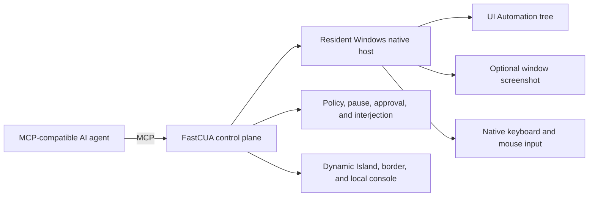

# FastCUA

**Turn Windows GUIs into a fast, executable interface for AI agents.**

[Website](https://guojiz.github.io/FastCUA/) · [中文](README_zh.md) · [Self-hosting](docs/SELF_HOSTING.md)

> **Bring your own agent.** FastCUA works with any stdio MCP-compatible agent. The installer only prepares Node.js and the verified FastCUA runtime—it does not install, select, or modify an AI client.

FastCUA is an open-source, local-first Computer Use runtime for Windows. It combines accessibility-first navigation, optional screenshots, native keyboard and mouse input, multi-action execution, access policy, and visible human control in one resident service.

Instead of forcing an agent to repeat the slow loop of **screenshot → reason → click → screenshot**, FastCUA lets it inspect Windows UI elements as text, plan several related actions, and execute them through one warm native control plane. Vision remains available for canvases, custom controls, and other places where accessibility data is not enough.

## Why FastCUA

| | Vision-first Computer Use | Browser bridge / extension | FastCUA |
|---|---|---|---|
| Control scope | What appears in screenshots | Web pages inside the browser | Windows desktop applications and browser windows |
| Primary navigation | Pixel coordinates | DOM / CDP / browser APIs | Windows UI Automation text, with screenshots when needed |
| Model requirement | Usually a vision-capable model | Usually text is enough | Text-only or vision-capable models |
| Execution pattern | Often one action per observe-reason loop | Browser commands | Multiple native actions in one model turn |
| Desktop drag and drawing | Depends on the implementation | Usually outside its scope | Native click, keyboard, scroll, drag, and repeated strokes |
| Human takeover | Varies | Usually limited to the browser | Global pause, interjection, approval, resume, and exit |

FastCUA does not replace browser automation. Inside a webpage, CDP or a browser bridge can still be the best tool. FastCUA covers the layer around it: application windows, system file dialogs, Paint, File Explorer, Office-style applications, browser chrome, and workflows that cross application boundaries.

## The fast path

### 1. Accessibility first, vision optional

An agent can request only the Windows accessibility tree when the next step is identifiable by text:

```js
const state = await sky.get_window_state({
  window,
  include_screenshot: false,
  include_text: true,
});
```

Screenshots can be requested independently for canvases, visual editors, custom-rendered controls, and verification. This avoids sending nearly identical images through the model when pixels add no useful information.

### 2. One warm native host

All connected clients share one resident Windows native host and one coherent control plane. Window identity, pointer state, approvals, pauses, and interruptions are not rebuilt for every individual action.

### 3. Many actions per model turn

FastCUA exposes a persistent JavaScript action environment through MCP, so an agent can execute related operations sequentially without returning to the model after every mouse movement:

```js
await sky.click({ window, x: 180, y: 240 });
await sky.press_key({ window, key: "Control_L+a" });
await sky.type_text({ window, text: "FastCUA" });
await sky.drag({ window, from_x: 120, from_y: 320, to_x: 420, to_y: 180 });
```

The agent should observe again when the layout, focus, modal state, or target elements may have changed. Stable keyboard, text, coordinate, and drawing actions can be batched against the same captured window.

## Start in 30 seconds

On Windows 11, open PowerShell as a regular user:

```powershell
irm https://raw.githubusercontent.com/Guojiz/FastCUA/main/install.ps1 | iex
```

The installer prepares Node.js and the verified FastCUA runtime. It does **not** install, select, or modify an AI client. After installation, give the generated `FastCUA Agent Setup.txt` prompt on your desktop to any MCP-compatible agent. The agent will read the bundled skill, configure its own stdio MCP connection, and verify FastCUA.

Then give your agent a real task:

> Open Paint and draw a house with the sun and grass.

The local control center is available at `http://127.0.0.1:8420`. Control endpoints listen on loopback only.

No specific agent is required. Any client that supports stdio MCP can connect through `server.mjs`.

## You stay in control

| State | Visual signal | Behavior |
|---|---|---|
| Active | Compact translucent island + screen border | AI is using the computer; the border remains click-through |
| Approval | Amber | Allow once, add to trusted apps, or deny |
| Full access | Purple / pink | No per-app prompts until you disable the mode |
| Paused | Red | New actions are blocked and can be resumed in one step |

Safe mode is the default. Trusted applications run directly; unknown applications require a decision. Full access is a separate, visible, reversible mode.

### Four global controls

| Key | Action |
|---|---|
| `F7` | Pause and open the control center |
| `F8` | Pause / resume |
| `F9` | Expand the island and interject |
| `F10` | Exit FastCUA completely |

Clicking the island also pauses and opens the control center for mouse takeover. Global keys remain available while the agent owns the pointer.

## More than a mouse script

- **Window-aware coordinates:** actions remain attached to the target window and account for Windows DPI scaling.
- **Accessibility and pixels are independent:** request text, screenshot, or both according to the next decision.
- **Native input:** click, keyboard chords, Unicode text, scrolling, drag, and supported accessibility actions.
- **Two-way interruption:** a person can pause or redirect the task; approval waiting also pauses the machine.
- **Exact trust rules:** canonical paths and executable names are matched exactly, never by unsafe substring.
- **Visible without being noisy:** the island stays compact until approval, interjection, or an exceptional state requires attention.
- **Local first:** MCP traffic uses a named pipe, the console binds to `127.0.0.1`, and policy remains on the PC.

## How it fits together



## Current boundaries

FastCUA currently targets Windows 11 x64. Secure Desktop, UAC elevation surfaces, authentication dialogs, password managers, and Windows security interfaces are intentionally outside the normal automation path. Applications that expose little or no accessibility information may require screenshots and coordinate input. Element indexes belong to the latest accessibility snapshot and should be refreshed after meaningful layout changes.

## Self-host

To audit, modify, or build the native component yourself:

```powershell
git clone https://github.com/Guojiz/FastCUA.git
cd FastCUA
.\native-host\build.ps1
node daemon.mjs
```

See the [self-hosting guide](docs/SELF_HOSTING.md) for MCP configuration, verification, protocol details, and troubleshooting.

## FAQ

**How do I take control immediately?** Press `F7` to pause or `F10` to exit.

**Can an unknown application launch silently?** Not in safe mode. Choose allow once, trust, or deny.

**Is Claude Code required?** No. Any client that supports stdio MCP can connect through `server.mjs`.

**Does FastCUA eliminate screenshots?** No. It makes them optional. Accessibility text is preferred when it can express the interface accurately; screenshots remain available where visual understanding is necessary.

**Is FastCUA only for browsers?** No. Browser windows are one target among Windows desktop applications. Browser-native automation can still be combined with FastCUA when DOM or network-level access is more suitable.

**How do I uninstall it?**

```powershell
& "$env:LOCALAPPDATA\FastCUA\app\uninstall.ps1"
```

## License

Apache-2.0. See [LICENSE](LICENSE).
