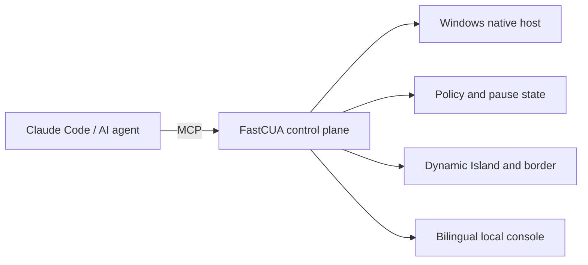

# FastCUA

**Let AI use your Windows PC while pause, interjection, and final control remain yours.**

[中文](README_zh.md) · [Self-hosting](docs/SELF_HOSTING.md)

FastCUA is a local computer-use control layer for Claude Code and other AI agents. It combines MCP, native Windows input, access policy, and visible system state in one resident service, so an agent can complete real desktop tasks while you can pause, interject, or exit at any moment.

## Start in 30 seconds

On Windows 11, open PowerShell as a regular user:

```powershell
irm https://raw.githubusercontent.com/Guojiz/FastCUA/main/install.ps1 | iex
```

The installer prepares Node.js, Claude Code, the FastCUA native component, MCP configuration, and the Computer Use skill. Then ask Claude Code:

> Open Paint and draw a house with the sun and grass.

The local control center is available at `http://127.0.0.1:8420`. Control endpoints listen on loopback only.

## You stay in control

| State | Visual signal | Behavior |
|---|---|---|
| Active | Compact translucent island + screen border | AI is using the computer; the border remains click-through |
| Approval | Amber | Allow once, add to trusted apps, or deny |
| Full access | Purple/pink | No per-action prompts until you disable the mode |
| Paused | Red | New actions are blocked and can be resumed in one step |

Safe mode is the default: trusted apps run directly and unknown apps require a decision. Full access is a separate, visible, reversible mode.

## Four shortcuts

| Key | Action |
|---|---|
| `F7` | Pause and open the control center |
| `F8` | Pause / resume |
| `F9` | Expand the island and interject |
| `F10` | Exit FastCUA completely |

Clicking the island also pauses and opens the control center for mouse takeover. Global keys are faster while the agent owns the pointer.

## More than a mouse script

- **One warm native host:** agents share window, pointer, approval, and pause state instead of rebuilding desktop context for each action.
- **Window-aware control:** coordinates stay attached to the target window and account for Windows DPI scaling.
- **Two-way interruption:** a person can pause; approval waiting pauses the machine; one action resumes the same control plane.
- **Exact trust rules:** canonical paths and executable names are matched exactly, never by unsafe substring.
- **Visible without being noisy:** the island stays compact until approval, interjection, or an exceptional state requires attention.
- **Local first:** MCP requests use a named pipe, the console binds to `127.0.0.1`, and policy remains on the PC.

## How it fits together



## Self-host

To audit, modify, or build the native component yourself:

```powershell
git clone https://github.com/Guojiz/FastCUA.git
cd FastCUA
.\native-host\build.ps1
node daemon.mjs
```

See the [self-hosting guide](docs/SELF_HOSTING.md) for MCP configuration, verification, protocol details, and troubleshooting.

## FAQ

**How do I take control immediately?** Press `F7` to pause or `F10` to exit.

**Can an unknown app launch silently?** Not in safe mode. Choose allow once, trust, or deny.

**Is Claude Code required?** No. Any client that supports stdio MCP can connect through `server.mjs`.

**How do I uninstall it?**

```powershell
& "$env:LOCALAPPDATA\FastCUA\app\uninstall.ps1"
```

## License

Apache-2.0. See [LICENSE](LICENSE).
