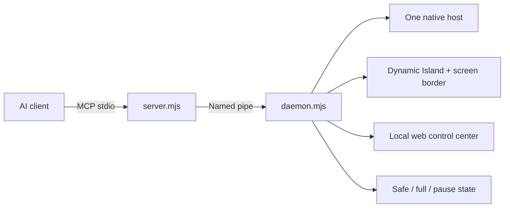

# FastCUA

**A local-first computer-use control plane for Windows AI agents.**

[中文](README_zh.md) · [Self-hosting](docs/SELF_HOSTING.md) · [中文部署指南](docs/SELF_HOSTING_zh.md)

FastCUA gives an AI agent controlled access to your Windows desktop while keeping the user visibly in charge. One resident native host is shared by connected clients, so desktop context, cursor ownership, approvals, pause state, and interrupts stay coherent across a task.

## Why it feels different

| Capability | User experience |
|---|---|
| **Compact Dynamic Island** | A small translucent status island stays out of the way. `F9` expands the interjection field only when needed. |
| **Full-screen state border** | A click-through rainbow edge means control is active; amber requests approval; red means paused or offline. |
| **Safe access by default** | Trusted executables run directly. Unknown apps open the island with Allow once, Add to trusted apps, and Deny. |
| **Explicit full access** | A separate no-prompt mode stays visibly purple/pink until disabled. |
| **Human and machine pause** | Pause immediately blocks new desktop actions. Approval waiting also pauses the control plane. One action resumes it. |
| **Shared warm host** | One resident helper serves all clients instead of rebuilding desktop state for every action. |
| **Local control center** | A bilingual, responsive console at `127.0.0.1:8420` shows state, activity, approvals, policy, and deployment help. |

## Keyboard controls

| Shortcut | Action |
|---|---|
| `F7` | Pause control and open local settings |
| `F8` | Toggle pause / resume |
| `F9` | Expand the island and interject |
| `F10` | Exit FastCUA completely |

## Architecture



The daemon listens only on loopback for HTTP and uses `\\.\pipe\fastcua` for clients. The native host validates window ownership before approval, restricts application launch to existing absolute `.exe` paths, and keeps approval decisions centralized.

## Quick start

Requirements: Windows 11, Node.js 18+, and Rust stable when building the included native host.

```powershell
git clone https://github.com/Guojiz/FastCUA.git
cd FastCUA
./native-host/build.ps1
node daemon.mjs
```

Then open `http://127.0.0.1:8420` and connect an MCP client to the absolute path of `server.mjs`:

```json
{
  "mcpServers": {
    "fastcua": {
      "command": "node",
      "args": ["C:\\path\\to\\FastCUA\\server.mjs"]
    }
  }
}
```

The daemon automatically finds `native-host/target/release/cua-native-host.exe`. You can also use `CUA_BIN` or `cuaBinPath` for a different compatible host.

## Safety model

- `safe` is the default policy. Trusted entries are exact executable basenames or exact canonical paths—not substrings; unknown apps ask for Allow once, Add to trusted apps, or Deny. Approval expires after 60 seconds.
- `full` is an explicit no-prompt mode and remains visibly purple/pink while enabled.
- Changing policy or whitelist clears the in-memory approval cache.
- Pause resets the native host, rejects pending work, and blocks new desktop requests.
- Stop and interjection reject in-flight work and write an interrupt marker for connected clients. Exit releases the helper, overlay, pipe, and HTTP server.
- The control API binds to `127.0.0.1`; browser framing and cross-origin access are restricted.
- Local helper binaries, logs, build output, and machine-specific paths are excluded from Git.

See [SELF_HOSTING.md](docs/SELF_HOSTING.md) for build, verification, troubleshooting, and protocol details.

## Repository map

| Path | Purpose |
|---|---|
| `daemon.mjs` | Resident control plane, policy, interrupts, web API, overlay lifecycle |
| `server.mjs` | MCP-to-named-pipe bridge |
| `native-host/` | Open-source Windows native computer-use host |
| `overlay.ps1`, `card.xaml` | Dynamic Island and click-through full-screen border |
| `web.html` | Bilingual local control center and self-host guide |
| `tests/` | Protocol and approval regression fixtures |

## License

Apache-2.0. See [LICENSE](LICENSE).
