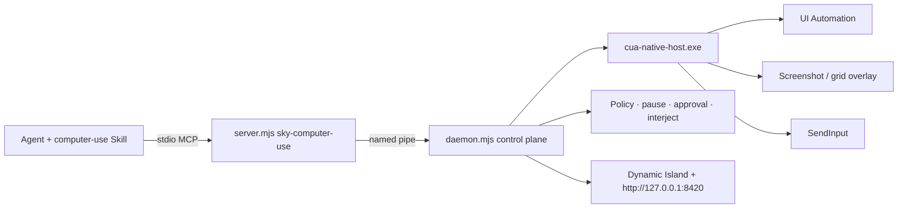

# FastCUA

**Turn Windows GUIs into a fast, executable interface for AI agents.**

[Website](https://guojiz.github.io/FastCUA/) · [中文](README_zh.md) · [Self-hosting](docs/SELF_HOSTING.md)

> [!WARNING]
> **FastCUA is still under development and is not yet complete.** Current versions may contain bugs, missing functionality, or compatibility issues. Use it for testing only and do not rely on it for important tasks.

> **Bring your own agent, and install FastCUA into that agent itself by default.** The Windows installer prepares Node.js and the verified FastCUA runtime. The agent that receives the setup prompt must then install both the complete `computer-use` Skill and the `sky-computer-use` MCP server into its own active configuration. Missing either part means installation failed.

FastCUA is an open-source, local-first Computer Use runtime for Windows. It combines accessibility-first navigation, optional screenshots, native keyboard and mouse input, multi-action execution, access policy, and visible human control in one resident service.

**Where things live (one line):** humans read this README + [self-host](docs/SELF_HOSTING.md); agents only load `skills/computer-use/` (Skill) and call MCP — not project docs.

## Design principles

Product rules the runtime is built around. How an agent must act step-by-step is **not** here — that is the Skill.

### 1. Accessibility first, vision optional

Prefer Windows UI Automation text when the next step is identifiable by name, role, or value. Request screenshots only when pixels add information (canvas, custom paint, verification). Do not burn tokens on near-duplicate full-window images every step.

### 2. One warm control plane

All agent clients share **one resident daemon** and **one native host** (one cursor). Window identity, approvals, pause, and interjection live in that control plane — they are not rebuilt per click.

### 3. Many actions per model turn

Through MCP, the agent gets a persistent JS environment (`sky.*`). Related keyboard, text, click, drag, and scroll work can run sequentially in one turn. Re-observe only when layout, focus, or modals may have changed.

### 4. Window screenshot pixels are the coordinate space

`click` / `drag` / `scroll` **x,y** are in **window screenshot pixels**, origin top-left of the target window — same space as `get_window_state().viewport` and `screenshots[0].width/height`. Never invent desktop-absolute coordinates. Captures may be downscaled (1568px long edge): read `viewport.scale` before pixel work; `unchanged: true` means reuse the previous image.

### 5. Fail fast on software work (30s)

Each desktop helper request, MCP round-trip, and JS cell defaults to a **30 second** budget. On timeout the runtime fails the call; agents retry once then change strategy (defined in the Skill). Human pause and approval waits are separate — not software hangs.

Hung target apps are bounded much tighter inside the helper: a wedged UIA provider times out in ~1.5s and that app's UIA is then disabled for the session (the request still returns, falling back to the HWND tree with `uia.prefer_vision: true`). Window activation (~1.5s) and screenshot capture (~3s) are bounded too, and screenshots / `grid_view` keep working against an unresponsive window via BitBlt. Cross-process window text never blocks the host, so wedged apps still appear in `list_windows` with their stored title. The shared helper survives all of this — a full helper restart is the last resort, not the default.

### 6. Visual targeting = Apple-style square number grid

When UIA is weak or `state.uia.prefer_vision` is true, the runtime exposes that signal; agents must switch to vision immediately (Skill). Product shape:

1. `sky.grid_view({ window })` → **one** annotated image: semi-transparent **square** cell outlines + small outlined numbers.
2. **Select** a number only (does **not** click).
3. `sky.grid_refine({ window, grid, cell })` → crop **inside that cell only**, draw a 3×3 of squares (still one image).
4. `sky.click_cell(...)` (cell center), `sky.click_in_cell(...)` (cell-local x,y), or `sky.click_view({window, view, x, y})` (precise point in the view image) only when ready.

Select ≠ click. Prefer `grid_view` over raw full screenshots for targeting.

### 7. Human control plane is first-class

People stay in charge with visible state and global keys:

| Key | Meaning |
|-----|---------|
| `F7` | Pause + open control center |
| `F8` | Pause / resume |
| `F9` | Pause, then interject text |
| `F10` | Exit FastCUA (agents must not self-restart) |

Agents receive stable `[control_plane:…]` tags on tool errors. **Branching rules are only in the Skill** — not re-specified here.

### 8. Safe by default, local by design

Safe mode requires human approval for unknown apps. Trust matches exact executable paths/names — never fuzzy substring. Common local tools ship on a default **whitelist** that only skips the approval prompt; Skill safety bans (terminals, password managers, security UI) still apply. MCP uses a named pipe; the console binds to `127.0.0.1` only. Policy stays on the machine.

### 9. Agent-neutral, Skill + MCP together

FastCUA is not tied to one vendor client. Complete install = **Skill folder** + **stdio MCP** in the **same** agent that will use it. MCP alone or Skill alone is incomplete. Runtime installers prepare the machine; the agent still must wire both parts into **itself**.

## Architecture



| Layer | Role | Who reads it |
|-------|------|----------------|
| **Skill** `skills/computer-use/` | How to run a desktop task (bootstrap, tags, grid, safety) | **Agent only** |
| **MCP** `server.mjs` | Tools + persistent `js` / `sky` | Agent tools (not prose docs) |
| **Daemon + host** | Shared lifecycle, UIA, screenshots, input, policy | Runtime |
| **README / self-host** | Product + install for people | **Humans** |
| **Overlay / console** | Pause, approval, interject UI | Humans |

## Why FastCUA

| | Vision-first Computer Use | Browser bridge | FastCUA |
|---|---|---|---|
| Scope | Screenshot surface | Web pages | Windows apps + browser chrome |
| Primary nav | Pixels | DOM / CDP | UIA text; screenshots when needed |
| Model | Usually vision | Often text | Text or vision |
| Execution | Often one act per loop | Browser cmds | Many native acts per turn |
| Human takeover | Varies | Browser-limited | Global pause, interject, approval, exit |

FastCUA does not replace in-page browser automation. It covers the desktop layer around it: windows, system dialogs, Paint, Explorer, Office-style apps, and cross-app flows.

## Start in 30 seconds

Windows 11, Node 18+ already available — **one line via npm**:

```bash
npx fastcua
```

Or PowerShell (installs Node via WinGet if needed):

```powershell
irm https://raw.githubusercontent.com/Guojiz/FastCUA/main/install.ps1 | iex
```

Both run the same verified installer: Node runtime, SHA-256 native host, and `FastCUA Agent Setup.txt` on the desktop.

Give that prompt to **the agent that will actually use FastCUA**. It must:

1. Install the complete `skills\computer-use` folder into its own Skill system (not a stub that only points at the source).
2. Add the `sky-computer-use` stdio MCP server (Node → `server.mjs`).
3. Reload, verify the Skill is discoverable, and successfully call `list_windows` through MCP.

If either the Skill or MCP is missing, installation failed.

Local control center: `http://127.0.0.1:8420` (loopback only).

## You stay in control

| State | Signal | Behavior |
|---|---|---|
| Active | Compact island + border | AI using the PC; border is click-through |
| Approval | Amber | `1` once · `2` always · `3` full access · `4` deny |
| Full access | Purple / pink | No per-app prompts until disabled |
| Paused | Red | New actions blocked; resume in one step |

## Example: multi-step turn

```js
const windows = await sky.list_windows();
const window = windows.find((w) => /Notepad/i.test(w.title));
await sky.activate_window({ window });
const state = await sky.get_window_state({ window, include_screenshot: false, include_text: true });
const editor = /^\s*(\d+)\s+(?:Edit|Document)\b/m.exec(state.accessibility.tree || "");
if (!editor) throw new Error("Notepad editor not found");
await sky.click({ window, element_index: Number(editor[1]) });
// Observe focused_value before deciding to replace or type at the caret.
const focused = await sky.get_window_state({ window, include_screenshot: false, include_text: true });
if (focused.accessibility.focused_value === undefined) throw new Error("Focused value was not observed");
// This example intentionally inserts at the current caret; use replace:true only after deciding to replace the observed value.
await sky.type_text({ window, text: "FastCUA" });
// Weak UIA? visual square grid, one image at a time:
let gv = await sky.grid_view({ window });
gv = await sky.grid_refine({ window, grid: gv.grid, cell: "4" });
await sky.click_cell({ window, grid: gv.grid, cell: "5" });
await sky.close(); // end this MCP turn; daemon stays up
```

## Record a Skill (preview)

> **Status: validated preview.** Works on real Windows 11; end-to-end validated against the FastCUA test fixture (60+ real-machine checks: record -> compile -> dry-run with a new parameter value after an app restart -> fail-safe drills). Audio narration is future work; a short human-input comparison session is still owed (all validation input was automation-injected and is labeled as such).

`tools/skill-recorder` watches a real demonstration — yours or a synthetic one driven through FastCUA itself — and compiles it into an **auditable, non-executable** skill draft:

1. **Record** — global hooks + UI Automation anchors (numeric control-type IDs + AutomationIds, localized names as hints only), sparse JPEG keyframes (~0.7 MB/min measured), `Ctrl+Alt+N` typed narration notes, `Ctrl+Alt+R` pause, `Ctrl+Alt+X` stop. Password fields are structurally redacted at the hook; the secure desktop is excluded; the recorder never records its own windows.
2. **Compile** — `session.jsonl` -> `draft.json`/`draft.md` + an inert `skill-draft/<name>/SKILL.md` marked `verified: false` with a bilingual UNVERIFIED banner. Parameters (dates, filenames, text) are inferred **with provenance**; anything uncertain stays an explicit `⚠ unresolved` marker.
3. **Review** — the draft is presented with its parameter table, ⚠ markers, redactions, and recorded app scope. The human decides every unresolved step.
4. **Dry-run** — replays the draft through the **normal control plane** (approvals, whitelist, F7–F10 all active). Unresolved steps pause for explicit decisions; redacted steps never execute; a workflow can never exceed its recorded app scope; an anchor that fails to re-resolve aborts instead of clicking somewhere wrong. Every step logs expected-vs-actual.
5. **Promote** — only the user copies a reviewed, dry-run-clean draft into a live skills directory. The draft never installs itself.

Agent procedure lives in `skills/skill-recorder/`; format + design in [docs/skill-recorder-design.md](docs/skill-recorder-design.md).

## Current boundaries

Windows 11 x64. Secure Desktop, UAC elevation, auth dialogs, password managers, and Windows security UI are outside the normal path. Apps with little accessibility data need screenshots / grid targeting. Element indexes belong to the latest UIA snapshot — refresh after layout changes.

## Self-host

```powershell
git clone https://github.com/Guojiz/FastCUA.git
cd FastCUA
.\native-host\build.ps1
```

Then install Skill + MCP into the agent. The MCP server starts the daemon automatically. See [docs/SELF_HOSTING.md](docs/SELF_HOSTING.md).

## FAQ

**How do I take control immediately?** `F7` pause or `F10` exit.

**How does an agent finish a turn?** Call MCP `close` once after verification. That closes the client connection, not the shared daemon.

**Can an unknown app launch silently?** Not in safe mode.

**Is one specific agent required?** No — any client with local Skills and stdio MCP.

**Can I configure only MCP?** No. Skill + MCP together.

**Uninstall:**

```powershell
& "$env:LOCALAPPDATA\FastCUA\app\uninstall.ps1"
```

## License

MIT. See [LICENSE](LICENSE).
