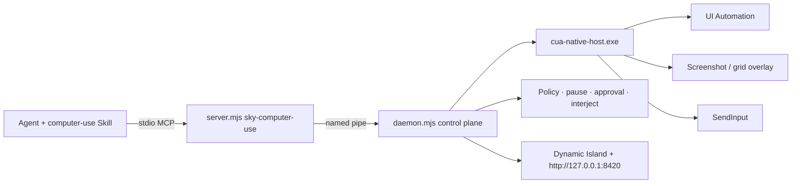

# FastCUA

**Turn Windows GUIs into a fast, executable interface for AI agents.**

[Website](https://guojiz.github.io/FastCUA/) · [中文](README_zh.md) · [Self-hosting](docs/SELF_HOSTING.md) · [Stuck / timeouts](docs/STUCK.md)

> **Bring your own agent, and install FastCUA into that agent itself by default.** The Windows installer prepares Node.js and the verified FastCUA runtime. The agent that receives the setup prompt must then install both the complete `computer-use` Skill and the `sky-computer-use` MCP server into its own active configuration. Missing either part means installation failed.

FastCUA is an open-source, local-first Computer Use runtime for Windows. It combines accessibility-first navigation, optional screenshots, native keyboard and mouse input, multi-action execution, access policy, and visible human control in one resident service.

### Documentation map (do not mix roles)

| Doc | Audience | Owns |
|-----|----------|------|
| **This README** | Everyone | Product identity, design principles, one-line install, FAQ |
| [docs/SELF_HOSTING.md](docs/SELF_HOSTING.md) | Operators | Build runtime, wire **Skill + MCP** into the agent |
| [docs/STUCK.md](docs/STUCK.md) | Operators + agents | 30s budget, bad UIA → vision, hang types, whitelist meaning |
| `skills/computer-use/` | Agents only | Bootstrap, control-plane tags, grid procedure, safety bans |
| MCP `server.mjs` | Runtime | Tools + persistent `sky` — not a second Skill |

Client-specific notes (e.g. OpenCode) stay under `docs/`, never as the product front door.

## Design principles

These are the product rules FastCUA is built around — not marketing points. Agent procedure lives in the Skill; install detail lives in Self-hosting.

### 1. Accessibility first, vision optional

Prefer Windows UI Automation text when the next step is identifiable by name, role, or value. Request screenshots only when pixels add information (canvas, custom paint, verification). Do not burn tokens on near-duplicate full-window images every step.

### 2. One warm control plane

All agent clients share **one resident daemon** and **one native host** (one cursor). Window identity, approvals, pause, and interjection live in that control plane — they are not rebuilt per click.

### 3. Many actions per model turn

Through MCP, the agent gets a persistent JS environment (`sky.*`). Related keyboard, text, click, drag, and scroll work can run sequentially in one turn. Re-observe only when layout, focus, or modals may have changed.

### 4. Window screenshot pixels are the coordinate space

`click` / `drag` / `scroll` **x,y** are in **window screenshot pixels**, origin top-left of the target window — same space as `get_window_state().viewport` and `screenshots[0].width/height`. Never invent desktop-absolute coordinates.

### 5. Fail fast on software work (30s)

Each desktop helper request, MCP round-trip, and JS cell defaults to a **30 second** budget. On timeout: retry **once**, then change strategy or report. Human pause and approval waits are **not** software hangs — agents must not spam tools to “fix” them. Details: [STUCK.md](docs/STUCK.md).

### 6. Visual targeting = Apple-style square number grid

When UIA is weak or `state.uia.prefer_vision` is true (broken/empty/shell-only tree — see [STUCK.md](docs/STUCK.md)), switch to vision **immediately** (same rule in the Skill):

1. `sky.grid_view({ window })` → **one** annotated image: semi-transparent **square** cell outlines + small outlined numbers.
2. **Select** a number only (does **not** click).
3. `sky.grid_refine({ window, grid, cell })` → crop **inside that cell only**, draw a 3×3 of squares (still one image).
4. `sky.click_cell(...)` only when ready.

Select ≠ click. Prefer `grid_view` over raw full screenshots for targeting.

### 7. Human control plane is first-class

People stay in charge with visible state and global keys:

| Key | Meaning |
|-----|---------|
| `F7` | Pause + open control center |
| `F8` | Pause / resume |
| `F9` | Pause, then interject text |
| `F10` | Exit FastCUA (agents must not self-restart) |

Agent-facing messages use stable tags. **Only** interjection is an instruction; everything else is a block or stop:

| Tag | Kind | Agent should |
|-----|------|----------------|
| `[control_plane:paused]` | BLOCK | Stop tools; wait for resume or a new chat message |
| `[control_plane:interjection]` | INSTRUCTION (one-shot) | Abort old plan; follow the text; tools may continue (auto-resume) |
| `[control_plane:stopped]` | STOP | End Computer Use for this turn |
| `[control_plane:shutdown]` | FINAL | Do not restart FastCUA or continue desktop automation |
| `[control_plane:awaiting_approval]` | BLOCK | Do not retry in a loop |

### 8. Safe by default, local by design

Safe mode requires human approval for unknown apps. Trust matches exact executable paths/names — never fuzzy substring. Common local tools ship on a default **whitelist** so they skip the approval prompt only — whitelist is **not** a license to automate Skill-banned surfaces (terminals, password managers, security UI). MCP uses a named pipe; the console binds to `127.0.0.1` only. Policy stays on the machine.

### 9. Agent-neutral, Skill + MCP together

FastCUA is not tied to one vendor client. Complete install = **Skill folder** + **stdio MCP** in the **same** agent that will use it. MCP alone or Skill alone is incomplete. Runtime installers prepare the machine; the agent still must wire both parts into **itself**.

## Architecture



| Layer | Role |
|-------|------|
| **Skill** | Agent procedure: bootstrap, coordinate rules, control-plane tags |
| **MCP `server.mjs`** | Tools + persistent `js` REPL with `sky` |
| **Daemon** | Shared helper lifecycle, approval cache, pause / interject / shutdown |
| **Native host** | UIA tree, PrintWindow screenshots, grid overlay, input |
| **Overlay / console** | Human UI on loopback |

## Why FastCUA

| | Vision-first Computer Use | Browser bridge | FastCUA |
|---|---|---|---|
| Scope | Screenshot surface | Web pages | Windows apps + browser chrome |
| Primary nav | Pixels | DOM / CDP | UIA text; screenshots when needed |
| Model | Usually vision | Often text | Text or vision |
| Execution | Often one act per loop | Browser cmds | Many native acts per turn |
| Human takeover | Varies | Browser-limited | Global pause, interject, approval, exit |

FastCUA does not replace in-page browser automation. It covers the desktop layer around it: windows, system dialogs, Paint, Explorer, Office-style apps, and cross-app flows.

## Start in 30 seconds

Windows 11, Node 18+ already available — **one line via npm**:

```bash
npx fastcua
```

Or PowerShell (installs Node via WinGet if needed):

```powershell
irm https://raw.githubusercontent.com/Guojiz/FastCUA/main/install.ps1 | iex
```

Both run the same verified installer: Node runtime, SHA-256 native host, and `FastCUA Agent Setup.txt` on the desktop.

Give that prompt to **the agent that will actually use FastCUA**. It must:

1. Install the complete `skills\computer-use` folder into its own Skill system (not a stub that only points at the source).
2. Add the `sky-computer-use` stdio MCP server (Node → `server.mjs`).
3. Reload, verify the Skill is discoverable, and successfully call `list_windows` through MCP.

If either the Skill or MCP is missing, installation failed.

Local control center: `http://127.0.0.1:8420` (loopback only).

## You stay in control

| State | Signal | Behavior |
|---|---|---|
| Active | Compact island + border | AI using the PC; border is click-through |
| Approval | Amber | `1` once · `2` always · `3` full access · `4` deny |
| Full access | Purple / pink | No per-app prompts until disabled |
| Paused | Red | New actions blocked; resume in one step |

## Example: multi-step turn

```js
const windows = await sky.list_windows();
const window = windows.find((w) => /Notepad/i.test(w.title));
await sky.activate_window({ window });
await sky.type_text({ window, text: "FastCUA", replace: true });
// Weak UIA? visual square grid, one image at a time:
let gv = await sky.grid_view({ window });
gv = await sky.grid_refine({ window, grid: gv.grid, cell: "4" });
await sky.click_cell({ window, grid: gv.grid, cell: "5" });
await sky.close(); // end this MCP turn; daemon stays up
```

## Current boundaries

Windows 11 x64. Secure Desktop, UAC elevation, auth dialogs, password managers, and Windows security UI are outside the normal path. Apps with little accessibility data need screenshots / grid targeting. Element indexes belong to the latest UIA snapshot — refresh after layout changes.

## Self-host

```powershell
git clone https://github.com/Guojiz/FastCUA.git
cd FastCUA
.\native-host\build.ps1
```

Then install Skill + MCP into the agent. The MCP server starts the daemon automatically. See [docs/SELF_HOSTING.md](docs/SELF_HOSTING.md).

## FAQ

**How do I take control immediately?** `F7` pause or `F10` exit.

**How does an agent finish a turn?** Call MCP `close` once after verification. That closes the client connection, not the shared daemon.

**Can an unknown app launch silently?** Not in safe mode.

**Is one specific agent required?** No — any client with local Skills and stdio MCP.

**Can I configure only MCP?** No. Skill + MCP together.

**Uninstall:**

```powershell
& "$env:LOCALAPPDATA\FastCUA\app\uninstall.ps1"
```

## License

MIT. See [LICENSE](LICENSE).
