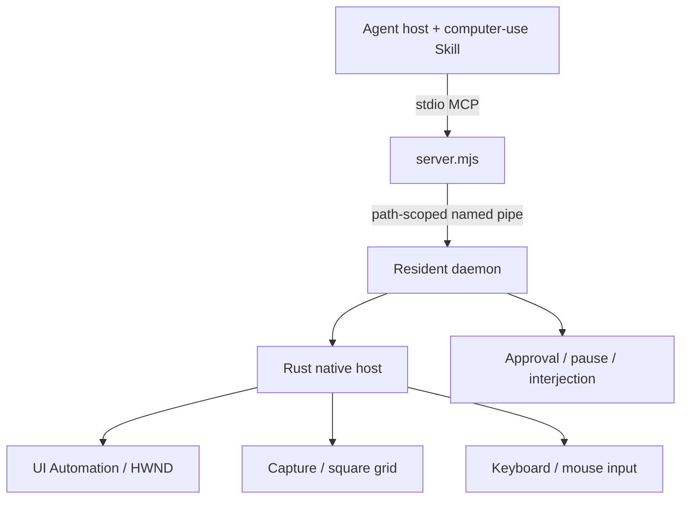

# FastCUA

**Text first. Vision on demand. Zoom until precise.**

FastCUA is a local Windows computer-use runtime for AI agents, designed around one rule:

> **Do not assume every computer-use step needs a screenshot. Show the model only the information needed for the current decision.**

[Website](https://guojiz.github.io/FastCUA/) · [中文](README_zh.md) · [Technical paper](docs/TECHNICAL_PAPER.md) · [Next design](docs/NEXT_DESIGN.md)

> [!WARNING]
> FastCUA is an experimental project under active development. Use it for testing, not important or unattended work.

## What makes FastCUA different

### 1. Screenshots are not the default observation

FastCUA first asks Windows UI Automation for structured semantic information such as control roles, names, bounds, and current snapshot element indexes.

If that information is good enough, the agent can act without receiving a screenshot at all:

```text
Windows UI
   ↓
UI Automation text
   ↓
Agent chooses element_index
   ↓
Windows input
```

If UI Automation is weak, broken, stale, or non-actionable, FastCUA switches to vision instead of repeatedly forcing the semantic path.

### 2. Vision uses progressive refinement instead of one-shot full-screen XY

When vision is necessary, FastCUA does not require the model to immediately predict a precise point on a large screenshot.

The first visual observation is **one window image with numbered square regions**. The model chooses the region containing the target. Choosing a number does not click anything.

FastCUA then crops only that region, draws a fresh 3×3 grid, and can repeat the process until the target is isolated:

```text
full window
    ↓
numbered regions
    ↓
choose one region
    ↓
crop only that region
    ↓
3×3 refinement
    ↓
refine again if needed
    ↓
commit one click
```

So the model solves several simpler questions such as **“which region contains the target?”** instead of one high-precision regression such as `click(3371, 184)` on a 4K window.

This is a single-image, coarse-to-fine observation loop, not a fan-out that sends many image tiles to the model at once.

### 3. The model judges the target; the runtime does the geometry

After a crop or refinement, model coordinates belong only to the current image or crop. FastCUA keeps the crop origin and capture scale and maps the point back deterministically:

```text
local view coordinate
        ↓
crop coordinate
        ↓
window coordinate
        ↓
physical screen coordinate
```

The model does not need to reverse DPI scaling, crop offsets, or full-screen geometry itself. Out-of-bounds points are rejected rather than silently clamped.

### 4. Grounding does not immediately become a side effect

Before committing input, FastCUA revalidates the local environment near the effect point. Window identity, foreground state, cursor position, bounds, timeouts, and human control signals can stop execution.

In short:

> **The model decides what should happen. The runtime decides whether it is still safe and geometrically valid to make it happen.**

The overall observation and action path is therefore:

```text
UIA text
   ↓ sufficient
semantic target
   ↓
validated input

   ↓ insufficient

window image
   ↓
region
   ↓
smaller region
   ↓
precise local target
   ↓
deterministic coordinate mapping
   ↓
environment revalidation
   ↓
validated input
```

FastCUA also keeps one resident local runtime so UIA quality history, capture state, approvals, pause/interjection state, and related native actions do not have to be rebuilt from scratch for every tool call.

FastCUA is agent-neutral, but a complete installation always has two parts in the **same agent host**:

1. the full `skills/computer-use/` operating policy;
2. the `sky-computer-use` stdio MCP server.

MCP alone is capability without the required procedure. The Skill alone has no executor.

## Model requirement

Use **one full-capability primary model** with text/image understanding, reliable reasoning, Skills, MCP, and enough context for the whole task. Native audio understanding is useful for recorded narration; otherwise use typed notes. Do not configure writer, transcription, fallback, or text-only models.

## Why FastCUA

| | Vision-first computer use | Browser automation | FastCUA |
|---|---|---|---|
| Main observation | Screenshots | DOM/CDP | UIA text first; vision only when needed |
| Visual grounding | Often direct full-image XY | DOM selectors | Numbered regions + recursive local refinement |
| Coordinate handling | Often model-facing | Browser-managed | Runtime maps crop-local points back to Windows |
| Scope | Any visible surface | Web content | Windows apps, browser chrome, cross-app flows |
| Execution | Often one action per loop | Browser commands | Several native actions per model turn |
| Runtime state | Often rebuilt per call | Browser session | One warm daemon and native host |
| Human takeover | Integration-dependent | Browser-limited | Global pause, interject, approve, exit |

FastCUA complements in-page browser automation; it does not replace it.

## Architecture


```mermaid
flowchart TB
  A["Agent host + computer-use Skill"] -->|"stdio MCP"| B["server.mjs"]
  B -->|"path-scoped named pipe"| C["Resident daemon"]
  C --> D["Rust native host"]
  D --> E["UI Automation / HWND"]
  D --> F["Capture / square grid"]
  D --> G["Keyboard / mouse input"]
  C --> H["Approval / pause / interjection"]
```

All clients share one daemon, policy state, and physical pointer. A persistent `js` cell can execute related `sky.*` actions in one model turn; stale targets, changed focus/cursor, out-of-bounds points, timeouts, and human control signals stop execution.

## Targeting logic

Start with `get_window_state({include_text:true})` and read `state.uia`:

| Observation | Required action |
|---|---|
| `quality:"good"` and a named, bounded target | Click its current `element_index` |
| `prefer_vision:true`, `weak`, `broken`, `[no-hit]`, or one stale-index failure | Stop semantic clicking and call `grid_view` |

Visual control is **observe → select → refine → commit**:

1. `grid_view({window})` returns one window image with numbered square cells.
2. Inspect the image and select the number containing the target. Selection is only a decision; it sends no input.
3. If the target is not safely isolated at that cell's center, call `grid_refine({window,grid,cell})`. It crops that square and draws a new 3×3 grid; refine again if needed.
4. Commit exactly once: `click_cell({window,grid,cell})` for the cell center, `click_in_cell({window,grid,cell,x,y,view})` for a cell-local offset, or `click_view({window,view,x,y})` for an exact point in the current image/crop.
5. Re-observe after any action that may change layout or focus.

Coordinates always use the current window image or crop, origin at its top-left. The helpers reverse capture scaling and reject points outside the target window. Full mechanics and proofs are in the [technical paper](docs/TECHNICAL_PAPER.md#4-observation-semantics-first-pixels-when-needed).

## Install

Use the PowerShell installer. It installs Node.js through WinGet when needed, downloads the GitHub Release runtime, and verifies its checksum:

```powershell
irm https://raw.githubusercontent.com/Guojiz/FastCUA/main/install.ps1 | iex
```

The verified installer writes `FastCUA Agent Setup.txt` to the desktop. Give it to the agent that will actually use FastCUA. That agent must:

1. install the complete `skills\computer-use` folder into its own Skill system;
2. configure Node.js + the installed `server.mjs` as `sky-computer-use` MCP;
3. reload and verify that the Skill is discoverable;
4. call `list_windows` successfully.

If either the Skill or MCP is missing, installation is incomplete.

### Verify and update

```powershell
& "$env:LOCALAPPDATA\FastCUA\app\install.ps1" -Action Doctor
& "$env:LOCALAPPDATA\FastCUA\app\install.ps1" -Action Check
& "$env:LOCALAPPDATA\FastCUA\app\install.ps1" -Action Update
```

Inside MCP, call `runtime_info` to confirm the exact server, daemon, native host, version, commit, pipe, and data directory in use.

## Human control

| Key | Action |
|---|---|
| `F7` | Pause and open the control center |
| `F8` | Pause or resume |
| `F9` | Pause and interject text |
| `F10` | Exit FastCUA |

The local control center is available at `http://127.0.0.1:8420`. Safe mode asks before acting in an unknown application. Trust uses exact application identity, not fuzzy name matching.

## Visual click example

Given a `window` returned by `list_windows`:

```js
let view = await sky.grid_view({ window });       // inspect; choose cell 4
view = await sky.grid_refine({
  window,
  grid: view.grid,
  cell: "4",
});                                               // inspect; choose cell 5
await sky.click_cell({ window, grid: view.grid, cell: "5" });
await sky.close();
```

## Record a Skill (preview)

The optional recorder turns a demonstration into an auditable evidence package before any Skill is written:

```text
record → compile evidence → current primary agent writes → provenance lint
       → dry-run with new values → human-reviewed promotion
```

Password fields and secure-desktop moments are redacted. The current primary agent writes the Skill from evidence; lint, dry-run, application scope, and explicit promotion approval remain hard gates. See `skills/skill-recorder/` and the [technical paper](docs/TECHNICAL_PAPER.md#9-evidence-first-skill-recording).

> [!NOTE]
> Using the Skill Recorder may send recorded screen content, interaction evidence, and narration to the configured cloud model provider.

## Develop from source

```powershell
git clone https://github.com/Guojiz/FastCUA.git
cd FastCUA
.\native-host\build.ps1
```

Then copy the complete `skills\computer-use` directory into the active agent's Skill directory and configure the absolute path to `server.mjs` as a stdio MCP server. Use `runtime_info` to verify the checkout. Reproduction commands and the test matrix are in the [technical paper](docs/TECHNICAL_PAPER.md#12-reproduction-and-operation).

The project website lives in `site/` and deploys from this repository through `.github/workflows/pages.yml`. The root `web.html` remains the local runtime control center; it is not the public website.

## Boundaries

FastCUA currently targets Windows 11 x64. UAC, Secure Desktop, authentication dialogs, password managers, Windows Security, higher-integrity processes, protected surfaces, and applications with unusual capture/accessibility behavior are outside the normal path. Synthetic input is not hardware input, and the current key-chord implementation still uses the superseded `keybd_event` API. Remaining input, provider, capture, IPC, and evaluation work is tracked in [Next design](docs/NEXT_DESIGN.md).

## Uninstall

```powershell
& "$env:LOCALAPPDATA\FastCUA\app\uninstall.ps1"
```

## Links

| | |
| --- | --- |
| **Project site** | https://guojiz.github.io/FastCUA/ |
| **Author site** | https://guojiz.github.io/ |
| **X** | https://x.com/guojizh |
| **Bilibili** | https://space.bilibili.com/3493114115263006 |
| **Sponsor** | https://github.com/Guojiz/Sponsors |

### Other Guojiz projects with official sites

- [GitLearnOS](https://guojiz.github.io/gitlearnos/) — learner-owned Git memory for AI-assisted study
- [Word Snap](https://guojiz.github.io/word-snap/) — bilingual vocabulary matching PWA

## License

MIT. See [LICENSE](LICENSE).
