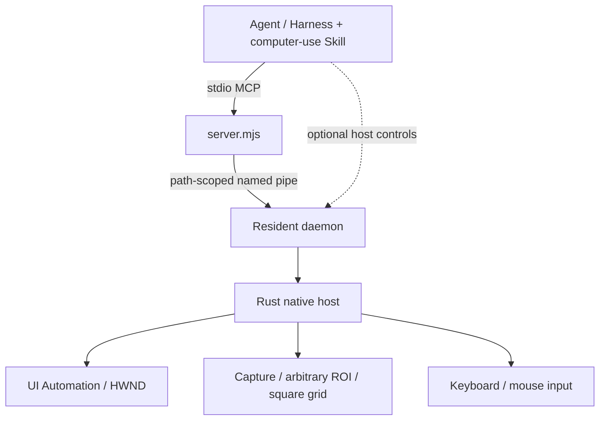

# FastCUA

**Text first. Vision on demand. Refine until precise.**

FastCUA is a local Windows Computer Use runtime for AI agents.

Its core idea is simple:

> **Do not send the whole screen to the model unless the model actually needs it.**

[Website](https://guojiz.github.io/FastCUA/) · [中文](README_zh.md) · [Current architecture](docs/CURRENT_ARCHITECTURE.md) · [Technical paper](docs/TECHNICAL_PAPER.md) · [Next design](docs/NEXT_DESIGN.md)

## Headless and host-neutral by design

FastCUA is intended to sit **under** an Agent or Harness, not replace it.

```text
Agent / Harness / Host
  ├─ task planning
  ├─ user interaction
  ├─ optional pause / interjection / approval UX
  └─ FastCUA integration
          ↓
      FastCUA
      ├─ UIA / HWND observation
      ├─ visual capture
      ├─ agent-defined ROI
      ├─ recursive visual grounding
      ├─ coordinate mapping
      ├─ Windows input
      └─ optional host-control hooks
          ↓
        Windows
```

FastCUA should not force a particular floating overlay, control center, hotkey layout, or agent product UX.

A host may optionally use runtime control primitives such as `pause`, `resume`, `interject`, approval resolution, or `shutdown`, but **the host decides how those controls are presented to the user**.

> **FastCUA defines the Windows runtime contract. The host defines the human experience.**

This separation is intentional. It allows DeepSeek, Qwen, Codex, Claude, opencode, and other agent stacks to integrate the same Windows substrate without inheriting FastCUA-specific UI assumptions.

Some legacy standalone-control UI code may still exist in the current branch while the implementation is being aligned with this boundary. `docs/CURRENT_ARCHITECTURE.md` is authoritative for the product direction, and `docs/HANDOFF_HEADLESS_RUNTIME.md` contains the cleanup handoff.

## The problem FastCUA is trying to solve

Most visual Computer Use systems start from roughly this loop:

```text
full screenshot
      ↓
vision model
      ↓
predict x, y
      ↓
click
```

That works, but it creates two avoidable costs.

First, many Windows controls already expose enough semantic information through UI Automation. Sending a screenshot anyway spends visual context on information the operating system already knows.

Second, when vision really is necessary, asking a model to predict one exact point on a large screenshot can be fragile. A model may correctly recognize the button but still miss it by a few pixels, especially on 4K displays, dense toolbars, small controls, or scaled screenshots.

FastCUA handles these two cases differently.

## 1. If text is enough, there is no screenshot

Suppose Windows exposes this current UI Automation snapshot:

```text
[12] Button
name="Save"

[13] Edit
name="Project name"

[14] CheckBox
name="Auto save"
```

If the UIA state is reliable, the agent can simply choose element `12`.

```text
Windows
   ↓
UI Automation
   ↓
structured text
   ↓
Agent chooses element_index=12
   ↓
validated Windows input
```

No screenshot needs to enter the model context.

The agent can explicitly request text without pixels:

```text
include_text = true
include_screenshot = false
```

FastCUA also does not blindly trust accessibility. UIA observations are graded as `good`, `weak`, or `broken`, and the runtime can set `prefer_vision=true` when semantics are incomplete, stale, non-actionable, or a provider times out.

So the policy is not "always use UIA". It is:

> **Use semantics when they are useful. Stop using them when they are not.**

## 2. If vision is needed, do not jump straight to full-screen XY

Imagine a Windows application occupying `3840 × 2160` pixels.

A one-shot visual controller may ask the model for something like:

```text
click(3371, 184)
```

FastCUA instead turns precise grounding into a coarse-to-fine search.

The first visual observation is **one window image with numbered regions drawn on it**:

```text
┌────┬────┬────┬────┐
│ 1  │ 2  │ 3  │ 4  │
├────┼────┼────┼────┤
│ 5  │ 6  │ 7  │ 8  │
├────┼────┼────┼────┤
│ 9  │10  │11  │12  │
└────┴────┴────┴────┘
```

The model only needs to answer:

```text
The target is in region 11.
```

Choosing `11` does **not** click anything.

FastCUA crops only that region and draws a new 3×3 grid:

```text
┌────┬────┬────┐
│ 1  │ 2  │ 3  │
├────┼────┼────┤
│ 4  │ 5  │ 6  │
├────┼────┼────┤
│ 7  │ 8  │ 9  │
└────┴────┴────┘
```

The agent can continue:

```text
11 → 6 → 2
```

until the target is isolated well enough to commit.

With repeated 3×3 refinement, the search area shrinks approximately to:

```text
1 refinement  → 1 / 9
2 refinements → 1 / 81
3 refinements → 1 / 729
```

The model therefore solves several simpler classification problems:

```text
Which region?
→ Which sub-region?
→ Refine again?
```

instead of one high-precision coordinate regression over the entire screen.

This is **one image at each observation step**, not a fan-out that cuts the screen into many tiles and sends all of them to the model at once.

## 3. The agent can define the crop itself

The numbered grid is not the only way to narrow the search, and the agent is not restricted to selecting a pre-made cell.

FastCUA's region system accepts arbitrary window-relative bounds:

```text
left
top
right
bottom
```

For example, on a large window the agent can request only:

```text
left   = 2800
top    = 0
right  = 3800
bottom = 500
```

That means:

> **The agent can decide exactly which rectangle it wants to inspect next.**

The next observation can therefore be driven by the model itself:

```text
full window
   ↓
agent chooses an arbitrary ROI
   ↓
capture only that rectangle
   ↓
agent chooses a smaller rectangle
   ↓
capture only that rectangle
   ↓
precise grounding
```

The agent can mix both modes:

```text
numbered grid
   ↓
choose a coarse area
   ↓
model-defined ROI
   ↓
recursive refinement if needed
```

or skip the grid entirely when the useful region is already obvious.

This turns zoom/refinement into an **active observation primitive**: the model controls not only what it clicks, but also what part of the interface it wants to see next.

Once refinement begins, the native host can capture the selected region directly instead of recapturing the whole window every time.

## 4. The model judges; the runtime does the geometry

Suppose the model is finally looking at a `300 × 200` crop and chooses:

```text
x = 84
y = 31
```

The model does not need to calculate where that point lies on the original monitor.

FastCUA keeps the crop origin and capture scale and maps the point deterministically:

```text
local view coordinate
        ↓
crop coordinate
        ↓
window coordinate
        ↓
physical screen coordinate
```

DPI scaling, crop offsets, and window geometry belong to the runtime, not to model reasoning. Out-of-bounds points are rejected instead of silently clamped.

## 5. Grounding is not the same as committing a side effect

Even after the target has been grounded, FastCUA does not assume the environment is still unchanged.

For example:

```text
Agent prepares to click Excel
        ↓
FastCUA moves the cursor
        ↓
foreground window changes
```

A naive controller might still send the click.

FastCUA revalidates the environment near the effect point. Window identity, foreground state, cursor position, target bounds, and timeouts can abort execution before the mouse-down event.

So the full FastCUA path is:

```text
UIA text
   ↓ sufficient
semantic target
   ↓
validated input

   ↓ insufficient

vision
   ↓
agent-selected region
   ↓
smaller region
   ↓
precise local target
   ↓
deterministic coordinate mapping
   ↓
environment revalidation
   ↓
validated input
```

A compact summary is:

> **FastCUA tries to expose the smallest useful observation to the model, then turns the model's approximate judgment into deterministic Windows actions.**

## Why FastCUA

| | Vision-first Computer Use | Browser automation | FastCUA |
|---|---|---|---|
| Main observation | Screenshot | DOM/CDP | UIA text first, vision only when needed |
| Visual grounding | Often direct full-image XY | DOM selectors | Agent-defined ROI + recursive refinement |
| Visual payload | Usually whole current view | Page structure | Progressively smaller regions |
| Coordinate handling | Often model-facing | Browser-managed | Runtime maps local coordinates back to Windows |
| Scope | Any visible surface | Web content | Windows apps, browser chrome, cross-app flows |
| Runtime state | Integration-dependent | Browser session | Resident daemon + native host |
| User interaction model | Integration-defined | Browser/tool-defined | **Host-defined; FastCUA stays headless** |

FastCUA complements in-page browser automation; it does not replace it.

## Architecture


```mermaid
flowchart TB
  A["Agent / Harness + computer-use Skill"] -->|"stdio MCP"| B["server.mjs"]
  B -->|"path-scoped named pipe"| C["Resident daemon"]
  C --> D["Rust native host"]
  D --> E["UI Automation / HWND"]
  D --> F["Capture / arbitrary ROI / square grid"]
  D --> G["Keyboard / mouse input"]
  A -. optional host controls .-> C
```

All clients share one daemon, policy state, UIA quality history, capture state, and physical pointer.

FastCUA is agent-neutral, but a complete installation always has two parts in the **same agent host**:

1. the full `skills/computer-use/` operating policy;
2. the `sky-computer-use` stdio MCP server.

MCP alone is capability without the required procedure. The Skill alone has no executor.

## Targeting logic

Start with `get_window_state({include_text:true})` and read `state.uia`:

| Observation | Required action |
|---|---|
| `quality:"good"` and a named, bounded target | Use the current `element_index` |
| `prefer_vision:true`, `weak`, `broken`, `[no-hit]`, or one stale-index failure | Stop semantic clicking and use visual grounding |

When vision is needed, the agent has two coarse-to-fine options:

1. **Discrete refinement:** `grid_view({window})` → select one numbered region → `grid_refine(...)` → repeat if needed.
2. **Model-defined ROI:** choose arbitrary `left/top/right/bottom` bounds → capture only that rectangle → choose a smaller rectangle if needed.

Both paths can end in `click_cell`, `click_in_cell`, or `click_view`. Selection and observation do not inject input; commit happens only at the final action.

Full mechanics and invariants are in the [technical paper](docs/TECHNICAL_PAPER.md#4-observation-semantics-first-pixels-when-needed).

## Install

Use the PowerShell installer. It installs Node.js through WinGet when needed, downloads the GitHub Release runtime, and verifies its checksum:

```powershell
irm https://raw.githubusercontent.com/Guojiz/FastCUA/main/install.ps1 | iex
```

The installer writes `FastCUA Agent Setup.txt` to the desktop. Give it to the agent that will actually use FastCUA. That agent must install the complete `skills\computer-use` folder, configure the installed `server.mjs` as the `sky-computer-use` stdio MCP server, reload, and verify `list_windows`.

### Verify and update

```powershell
& "$env:LOCALAPPDATA\FastCUA\app\install.ps1" -Action Doctor
& "$env:LOCALAPPDATA\FastCUA\app\install.ps1" -Action Check
& "$env:LOCALAPPDATA\FastCUA\app\install.ps1" -Action Update
```

Use `runtime_info` inside MCP to confirm the exact server, daemon, native host, version, commit, pipe, and data directory in use.

## Visual click example

```js
let view = await sky.grid_view({ window });       // inspect; choose cell 4
view = await sky.grid_refine({
  window,
  grid: view.grid,
  cell: "4",
});                                               // inspect; choose cell 5
await sky.click_cell({ window, grid: view.grid, cell: "5" });
await sky.close();
```

## Record a Skill (preview)

The optional recorder turns a demonstration into an auditable evidence package before any Skill is written:

```text
record → compile evidence → current primary agent writes → provenance lint
       → dry-run with new values → human-reviewed promotion
```

Password fields and secure-desktop moments are redacted. See `skills/skill-recorder/` and the [technical paper](docs/TECHNICAL_PAPER.md#9-evidence-first-skill-recording).

> [!NOTE]
> Using the Skill Recorder may send recorded screen content, interaction evidence, and narration to the configured cloud model provider.

## Develop from source

```powershell
git clone https://github.com/Guojiz/FastCUA.git
cd FastCUA
.\native-host\build.ps1
```

Then copy the complete `skills\computer-use` directory into the active agent's Skill directory and configure the absolute path to `server.mjs` as a stdio MCP server. Reproduction commands and the test matrix are in the [technical paper](docs/TECHNICAL_PAPER.md#12-reproduction-and-operation).

## Documentation status

The current product boundary is defined in [`docs/CURRENT_ARCHITECTURE.md`](docs/CURRENT_ARCHITECTURE.md).

The technical paper is an implementation-backed report and may still contain descriptions from the earlier FastCUA-owned UI/control-center architecture until the headless cleanup is complete. The migration plan is tracked in [`docs/NEXT_DESIGN.md`](docs/NEXT_DESIGN.md), and the code handoff is in [`docs/HANDOFF_HEADLESS_RUNTIME.md`](docs/HANDOFF_HEADLESS_RUNTIME.md).

## Boundaries

FastCUA currently targets Windows 11 x64. UAC, Secure Desktop, authentication dialogs, password managers, Windows Security, higher-integrity processes, protected surfaces, and applications with unusual capture/accessibility behavior are outside the normal path. Synthetic input is not hardware input. Remaining input, provider, capture, IPC, and evaluation work is tracked in [Next design](docs/NEXT_DESIGN.md).

## Uninstall

```powershell
& "$env:LOCALAPPDATA\FastCUA\app\uninstall.ps1"
```

## Links

| | |
| --- | --- |
| **Project site** | https://guojiz.github.io/FastCUA/ |
| **Author site** | https://guojiz.github.io/ |
| **X** | https://x.com/guojizh |
| **Bilibili** | https://space.bilibili.com/3493114115263006 |
| **Sponsor** | https://github.com/Guojiz/Sponsors |

### Other Guojiz projects with official sites

- [GitLearnOS](https://guojiz.github.io/gitlearnos/) - learner-owned Git memory for AI-assisted study
- [Word Snap](https://guojiz.github.io/word-snap/) - bilingual vocabulary matching PWA

## License

MIT. See [LICENSE](LICENSE).
