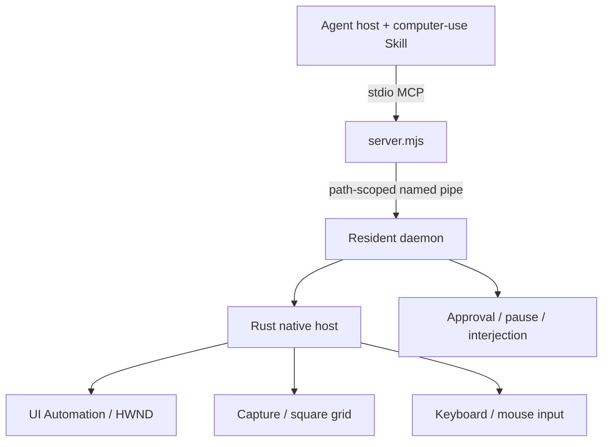

# FastCUA

**A local, accessibility-first Windows control plane for AI agents.**

[Website](https://guojiz.github.io/FastCUA/) · [中文](README_zh.md) · [Technical paper](docs/TECHNICAL_PAPER.md) · [Next design](docs/NEXT_DESIGN.md)

> [!WARNING]
> FastCUA is an experimental project under active development. Use it for testing, not important or unattended work.

FastCUA gives an agent a fast, inspectable interface to Windows applications. It prefers Windows UI Automation text, switches to screenshots and a numbered square grid when semantics are weak, and executes related native actions through one resident local runtime. The human remains in control through visible state, per-app approval, global pause, interjection, and exit controls.

FastCUA is agent-neutral, but a complete installation always has two parts in the **same agent host**:

1. the full `skills/computer-use/` operating policy;
2. the `sky-computer-use` stdio MCP server.

MCP alone is capability without the required procedure. The Skill alone has no executor.

## Model requirement

Use **one full-capability primary model** that can reason over text and images, call Skills and MCP tools, and keep enough context for a multi-step desktop task. Native audio understanding is preferred for recorded narration. Do not configure a separate writer, transcription model, or fallback model for FastCUA; the same active agent observes, acts, reviews evidence, and writes reusable Skills. If it cannot understand an audio track, use the recorded notes or a user-corrected text note instead of adding another model.

## Why FastCUA

| | Vision-first computer use | Browser automation | FastCUA |
|---|---|---|---|
| Main observation | Screenshots | DOM/CDP | UIA text, then vision when needed |
| Scope | Any visible surface | Web content | Windows apps, browser chrome, cross-app flows |
| Execution | Often one action per loop | Browser commands | Several native actions per model turn |
| Runtime state | Often rebuilt per call | Browser session | One warm daemon and native host |
| Human takeover | Integration-dependent | Browser-limited | Global pause, interject, approve, exit |

FastCUA complements in-page browser automation; it does not replace it.

## Architecture


```mermaid
flowchart TB
  A["Agent host + computer-use Skill"] -->|"stdio MCP"| B["server.mjs"]
  B -->|"path-scoped named pipe"| C["Resident daemon"]
  C --> D["Rust native host"]
  D --> E["UI Automation / HWND"]
  D --> F["Capture / square grid"]
  D --> G["Keyboard / mouse input"]
  C --> H["Approval / pause / interjection"]
```

Core behavior:

- **Accessibility first:** use semantic names, roles, values, and bounds when UIA is healthy.
- **Vision on demand:** weak or hung providers produce `prefer_vision:true`; `grid_view` returns one annotated image and can refine one cell into 3×3.
- **One control plane:** all clients share lifecycle, policy, runtime identity, and one physical cursor.
- **Many actions per turn:** a persistent `js` tool exposes bounded `sky.*` operations and cancels late work when a cell ends.
- **Fail explicitly:** stale elements, out-of-bounds coordinates, focus loss, pointer movement, timeout, approval wait, or human interruption stop the action.
- **Local by design:** the console binds to loopback and policy remains on the machine.

For the complete design, formal coordinate model, input state machines, evidence, limitations, recorder architecture, self-hosting, and release process, read the [technical paper](docs/TECHNICAL_PAPER.md).

## Install

Use the PowerShell installer. It installs Node.js through WinGet when needed, downloads the GitHub Release runtime, and verifies its checksum:

```powershell
irm https://raw.githubusercontent.com/Guojiz/FastCUA/main/install.ps1 | iex
```

The verified installer writes `FastCUA Agent Setup.txt` to the desktop. Give it to the agent that will actually use FastCUA. That agent must:

1. install the complete `skills\computer-use` folder into its own Skill system;
2. configure Node.js + the installed `server.mjs` as `sky-computer-use` MCP;
3. reload and verify that the Skill is discoverable;
4. call `list_windows` successfully.

If either the Skill or MCP is missing, installation is incomplete.

### Verify and update

```powershell
& "$env:LOCALAPPDATA\FastCUA\app\install.ps1" -Action Doctor
& "$env:LOCALAPPDATA\FastCUA\app\install.ps1" -Action Check
& "$env:LOCALAPPDATA\FastCUA\app\install.ps1" -Action Update
```

Inside MCP, call `runtime_info` to confirm the exact server, daemon, native host, version, commit, pipe, and data directory in use.

## Human control

| Key | Action |
|---|---|
| `F7` | Pause and open the control center |
| `F8` | Pause or resume |
| `F9` | Pause and interject text |
| `F10` | Exit FastCUA |

The local control center is available at `http://127.0.0.1:8420`. Safe mode asks before acting in an unknown application. Trust uses exact application identity, not fuzzy name matching.

## Example: one multi-step turn

```js
const windows = await sky.list_windows();
const window = windows.find((w) => /Notepad/i.test(w.title));
if (!window) throw new Error("Notepad is not open");

const state = await sky.get_window_state({
  window,
  include_screenshot: false,
  include_text: true,
});

if (state.uia?.prefer_vision) {
  let view = await sky.grid_view({ window });
  view = await sky.grid_refine({ window, grid: view.grid, cell: "4" });
  await sky.click_cell({ window, grid: view.grid, cell: "5" });
} else {
  const editor = /^\s*(\d+)\s+(?:Edit|Document)\b/m.exec(
    state.accessibility.tree || "",
  );
  if (!editor) throw new Error("Editor not found");
  await sky.click({ window, element_index: Number(editor[1]) });
}

await sky.type_text({ window, text: "FastCUA" });
await sky.close();
```

Element indexes belong to the latest UIA snapshot. Refresh after layout changes. Selecting a grid number does not click; only an explicit click helper commits input.

## Record a Skill (preview)

The optional recorder turns a demonstration into an auditable evidence package before any Skill is written:

```text
record → compile evidence → current primary agent writes → provenance lint
       → dry-run with new values → human-reviewed promotion
```

Password fields and secure-desktop moments are structurally redacted. Compiled drafts are non-executable and unverified. The same active full-capability agent reads the evidence and available media, writes the Skill, then runs provenance lint; no writer or transcription model is configured. Out-of-scope applications, unresolved anchors, control-plane interruption, and promotion without explicit review all fail closed. The agent procedure is in `skills/skill-recorder/`; the design and evidence model are in the [technical paper](docs/TECHNICAL_PAPER.md#9-evidence-first-skill-recording).

## Develop from source

```powershell
git clone https://github.com/Guojiz/FastCUA.git
cd FastCUA
.\native-host\build.ps1
```

Then copy the complete `skills\computer-use` directory into the active agent's Skill directory and configure the absolute path to `server.mjs` as a stdio MCP server. Use `runtime_info` to verify the checkout. Reproduction commands and the test matrix are in the [technical paper](docs/TECHNICAL_PAPER.md#12-reproduction-and-operation).

## Boundaries

FastCUA currently targets Windows 11 x64. UAC, Secure Desktop, authentication dialogs, password managers, Windows Security, higher-integrity processes, protected surfaces, and applications with unusual capture/accessibility behavior are outside the normal path. Synthetic input is not hardware input, and the current key-chord implementation still uses the superseded `keybd_event` API. The repository also retains legacy npm and separate-model code that is no longer the recommended design; its removal and the other implementation gaps are tracked in [Next design](docs/NEXT_DESIGN.md).

## Uninstall

```powershell
& "$env:LOCALAPPDATA\FastCUA\app\uninstall.ps1"
```

## License

MIT. See [LICENSE](LICENSE).
