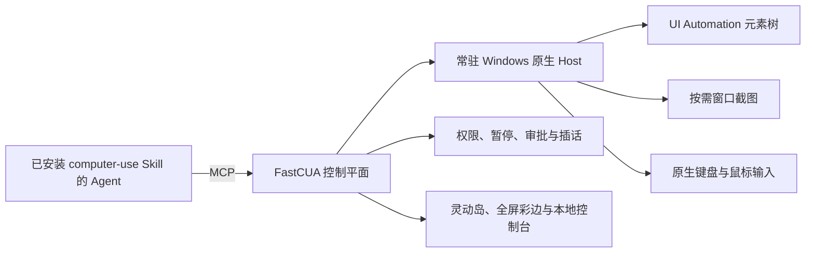

# FastCUA

**把 Windows 图形界面变成 AI 可快速执行的操作接口。**

[官网](https://guojiz.github.io/FastCUA/) · [English](README.md) · [自部署指南](docs/SELF_HOSTING_zh.md)

> **使用你自己的 Agent，并默认安装到它自己。** Windows 安装器负责准备 Node.js 和经过校验的 FastCUA 运行时。随后，接收安装提示词的 Agent 必须把完整 `computer-use` Skill 和 `sky-computer-use` MCP Server 都安装到自己的活动配置中。缺少任意一项都不算安装成功。

FastCUA 是面向 Windows 的开源、本地优先 Computer Use 运行时。它把无障碍元素优先导航、按需截图、原生键鼠输入、多步执行、权限策略和可见的人类控制整合进一个常驻服务。

传统视觉 Computer Use 往往反复执行：**截图 → 模型判断 → 点击 → 再截图**。FastCUA 可以先把 Windows 界面元素读取成文本，让 Agent 一次规划并执行多个相关动作；只有遇到画布、自绘控件或无障碍信息不足的界面时，才调用视觉能力。

## 为什么是 FastCUA

| | 视觉优先 Computer Use | 浏览器 Bridge / 扩展 | FastCUA |
|---|---|---|---|
| 控制范围 | 截图中可见的界面 | 浏览器内部网页 | Windows 桌面应用与浏览器窗口 |
| 主要导航方式 | 像素与坐标 | DOM、CDP、浏览器 API | Windows UI Automation 文本，必要时使用截图 |
| 模型要求 | 通常需要视觉模型 | 通常文本模型即可 | 文本模型或视觉模型均可 |
| 执行方式 | 常见为观察一次、执行一步 | 浏览器命令 | 一个模型回合连续执行多个原生动作 |
| 桌面拖拽与绘图 | 取决于具体实现 | 通常不在其控制范围 | 原生点击、键盘、滚动、拖拽和连续笔画 |
| 人工接管 | 取决于具体实现 | 通常限于浏览器 | 全局暂停、插话、审批、恢复和退出 |

FastCUA 不需要取代浏览器自动化。网页内部如果适合使用 CDP 或浏览器 Bridge，它们仍然可能是最好的工具。FastCUA 负责浏览器之外以及浏览器周围的那一层：应用窗口、系统文件选择框、画图、文件资源管理器、Office 类软件、浏览器外壳，以及跨应用工作流。

## 快速执行路径

### 1. 元素优先，视觉可选

当下一步可以通过文字和控件类型识别时，Agent 可以只请求 Windows 无障碍元素树：

```js
const state = await sky.get_window_state({
  window,
  include_screenshot: false,
  include_text: true,
});
```

遇到画布、设计工具、自绘控件或需要核对最终视觉效果的场景，再单独请求截图。这样不会在像素没有新增信息时，反复把近乎相同的图片送进模型上下文。

### 2. 一个常驻原生 Host

所有连接的客户端共享同一个 Windows 原生 Host 和同一套控制平面。窗口身份、光标状态、审批、暂停与中断，不需要为每个单独动作重新建立。

### 3. 一个模型回合执行多个动作

FastCUA 通过 MCP 提供持久 JavaScript 动作环境，Agent 可以顺序执行一组相关操作，不必在每次鼠标移动之后都返回模型：

```js
await sky.click({ window, x: 180, y: 240 });
await sky.press_key({ window, key: "Control_L+a" });
await sky.type_text({ window, text: "FastCUA" });
await sky.drag({ window, from_x: 120, from_y: 320, to_x: 420, to_y: 180 });
```

当布局、焦点、弹窗或目标元素可能发生变化时，应重新观察界面。窗口结构稳定时，键盘、文本、坐标和绘图动作可以针对同一次捕获连续执行。

## 30 秒上手

适用于 Windows 11。以普通用户身份打开 PowerShell：

```powershell
irm https://raw.githubusercontent.com/Guojiz/FastCUA/main/install.ps1 | iex
```

安装器会准备 Node.js、FastCUA 运行时和经过 SHA-256 校验的原生 Host，并在桌面生成 `FastCUA Agent Setup.txt`。

把这个提示词交给**实际要使用 FastCUA 的 Agent**。默认目标就是接收提示词的 Agent 自己。它必须完成下面三步：

1. 把整个 `skills\computer-use` 文件夹复制、链接或注册到自己的活动 Skill 系统，不能只读取 `SKILL.md`。
2. 把 `sky-computer-use` stdio MCP Server 写入自己的 MCP 配置。
3. 重新加载两者，确认 `computer-use` Skill 可发现，并通过 MCP 成功调用 `list_windows`。

Skill 与 MCP 缺少任意一项，都应判定为安装失败。Agent 还必须报告 Skill 安装位置和被修改的 MCP 配置文件。

然后给 Agent 一个真实任务：

> 打开画图，画一座带太阳和草地的房子。

控制台位于 `http://127.0.0.1:8420`，所有控制接口仅监听本机回环地址。

FastCUA 不限定具体 Agent，但客户端必须同时支持本地 Skill 与 stdio MCP，才能使用完整部署流程。

## 你始终拥有控制权

| 状态 | 视觉提示 | 行为 |
|---|---|---|
| 正常运行 | 小型透明灵动岛 + 全屏彩边 | AI 正在使用电脑，彩边不拦截鼠标操作 |
| 等待确认 | 琥珀色 | 可选择“仅允许一次”“加入白名单”或“拒绝” |
| 完全访问 | 紫色 / 粉色 | 不再逐个应用询问，直到你关闭该模式 |
| 已暂停 | 红色 | 新操作立即被拦截，可一键恢复 |

默认使用安全模式。白名单应用可以直接运行，未知应用需要用户决定。完全访问是独立、可见、可随时撤销的模式。

### 四个全局控制键

| 快捷键 | 操作 |
|---|---|
| `F7` | 暂停并打开控制台 |
| `F8` | 暂停 / 恢复 |
| `F9` | 展开灵动岛并插话 |
| `F10` | 完全退出 FastCUA |

单击灵动岛也会暂停并打开控制台，方便用户直接接管鼠标。Agent 正在控制光标时，全局快捷键仍然可用。

## 不只是鼠标脚本

- **窗口感知坐标**：动作绑定目标窗口，并处理 Windows DPI 缩放，不依赖盲目的全屏绝对坐标。
- **元素与像素相互独立**：根据下一步决策，单独请求文本、截图，或同时请求两者。
- **Windows 原生输入**：支持点击、键盘组合键、Unicode 文本、滚动、拖拽及已支持的无障碍动作。
- **人机双向中断**：用户可以暂停或改变任务方向；机器等待审批时也会自动暂停。
- **精确白名单**：按规范化绝对路径或可执行文件名匹配，不使用危险的子字符串放行。
- **可见而不打扰**：正常状态只保留小型灵动岛；审批、插话和异常时才展开。
- **本地优先**：MCP 流量通过命名管道传输，控制台只绑定 `127.0.0.1`，策略保留在本机。

## 工作方式



## 当前边界

FastCUA 当前面向 Windows 11 x64。安全桌面、UAC 提权界面、身份验证窗口、密码管理器和 Windows 安全界面不属于正常自动化范围。几乎不暴露无障碍信息的应用可能仍需要截图和坐标输入。元素编号属于最近一次无障碍快照，界面布局发生明显变化后应重新读取。

## 自部署

自部署不是只编译并启动 daemon。完整流程是：

1. 克隆并编译原生 Host。
2. 默认把完整 `computer-use` Skill 安装到当前 Agent 自己。
3. 把 `sky-computer-use` MCP 安装到同一个 Agent。
4. 重新加载并同时验证 Skill 与 `list_windows`。

```powershell
git clone https://github.com/Guojiz/FastCUA.git
cd FastCUA
.\native-host\build.ps1
```

正常使用时 MCP 会自动启动 daemon，不必手动运行 `node daemon.mjs`。完整路径、配置模板和验收条件见[自部署指南](docs/SELF_HOSTING_zh.md)。

## 常见问题

**如何立即夺回电脑？** 按 `F7` 暂停，或按 `F10` 完全退出。

**未知软件会静默启动吗？** 安全模式下不会。你可以仅允许一次、加入白名单或拒绝。

**必须使用 Claude Code 吗？** 不是。任何同时支持本地 Skill 与 stdio MCP 的 Agent 都可以安装完整 FastCUA。

**只配置 MCP 可以吗？** 不可以。FastCUA 的标准安装要求同一个 Agent 同时安装 `computer-use` Skill 与 `sky-computer-use` MCP，并通过双重验证。

**FastCUA 会完全取消截图吗？** 不会。它让截图变成按需选项。无障碍文本能够准确表达界面时优先使用文本，需要视觉判断时仍然可以截图。

**FastCUA 只用于浏览器吗？** 不是。浏览器窗口只是 Windows 桌面应用中的一个目标。网页内部更适合 DOM 或网络级访问时，也可以把浏览器原生自动化与 FastCUA 组合使用。

**如何卸载？**

```powershell
& "$env:LOCALAPPDATA\FastCUA\app\uninstall.ps1"
```

卸载器会删除 FastCUA 运行时，但不会自动删除各 AI 客户端中的 Skill 与 MCP 配置。需要在曾经安装 FastCUA 的 Agent 中移除 `computer-use` Skill 和 `sky-computer-use` MCP 条目。

## 许可

Apache-2.0，详见 [LICENSE](LICENSE)。
