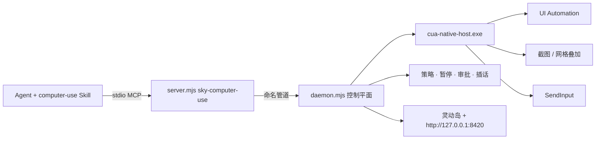

# FastCUA

**把 Windows 图形界面变成 AI 可快速执行的操作接口。**

[官网](https://guojiz.github.io/FastCUA/) · [English](README.md) · [自部署指南](docs/SELF_HOSTING_zh.md) · [卡住/超时](docs/STUCK_zh.md)

> **使用你自己的 Agent，并默认安装到它自己。** Windows 安装器负责准备 Node.js 和经过校验的 FastCUA 运行时。随后，接收安装提示词的 Agent 必须把完整 `computer-use` Skill 和 `sky-computer-use` MCP Server 都安装到自己的活动配置中。缺少任意一项都不算安装成功。

FastCUA 是面向 Windows 的开源、本地优先 Computer Use 运行时。它把无障碍优先导航、按需截图、原生键鼠、多步执行、权限策略和可见的人类控制整合进一个常驻服务。

### 文档地图（不要串角色）

| 文档 | 读者 | 职责 |
|------|------|------|
| **本 README** | 所有人 | 产品定位、设计原理、一键安装、FAQ |
| [docs/SELF_HOSTING_zh.md](docs/SELF_HOSTING_zh.md) | 部署方 | 编译运行时，把 **Skill + MCP** 接到 Agent |
| [docs/STUCK_zh.md](docs/STUCK_zh.md) | 部署方 + Agent | 30s 预算、烂树 → 视觉、卡住类型、白名单含义 |
| `skills/computer-use/` | 仅 Agent | 接入、控制平面标签、网格规程、安全禁令 |
| MCP `server.mjs` | 运行时 | 工具 + 持久 `sky` — 不是第二份 Skill |

某一客户端的专属说明放在 `docs/` 下，不当作产品门面。

## 设计原理

下面是产品与实现的硬规则，不是宣传话术。Agent 操作规程在 Skill；安装细节在自部署指南。

### 1. 元素优先，视觉可选

下一步能靠名称、角色、取值识别时，优先用 Windows UI Automation 文本。只有像素带来新信息时才截图（画布、自绘控件、核对结果）。不要每步都把几乎相同的全窗口图塞进模型。

### 2. 一条常温控制平面

所有 Agent 客户端共享 **一个常驻 daemon** 和 **一个原生 Host（一根光标）**。窗口身份、审批、暂停、插话都在这条控制平面上，不为每次点击重建。

### 3. 一个模型回合执行多步

MCP 提供持久 JS 环境（`sky.*`）。同一回合内可连续点、键、输字、拖、滚。只有布局、焦点或模态可能变化时再观察。

### 4. 坐标空间 = 窗口截图像素

`click` / `drag` / `scroll` 的 **x,y** 在 **窗口截图像素** 中，原点为窗口左上角，与 `get_window_state().viewport` 以及 `screenshots[0]` 的宽高一致。禁止臆造桌面绝对坐标。

### 5. 软件侧快速失败（30 秒）

每次桌面 helper 请求、MCP 往返、JS 单元默认 **30 秒**预算。超时：最多 **再试一次**，然后换策略或报告。人类暂停与审批等待**不是**软件挂起——Agent 不得靠刷工具去「修」。详见 [STUCK_zh.md](docs/STUCK_zh.md)。

### 6. 视觉定位 = Apple 式正方形数字网格

UIA 弱或 `state.uia.prefer_vision === true`（空树/壳树/点不到——见 [STUCK_zh.md](docs/STUCK_zh.md)）时，**立刻**切视觉（与 Skill 同一条规则）：

1. `sky.grid_view({ window })` → **一张** 标注图：半透明 **正方形** 格线 + 小号描边数字。
2. 只 **选择** 编号（**不等于** 点击）。
3. `sky.grid_refine({ window, grid, cell })` → **只在选中格内** 裁剪并画 3×3 正方形（仍是一张图）。
4. 足够精确后再 `sky.click_cell(...)`。

选择 ≠ 点击。定位时优先 `grid_view`，少用原始全图。

### 7. 人类控制平面是一等公民

可见状态 + 全局热键：

| 键 | 含义 |
|----|------|
| `F7` | 暂停并打开控制中心 |
| `F8` | 暂停 / 恢复 |
| `F9` | 先暂停，再输入插话 |
| `F10` | 彻底退出（Agent 禁止自重启） |

发给 Agent 的消息带稳定标签。**只有** 插话是指令；其余是阻塞或停止：

| 标签 | 类型 | Agent 行为 |
|------|------|------------|
| `[control_plane:paused]` | 阻塞 | 停工具；等恢复或用户新聊天 |
| `[control_plane:interjection]` | 指令（一次性） | 放弃旧计划；只跟插话；可立刻继续工具（自动恢复） |
| `[control_plane:stopped]` | 停止 | 结束本回合 Computer Use |
| `[control_plane:shutdown]` | 终态 | 禁止重启 FastCUA 或继续桌面自动化 |
| `[control_plane:awaiting_approval]` | 阻塞 | 不要循环重试 |

### 8. 默认安全，本地优先

Safe 模式对未知应用要求人工审批。信任匹配精确可执行路径/名，不用模糊子串。常见本地工具带默认 **白名单**，仅跳过审批弹窗——**不是**允许自动化 Skill 禁止的面（终端、密码管理器、安全界面）。MCP 走命名管道；控制台只绑 `127.0.0.1`。策略留在本机。

### 9. Agent 中立，Skill 与 MCP 成对

不绑定某一家客户端。完整安装 = **同一个** 将要使用它的 Agent 里同时有 **Skill 目录** + **stdio MCP**。只装其一不算成功。安装器准备本机运行时；Agent 仍须把两半装进**自己**。

## 架构



| 层 | 职责 |
|----|------|
| **Skill** | Agent 规程：接入、坐标规则、控制平面标签 |
| **MCP `server.mjs`** | 工具 + 持久 `js` REPL（`sky`） |
| **Daemon** | 共享 Host 生命周期、审批缓存、暂停 / 插话 / 关机 |
| **Native host** | UIA 树、PrintWindow 截图、网格叠加、输入 |
| **Overlay / 控制台** | 人类 UI（本机回环） |

## 为什么是 FastCUA

| | 视觉优先 Computer Use | 浏览器 Bridge | FastCUA |
|---|---|---|---|
| 范围 | 截图可见区域 | 网页内部 | Windows 应用 + 浏览器外壳 |
| 主导航 | 像素 | DOM / CDP | UIA 文本；必要时截图 |
| 模型 | 通常要视觉 | 常可文本 | 文本或视觉均可 |
| 执行 | 常一步一循环 | 浏览器命令 | 一回合多步原生动作 |
| 人工接管 | 视实现 | 多限于浏览器 | 全局暂停、插话、审批、退出 |

FastCUA 不取代页内浏览器自动化，负责其周围的桌面层：窗口、系统对话框、画图、资源管理器、Office 类软件与跨应用流程。

## 30 秒开始

Windows 11 普通用户 PowerShell：

```powershell
irm https://raw.githubusercontent.com/Guojiz/FastCUA/main/install.ps1 | iex
```

安装器准备 Node.js、运行时与 SHA-256 校验的原生 Host，并在桌面生成 `FastCUA Agent Setup.txt`。

把该提示交给 **真正要使用 FastCUA 的 Agent**。它必须：

1. 把完整 `skills\computer-use` 装进自己的 Skill 系统（不能只做指向源码的转发 stub）。
2. 添加 `sky-computer-use` stdio MCP（Node → `server.mjs`）。
3. 重载后确认 Skill 可发现，并成功通过 MCP 调用 `list_windows`。

缺 Skill 或 MCP 任一即安装失败。

本机控制中心：`http://127.0.0.1:8420`（仅回环）。

## 你始终掌控

| 状态 | 信号 | 行为 |
|---|---|---|
| 活动 | 紧凑岛 + 边框 | AI 在用电脑；边框可点击穿透 |
| 审批 | 琥珀色 | `1` 一次 · `2` 总是 · `3` 完全访问 · `4` 拒绝 |
| 完全访问 | 紫 / 粉 | 关闭前不再逐应用提示 |
| 暂停 | 红 | 阻塞新动作；一步恢复 |

## 示例：多步回合

```js
const windows = await sky.list_windows();
const window = windows.find((w) => /Notepad/i.test(w.title));
await sky.activate_window({ window });
await sky.type_text({ window, text: "FastCUA", replace: true });
let gv = await sky.grid_view({ window });
gv = await sky.grid_refine({ window, grid: gv.grid, cell: "4" });
await sky.click_cell({ window, grid: gv.grid, cell: "5" });
await sky.close(); // 结束本 MCP 回合；daemon 继续常驻
```

## 当前边界

Windows 11 x64。安全桌面、UAC、认证框、密码管理器与系统安全界面不在常规路径内。无障碍信息少的应用需截图 / 网格定位。元素索引属于最近一次 UIA 快照，布局变化后应刷新。

## 自部署

```powershell
git clone https://github.com/Guojiz/FastCUA.git
cd FastCUA
.\native-host\build.ps1
```

再把 Skill + MCP 装进 Agent。MCP 会自动拉起 daemon。详见 [docs/SELF_HOSTING_zh.md](docs/SELF_HOSTING_zh.md)。

## 常见问题

**立刻接管？** `F7` 暂停或 `F10` 退出。

**Agent 如何结束回合？** 验证后调用一次 MCP `close`。只关本客户端连接，不关共享 daemon。

**未知应用会静默启动吗？** Safe 模式下不会。

**必须特定 Agent 吗？** 不必，只要支持本地 Skill 与 stdio MCP。

**只配 MCP 可以吗？** 不可以，Skill 与 MCP 必须成对。

**卸载：**

```powershell
& "$env:LOCALAPPDATA\FastCUA\app\uninstall.ps1"
```

## 许可证

MIT。详见 [LICENSE](LICENSE)。
