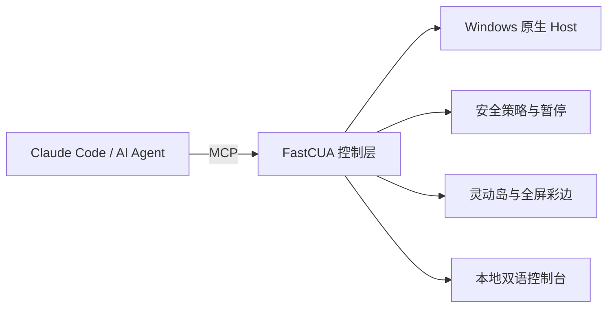

# FastCUA

**让 AI 操作你的 Windows，同时把暂停、插话和最终决定权留在你手里。**

[English](README.md) · [自部署指南](docs/SELF_HOSTING_zh.md)

FastCUA 是面向 Claude Code 等 AI Agent 的本地 Computer Use 控制层。它把 MCP、Windows 原生键鼠控制、权限策略和可见状态整合成一个常驻服务：AI 可以连续完成真实桌面任务，你随时可以暂停、插话或退出。

## 30 秒上手

适用于 Windows 11。以普通用户身份打开 PowerShell：

```powershell
irm https://raw.githubusercontent.com/Guojiz/FastCUA/main/install.ps1 | iex
```

安装器会准备 Node.js、Claude Code、FastCUA 原生组件、MCP 配置和 Computer Use Skill。完成后直接对 Claude Code 说：

> 打开画图，画一座带太阳和草地的房子。

控制台位于 `http://127.0.0.1:8420`，所有控制接口仅监听本机回环地址。

## 你始终拥有控制权

| 状态 | 视觉提示 | 行为 |
|---|---|---|
| 正常运行 | 小型透明灵动岛 + 全屏彩边 | AI 正在使用电脑，鼠标操作仍可穿透边框 |
| 等待确认 | 琥珀色 | 可选择“仅允许一次”“加入白名单”或“拒绝” |
| 完全访问 | 紫粉色 | 不再逐次询问，直到你关闭该模式 |
| 已暂停 | 红色 | 新操作立即被拦截，可一键恢复 |

默认使用安全模式：白名单应用直接运行，未知应用需要确认。完全访问是独立、可见、可随时撤销的模式。

## 四个快捷键

| 快捷键 | 操作 |
|---|---|
| `F7` | 暂停并打开控制台 |
| `F8` | 暂停 / 恢复 |
| `F9` | 展开灵动岛并插话 |
| `F10` | 完全退出 FastCUA |

单击灵动岛也会进入控制台并暂停，适合鼠标接管；机器操作期间则推荐使用全局快捷键。

## 为什么不是普通的鼠标脚本

- **一个常驻原生 Host**：多个 Agent 共享窗口、光标、审批和暂停状态，减少重复启动和上下文漂移。
- **窗口感知操作**：坐标绑定目标窗口并适配 Windows DPI 缩放，不依赖盲目的全屏绝对坐标。
- **人机双向中断**：用户可以暂停，机器在等待授权时也会暂停；恢复后继续同一控制平面。
- **精确白名单**：按规范化绝对路径或可执行文件名匹配，不使用危险的子字符串放行。
- **可见而不打扰**：常态只显示小岛；插话、授权和异常时才展开。静态彩边保持低资源占用。
- **本地优先**：命名管道承载 MCP 请求，控制台只绑定 `127.0.0.1`，策略和日志留在本机。

## 工作方式



## 自部署

需要自行审计、修改或构建原生组件时：

```powershell
git clone https://github.com/Guojiz/FastCUA.git
cd FastCUA
.\native-host\build.ps1
node daemon.mjs
```

详细的 MCP 配置、构建验证、协议与故障排查见[自部署指南](docs/SELF_HOSTING_zh.md)。

## 常见问题

**如何立刻夺回电脑？**  按 `F7` 暂停，或按 `F10` 完全退出。

**未知软件会直接启动吗？**  安全模式下不会。你可以仅允许一次、加入白名单或拒绝。

**必须使用 Claude Code 吗？**  不是。任何支持 stdio MCP 的客户端都可连接 `server.mjs`。

**如何卸载？**

```powershell
& "$env:LOCALAPPDATA\FastCUA\app\uninstall.ps1"
```

## 许可

Apache-2.0，详见 [LICENSE](LICENSE)。
