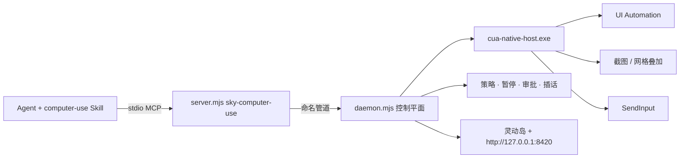

# FastCUA

**把 Windows 图形界面变成 AI 可快速执行的操作接口。**

[官网](https://guojiz.github.io/FastCUA/) · [English](README.md) · [自部署指南](docs/SELF_HOSTING_zh.md)

> [!WARNING]
> **FastCUA 仍在开发中，尚未完全完成。** 当前版本可能存在 Bug、功能缺失或兼容性问题，仅建议用于测试，请勿用于重要任务。

> **使用你自己的 Agent，并默认安装到它自己。** Windows 安装器负责准备 Node.js 和经过校验的 FastCUA 运行时。随后，接收安装提示词的 Agent 必须把完整 `computer-use` Skill 和 `sky-computer-use` MCP Server 都安装到自己的活动配置中。缺少任意一项都不算安装成功。

FastCUA 是面向 Windows 的开源、本地优先 Computer Use 运行时。它把无障碍优先导航、按需截图、原生键鼠、多步执行、权限策略和可见的人类控制整合进一个常驻服务。

**各放哪里（一句话）：** 人看本 README + [自部署](docs/SELF_HOSTING_zh.md)；Agent **只**加载 `skills/computer-use/`（Skill）并调 MCP——不要去读仓库里的「卡住文档」。

## 设计原理

产品与运行时的硬规则。Agent 逐步怎么操作**不在这里**——在 Skill。

### 1. 元素优先，视觉可选

下一步能靠名称、角色、取值识别时，优先用 Windows UI Automation 文本。只有像素带来新信息时才截图（画布、自绘控件、核对结果）。不要每步都把几乎相同的全窗口图塞进模型。

### 2. 一条常温控制平面

所有 Agent 客户端共享 **一个常驻 daemon** 和 **一个原生 Host（一根光标）**。窗口身份、审批、暂停、插话都在这条控制平面上，不为每次点击重建。

### 3. 一个模型回合执行多步

MCP 提供持久 JS 环境（`sky.*`）。同一回合内可连续点、键、输字、拖、滚。只有布局、焦点或模态可能变化时再观察。

### 4. 坐标空间 = 窗口截图像素

`click` / `drag` / `scroll` 的 **x,y** 在 **窗口截图像素** 中，原点为窗口左上角，与 `get_window_state().viewport` 以及 `screenshots[0]` 的宽高一致。禁止臆造桌面绝对坐标。截图可能按 1568px 长边缩小：像素操作前先读 `viewport.scale`；返回 `unchanged: true` 表示复用上一张图。

### 5. 软件侧快速失败（30 秒）

每次桌面 helper 请求、MCP 往返、JS 单元默认 **30 秒**预算。超时运行时会失败；Agent 最多再试一次再换策略（规程在 Skill）。人类暂停与审批等待另算——不是软件挂起。

目标应用卡死时，helper 内部有更紧的边界：UIA provider 挂起约 1.5 秒即超时，此后该应用的 UIA 在本次会话内被禁用（请求照常返回，回退到 HWND 树并给出 `uia.prefer_vision: true`）。窗口激活（约 1.5 秒）与截图捕获（约 3 秒）同样有界；对无响应窗口，截图与 `grid_view` 通过 BitBlt 依然可用。跨进程读取窗口标题绝不阻塞宿主，因此卡死的应用仍会带着已存储的标题出现在 `list_windows` 中。共享 helper 在上述情况下都会存活——整体重启只是最后手段，而非常态。

### 6. 视觉定位 = Apple 式正方形数字网格

UIA 弱或 `state.uia.prefer_vision === true` 时运行时会给出信号；Agent 必须立刻切视觉（Skill）。产品形态：

1. `sky.grid_view({ window })` → **一张** 标注图：半透明 **正方形** 格线 + 小号描边数字。
2. 只 **选择** 编号（**不等于** 点击）。
3. `sky.grid_refine({ window, grid, cell })` → **只在选中格内** 裁剪并画 3×3 正方形（仍是一张图）。
4. 足够精确后再 `sky.click_cell(...)`（格子中心）、`sky.click_in_cell(...)`（格内 x,y）或 `sky.click_view({window, view, x, y})`（视图内精确点）。

选择 ≠ 点击。定位时优先 `grid_view`，少用原始全图。

### 7. 人类控制平面是一等公民

可见状态 + 全局热键：

| 键 | 含义 |
|----|------|
| `F7` | 暂停并打开控制中心 |
| `F8` | 暂停 / 恢复 |
| `F9` | 先暂停，再输入插话 |
| `F10` | 彻底退出（Agent 禁止自重启） |

Agent 在工具错误里收到稳定的 `[control_plane:…]` 标签。**如何分支只写在 Skill 里**——这里不重复规程。

### 8. 默认安全，本地优先

Safe 模式对未知应用要求人工审批。信任匹配精确可执行路径/名，不用模糊子串。常见本地工具带默认 **白名单**，只跳过审批弹窗；Skill 安全禁令（终端、密码管理器、安全界面）仍生效。MCP 走命名管道；控制台只绑 `127.0.0.1`。策略留在本机。

### 9. Agent 中立，Skill 与 MCP 成对

不绑定某一家客户端。完整安装 = **同一个** 将要使用它的 Agent 里同时有 **Skill 目录** + **stdio MCP**。只装其一不算成功。安装器准备本机运行时；Agent 仍须把两半装进**自己**。

## 架构



| 层 | 职责 | 谁读 |
|----|------|------|
| **Skill** `skills/computer-use/` | 桌面任务怎么跑（接入、标签、网格、安全） | **仅 Agent** |
| **MCP** `server.mjs` | 工具 + 持久 `js` / `sky` | Agent 的工具（不是说明书） |
| **Daemon + host** | 生命周期、UIA、截图、输入、策略 | 运行时 |
| **README / 自部署** | 给人看的产品与安装 | **人** |
| **Overlay / 控制台** | 暂停、审批、插话 | 人 |

## 为什么是 FastCUA

| | 视觉优先 Computer Use | 浏览器 Bridge | FastCUA |
|---|---|---|---|
| 范围 | 截图可见区域 | 网页内部 | Windows 应用 + 浏览器外壳 |
| 主导航 | 像素 | DOM / CDP | UIA 文本；必要时截图 |
| 模型 | 通常要视觉 | 常可文本 | 文本或视觉均可 |
| 执行 | 常一步一循环 | 浏览器命令 | 一回合多步原生动作 |
| 人工接管 | 视实现 | 多限于浏览器 | 全局暂停、插话、审批、退出 |

FastCUA 不取代页内浏览器自动化，负责其周围的桌面层：窗口、系统对话框、画图、资源管理器、Office 类软件与跨应用流程。

## 30 秒开始

Windows 11，已有 Node 18+ 时用 **npm 一句话**：

```bash
npx fastcua
```

或 PowerShell（缺 Node 时会用 WinGet 安装）：

```powershell
irm https://raw.githubusercontent.com/Guojiz/FastCUA/main/install.ps1 | iex
```

两者走同一套校验安装：运行时、SHA-256 原生 Host、桌面 `FastCUA Agent Setup.txt`。

把该提示交给 **真正要使用 FastCUA 的 Agent**。它必须：

1. 把完整 `skills\computer-use` 装进自己的 Skill 系统（不能只做指向源码的转发 stub）。
2. 添加 `sky-computer-use` stdio MCP（Node → `server.mjs`）。
3. 重载后确认 Skill 可发现，并成功通过 MCP 调用 `list_windows`。

缺 Skill 或 MCP 任一即安装失败。

本机控制中心：`http://127.0.0.1:8420`（仅回环）。

### 更新与版本检查

```powershell
npx fastcua check
npx fastcua update
npx fastcua doctor
```

正式安装版每天最多检查一次更新，只通知、不静默安装。更新使用一个经过校验的运行时 ZIP，保留 `app.previous` 供回滚，绝不会覆盖开发仓库。通过 MCP 调用 `runtime_info` 可以查看实际使用的 server、daemon、native-host、版本、Git 提交、管道和数据目录。参阅[发行与更新](docs/RELEASING_zh.md)。

## 你始终掌控

| 状态 | 信号 | 行为 |
|---|---|---|
| 活动 | 紧凑岛 + 边框 | AI 在用电脑；边框可点击穿透 |
| 审批 | 琥珀色 | `1` 一次 · `2` 总是 · `3` 完全访问 · `4` 拒绝 |
| 完全访问 | 紫 / 粉 | 关闭前不再逐应用提示 |
| 暂停 | 红 | 阻塞新动作；一步恢复 |

## 示例：多步回合

```js
const windows = await sky.list_windows();
const window = windows.find((w) => /Notepad/i.test(w.title));
await sky.activate_window({ window });
const state = await sky.get_window_state({ window, include_screenshot: false, include_text: true });
const editor = /^\s*(\d+)\s+(?:Edit|Document)\b/m.exec(state.accessibility.tree || "");
if (!editor) throw new Error("Notepad editor not found");
await sky.click({ window, element_index: Number(editor[1]) });
// 决定替换或在光标处输入前，先读取 focused_value。
const focused = await sky.get_window_state({ window, include_screenshot: false, include_text: true });
if (focused.accessibility.focused_value === undefined) throw new Error("Focused value was not observed");
// 此示例有意在当前光标处插入；仅在决定替换已读取的值后使用 replace:true。
await sky.type_text({ window, text: "FastCUA" });
let gv = await sky.grid_view({ window });
gv = await sky.grid_refine({ window, grid: gv.grid, cell: "4" });
await sky.click_cell({ window, grid: gv.grid, cell: "5" });
await sky.close(); // 结束本 MCP 回合；daemon 继续常驻
```

## 录制技能（预览）

> **状态：已验证的预览版。** 在真实 Windows 11 上可用；已针对 FastCUA 测试夹具完成端到端验证（60+ 项真机检查：录制 → 编译 → 应用重启后用新参数值干跑 → 故障安全演练）。仍欠一次短时真人输入对比（目前所有验证输入均为自动化注入，并已被如实标记）。

`tools/skill-recorder` 观察一段真实演示——你亲手操作，或由 FastCUA 自己驱动的合成演示——先把它编译成一份**可审计、不可执行的证据包**，再由专用子代理撰写 Skill。整个流程由 Agent 驱动；用户负责演示、审查和拍板：

1. **录制** — 捕获 UIA 锚点、采样后的指针轨迹、滚轮轴向与 delta、稀疏关键帧、本地 MJPEG 视频、可选 WAV 旁白和文字笔记；滚轮输入与拖动手势保持独立，密码框与安全桌面在结构层脱敏。
2. **编译证据** — `session.jsonl` 生成规范的 `evidence.json`/`evidence.md` 和确定性的 `draft.json`/`draft.md`。`--skill` 只写合成请求，不写 `SKILL.md`；参数与不确定项都保留来源。
3. **子代理合成 + 溯源校验** — 在 FastCUA 控制台单独配置 OpenAI 兼容 API、Skill 执笔模型和可选转录模型，密钥独立保存。无桌面工具的专用子代理负责自然语言 Skill；lint 要求每个步骤、参数和警告都有证据引用，并拒绝编造。旁白按“模型直接读音频 → 转录 API → 文字旁白/录制笔记”降级；`typed` 模式不会上传音频。
4. **审查** — Agent 向用户呈现参数、警告、脱敏、应用范围、使用模型和旁白路径；可用 `frame-extract.mjs` 查看未脱敏的指定时刻，不靠猜测。
5. **干跑** — 通过正常控制平面，用不同参数值回放确定性草稿。未决步骤需显式决策；脱敏步骤永不执行；范围或锚点失败会安全中止。
6. **晋升** — 只有用户明确批准后才检测当前宿主的 Skill 目录并运行 `promote.mjs`。审查与验证闸门保持生效，绝不静默安装。

Agent 操作规程在 `skills/skill-recorder/`；格式与设计见 [docs/skill-recorder-design.md](docs/skill-recorder-design.md)。

## 当前边界

Windows 11 x64。安全桌面、UAC、认证框、密码管理器与系统安全界面不在常规路径内。无障碍信息少的应用需截图 / 网格定位。元素索引属于最近一次 UIA 快照，布局变化后应刷新。

## 自部署

```powershell
git clone https://github.com/Guojiz/FastCUA.git
cd FastCUA
.\native-host\build.ps1
```

再把 Skill + MCP 装进 Agent。MCP 会自动拉起 daemon。详见 [docs/SELF_HOSTING_zh.md](docs/SELF_HOSTING_zh.md)。

## 常见问题

**立刻接管？** `F7` 暂停或 `F10` 退出。

**Agent 如何结束回合？** 验证后调用一次 MCP `close`。只关本客户端连接，不关共享 daemon。

**未知应用会静默启动吗？** Safe 模式下不会。

**必须特定 Agent 吗？** 不必，只要支持本地 Skill 与 stdio MCP。

**只配 MCP 可以吗？** 不可以，Skill 与 MCP 必须成对。

**卸载：**

```powershell
& "$env:LOCALAPPDATA\FastCUA\app\uninstall.ps1"
```

## 许可证

MIT。详见 [LICENSE](LICENSE)。
