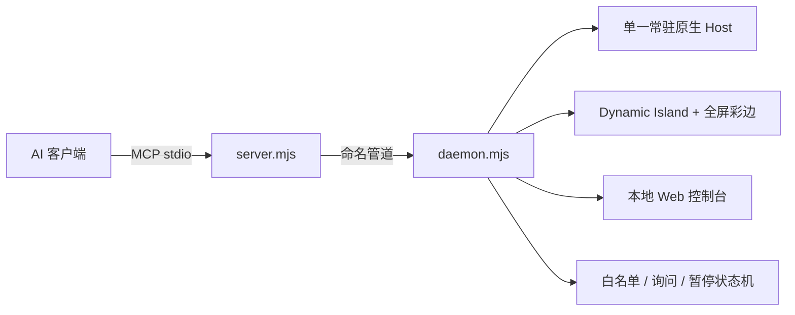

# FastCUA

**面向 Windows AI Agent 的本地优先 Computer Use 控制平面。**

[English](README.md) · [中文自部署](docs/SELF_HOSTING_zh.md) · [Self-hosting](docs/SELF_HOSTING.md)

FastCUA 让 AI 可以受控地操作 Windows 桌面，同时始终把最终控制权留给用户。所有客户端共享一个常驻原生 Host，因此光标、桌面上下文、授权、暂停和中断在整个任务中保持一致。

## 它为什么更顺手

| 能力 | 用户体验 |
|---|---|
| **小型 Dynamic Island** | 正常状态只显示一个透明小岛，不遮挡内容。仅在按下 `F9` 时展开插话输入框。 |
| **全屏状态彩边** | 不拦截点击的彩虹边框表示正在接管；琥珀色表示等待授权；红色表示暂停或离线。 |
| **白名单优先** | 精确匹配可执行文件名或规范路径。白名单应用无需授权，未知应用默认拒绝。 |
| **独立询问模式** | 可切换为“未知应用询问”，岛会展示仅允许一次、信任应用、拒绝三个选择。 |
| **人机双暂停** | 用户暂停会立即拦截新操作；等待授权也是机器暂停。一键即可恢复。 |
| **共享热 Host** | 多个客户端共用一个常驻 Host，不必为每个动作重新建立桌面状态。 |
| **现代双语控制台** | `127.0.0.1:8420` 可查看状态、时间线、授权、策略与自部署说明。 |

## 全局快捷键

| 快捷键 | 功能 |
|---|---|
| `F7` | 暂停控制并打开本地设置 |
| `F8` | 暂停 / 恢复切换 |
| `F9` | 展开小岛并插话 |
| `F10` | 完全退出 FastCUA |

## 架构



HTTP 只监听回环地址，客户端通过 `\\.\pipe\fastcua` 连接。原生 Host 会在授权前核验窗口与进程归属，启动应用只接受真实存在的绝对 `.exe` 路径。

## 快速开始

需要 Windows 11、Node.js 18+；编译内置原生 Host 还需要 Rust stable。

```powershell
git clone https://github.com/Guojiz/FastCUA.git
cd FastCUA
./native-host/build.ps1
node daemon.mjs
```

打开 `http://127.0.0.1:8420`，再把 MCP 客户端指向 `server.mjs` 的绝对路径：

```json
{
  "mcpServers": {
    "fastcua": {
      "command": "node",
      "args": ["C:\\path\\to\\FastCUA\\server.mjs"]
    }
  }
}
```

daemon 会自动发现 `native-host/target/release/cua-native-host.exe`。也可以用 `CUA_BIN` 或 `cuaBinPath` 指定其他兼容 Host。

## 安全模型

- 默认策略为 `safe`：可信条目按可执行文件名或规范绝对路径精确匹配；未知应用可选择仅允许一次、加入可信名单或拒绝，授权请求 60 秒后自动失效。
- `full` 是独立的免询问模式，启用期间始终以紫粉色明确提示。
- 修改白名单或授权策略会清空内存中的历史放行缓存。
- 暂停会重置原生 Host、拒绝待处理工作，并拦截新的桌面请求。
- 停止与插话会拒绝进行中的操作，并为所有连接客户端写入中断标记；退出会释放 Helper、浮窗、命名管道和 HTTP 服务。
- 控制 API 仅绑定 `127.0.0.1`，同时限制网页嵌入与跨域访问。
- 本机 Helper、日志、构建产物和机器专属路径不会进入 Git。

完整构建、验证、故障排查与协议说明见 [SELF_HOSTING_zh.md](docs/SELF_HOSTING_zh.md)。

## 仓库结构

| 路径 | 用途 |
|---|---|
| `daemon.mjs` | 常驻控制平面、策略、中断、Web API 与浮窗生命周期 |
| `server.mjs` | MCP 到命名管道的薄桥接层 |
| `native-host/` | 开源 Windows 原生 Computer Use Host |
| `overlay.ps1`、`card.xaml` | Dynamic Island 与全屏穿透状态彩边 |
| `web.html` | 双语本地控制台与自部署页面 |
| `tests/` | 协议、授权和回归测试 |

## 许可

Apache-2.0，见 [LICENSE](LICENSE)。
