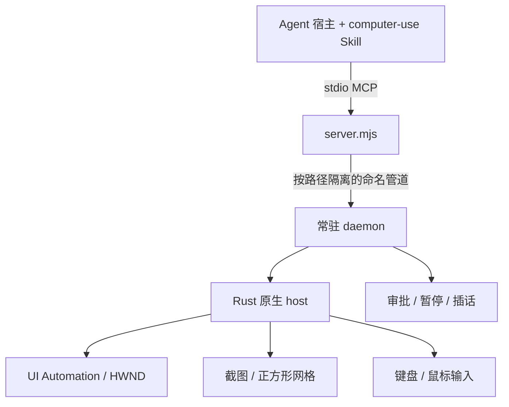

# FastCUA

**面向 AI Agent 的本地、元素优先 Windows 控制平面。**

[网站](https://guojiz.github.io/FastCUA/) · [English](README.md) · [技术论文](docs/TECHNICAL_PAPER.md) · [下一步设计](docs/NEXT_DESIGN.md)

> [!WARNING]
> FastCUA 仍是快速开发中的实验项目。请只用于测试，不要用于重要或无人值守的工作。

FastCUA 为 Agent 提供一套快速、可审计的 Windows 应用接口。它优先读取 Windows UI Automation 文本；当语义信息不足时，再切换到截图和正方形数字网格；相关的多个原生动作由一个常驻本地运行时执行。人类可以通过可见状态、按应用审批、全局暂停、插话和退出控制始终掌握电脑。

FastCUA 不绑定某一家 Agent，但完整安装必须在**同一个 Agent 宿主**内同时具备：

1. 完整的 `skills/computer-use/` 操作规范；
2. `sky-computer-use` stdio MCP Server。

只装 MCP 等于有能力却缺少必要操作规范；只装 Skill 则没有执行器。

## 模型要求

只使用**一个五官齐全的主模型**：能够理解文本和图像、调用 Skill 与 MCP 工具，并保留足够上下文完成多步桌面任务；若要使用录制旁白，最好还能原生理解音频。FastCUA 不再要求配置独立 writer、转写模型或备用模型。同一个当前 Agent 负责观察、操作、审查证据并写出可复用 Skill。如果它无法理解音频，就使用录制时的文字笔记或用户修正的文本，不再额外接入另一个模型。

## 为什么使用 FastCUA

| | 视觉优先 Computer Use | 浏览器自动化 | FastCUA |
|---|---|---|---|
| 主要观察方式 | 截图 | DOM/CDP | UIA 文本，不足时再用视觉 |
| 范围 | 任意可见界面 | 网页内容 | Windows 应用、浏览器外壳、跨应用流程 |
| 执行方式 | 通常每轮一个动作 | 浏览器命令 | 一个模型回合执行多个原生动作 |
| 运行时状态 | 常按调用重建 | 浏览器会话 | 一个常驻 daemon 与原生 host |
| 人类接管 | 取决于集成 | 仅限浏览器 | 全局暂停、插话、审批、退出 |

FastCUA 是网页内自动化的补充，不是替代品。

## 架构


```mermaid
flowchart TB
  A["Agent 宿主 + computer-use Skill"] -->|"stdio MCP"| B["server.mjs"]
  B -->|"按路径隔离的命名管道"| C["常驻 daemon"]
  C --> D["Rust 原生 host"]
  D --> E["UI Automation / HWND"]
  D --> F["截图 / 正方形网格"]
  D --> G["键盘 / 鼠标输入"]
  C --> H["审批 / 暂停 / 插话"]
```

核心行为：

- **元素优先：** UIA 健康时使用语义名称、角色、值和边界。
- **按需视觉：** 弱或卡死的 provider 会返回 `prefer_vision:true`；`grid_view` 只给出一张标注图，并可把一个格子继续细分为 3×3。
- **单一控制平面：** 所有客户端共享生命周期、策略、运行时身份和同一个物理光标。
- **一轮多步：** 持久化 `js` 工具提供受限的 `sky.*` 操作；cell 结束时会取消迟到任务。
- **显式失败：** 过期元素、越界坐标、焦点丢失、光标被移动、超时、等待审批或人类中断都会停止动作。
- **本地优先：** 控制台只绑定 loopback，策略留在电脑本地。

完整设计、形式化坐标模型、输入状态机、证据、限制、录制器架构、自部署与发行流程统一收录在[技术论文](docs/TECHNICAL_PAPER.md)中。

## 安装

统一使用 PowerShell 安装器。它会在需要时通过 WinGet 安装 Node.js，从 GitHub Release 下载运行时并校验哈希：

```powershell
irm https://raw.githubusercontent.com/Guojiz/FastCUA/main/install.ps1 | iex
```

经过校验的安装器会在桌面生成 `FastCUA Agent Setup.txt`。把它交给真正要使用 FastCUA 的 Agent。该 Agent 必须：

1. 把完整 `skills\computer-use` 文件夹安装到自己的 Skill 系统；
2. 把 Node.js + 已安装的 `server.mjs` 配置为 `sky-computer-use` MCP；
3. 重新加载并确认 Skill 可被发现；
4. 成功调用 `list_windows`。

Skill 或 MCP 缺少任何一个，安装都不完整。

### 验证与更新

```powershell
& "$env:LOCALAPPDATA\FastCUA\app\install.ps1" -Action Doctor
& "$env:LOCALAPPDATA\FastCUA\app\install.ps1" -Action Check
& "$env:LOCALAPPDATA\FastCUA\app\install.ps1" -Action Update
```

在 MCP 内调用 `runtime_info`，确认实际使用的 server、daemon、原生 host、版本、提交、管道和数据目录。

## 人类控制

| 按键 | 操作 |
|---|---|
| `F7` | 暂停并打开控制中心 |
| `F8` | 暂停或继续 |
| `F9` | 暂停并插话 |
| `F10` | 退出 FastCUA |

本地控制中心位于 `http://127.0.0.1:8420`。安全模式在操作未知应用前会请求审批；信任采用精确应用身份，而不是模糊名称匹配。

## 示例：一个回合完成多步

```js
const windows = await sky.list_windows();
const window = windows.find((w) => /Notepad/i.test(w.title));
if (!window) throw new Error("Notepad is not open");

const state = await sky.get_window_state({
  window,
  include_screenshot: false,
  include_text: true,
});

if (state.uia?.prefer_vision) {
  let view = await sky.grid_view({ window });
  view = await sky.grid_refine({ window, grid: view.grid, cell: "4" });
  await sky.click_cell({ window, grid: view.grid, cell: "5" });
} else {
  const editor = /^\s*(\d+)\s+(?:Edit|Document)\b/m.exec(
    state.accessibility.tree || "",
  );
  if (!editor) throw new Error("Editor not found");
  await sky.click({ window, element_index: Number(editor[1]) });
}

await sky.type_text({ window, text: "FastCUA" });
await sky.close();
```

元素索引只属于最新一次 UIA 快照。布局变化后必须重新观察。选择网格数字并不会点击，只有显式点击 helper 才会真正提交输入。

## 录制技能（预览）

可选录制器会先把演示变成可审计证据包，再允许写出 Skill：

```text
录制 → 编译证据 → 当前主 Agent 写 Skill → 来源校验
     → 用新参数 dry-run → 人工审阅后安装
```

密码框和安全桌面时刻会被结构化遮蔽。编译出的草稿不可执行且未验证。同一个五官齐全的当前 Agent 读取证据与可用媒体、写出 Skill，再运行来源校验；不配置 writer 或转写模型。应用越界、无法解析的锚点、控制平面中断，以及未经明确审阅的安装都会安全失败。Agent 操作流程位于 `skills/skill-recorder/`；设计和证据模型位于[技术论文](docs/TECHNICAL_PAPER.md#9-evidence-first-skill-recording)。

## 从源码开发

```powershell
git clone https://github.com/Guojiz/FastCUA.git
cd FastCUA
.\native-host\build.ps1
```

然后把完整 `skills\computer-use` 目录复制到当前 Agent 的 Skill 目录，并把 `server.mjs` 的绝对路径配置为 stdio MCP Server。用 `runtime_info` 验证当前 checkout。复现命令与测试矩阵见[技术论文](docs/TECHNICAL_PAPER.md#12-reproduction-and-operation)。

## 使用边界

FastCUA 当前面向 Windows 11 x64。UAC、安全桌面、认证对话框、密码管理器、Windows 安全中心、更高完整性进程、受保护画面，以及具有特殊截图/无障碍行为的应用，不属于正常工作路径。合成输入不等同于硬件输入，当前组合键实现仍使用已被取代的 `keybd_event` API。仓库里也仍残留已经不再推荐的 npm 与独立模型代码；它们的删除方案和其它实现缺口统一记录在[下一步设计](docs/NEXT_DESIGN.md)中。

## 卸载

```powershell
& "$env:LOCALAPPDATA\FastCUA\app\uninstall.ps1"
```

## 许可证

MIT，见 [LICENSE](LICENSE)。
