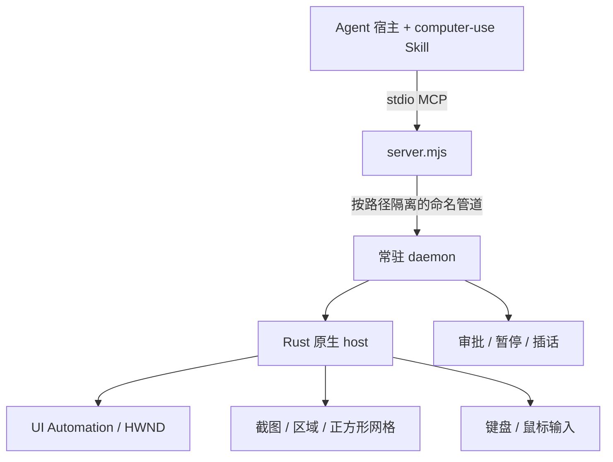

# FastCUA

**文本优先。视觉按需。不断细分，直到足够精准。**

FastCUA 是一个面向 AI Agent 的本地 Windows Computer Use 运行时。

它最核心的想法其实很简单：

> **除非模型真的需要，否则不要默认把整张屏幕都交给模型。**

[网站](https://guojiz.github.io/FastCUA/) · [English](README.md) · [技术论文](docs/TECHNICAL_PAPER.md) · [下一步设计](docs/NEXT_DESIGN.md)

> [!WARNING]
> FastCUA 仍是快速开发中的实验项目。请只用于测试，不要用于重要或无人值守的工作。

## FastCUA 想解决什么问题

很多视觉 Computer Use 系统大致都是这样工作的：

```text
整张截图
   ↓
视觉模型
   ↓
预测 x, y
   ↓
点击
```

这种方式当然能工作，但里面有两类经常可以避免的成本。

第一，Windows 很多标准控件本来就会通过 UI Automation 暴露名称、角色、边界等结构化信息。如果这些信息已经足够，仍然把整张截图送给模型，其实是在重复描述操作系统已经知道的东西。

第二，当视觉确实不可避免时，让模型直接在一张很大的截图上一次性预测一个精确坐标并不总是稳。模型可能已经认出了按钮，却因为 4K 分辨率、高 DPI、密集工具栏、小控件或截图缩放，最后点偏几像素。

FastCUA 对这两种情况采用两条不同的路径。

## 1. 文本够用，就完全不需要截图

假设 Windows 当前的 UI Automation 快照是：

```text
[12] Button
name="Save"

[13] Edit
name="Project name"

[14] CheckBox
name="Auto save"
```

如果 UIA 状态足够可靠，Agent 只需要选择元素 `12`：

```text
Windows
   ↓
UI Automation
   ↓
结构化文本
   ↓
Agent 选择 element_index=12
   ↓
校验后的 Windows 输入
```

整个过程不需要把截图放进模型上下文。

Agent 甚至可以明确请求：

```text
include_text = true
include_screenshot = false
```

但 FastCUA 也不会盲目信任无障碍信息。UIA 观察会被分成 `good`、`weak`、`broken`，当语义信息不完整、过期、不可操作，或者 provider 超时时，运行时可以直接给出 `prefer_vision=true`。

所以它不是“永远用 UIA”，而是：

> **语义信息有用时就用；不好用时就立刻换视觉。**

## 2. 必须用视觉时，也不要一上来就在整张大图上猜 XY

假设当前应用窗口是：

```text
3840 × 2160
```

一次性的视觉控制可能要求模型直接给出：

```text
click(3371, 184)
```

FastCUA 更倾向于把精准定位变成一个由粗到细的搜索过程。

第一步仍然只有**一张窗口图**，只是在这张图上画编号区域：

```text
┌────┬────┬────┬────┐
│ 1  │ 2  │ 3  │ 4  │
├────┼────┼────┼────┤
│ 5  │ 6  │ 7  │ 8  │
├────┼────┼────┼────┤
│ 9  │10  │11  │12  │
└────┴────┴────┴────┘
```

模型只需要回答：

```text
目标在 11 号区域。
```

选择 `11` 本身**不会点击**。

FastCUA 接下来只取 11 号区域，再画一个新的 3×3 网格：

```text
┌────┬────┬────┐
│ 1  │ 2  │ 3  │
├────┼────┼────┤
│ 4  │ 5  │ 6  │
├────┼────┼────┤
│ 7  │ 8  │ 9  │
└────┴────┴────┘
```

Agent 可以继续：

```text
11 → 6 → 2
```

直到目标已经被隔离得足够清楚，再真正提交点击。

连续 3×3 细分后，搜索面积大约会缩小为：

```text
细分 1 次 → 1 / 9
细分 2 次 → 1 / 81
细分 3 次 → 1 / 729
```

于是模型解决的不再是：

```text
请在 3840×2160 里一次性给出一个精准坐标
```

而是连续几个简单问题：

```text
在哪个区域？
→ 在哪个子区域？
→ 还需要继续细分吗？
```

而且这始终是**每一步只给模型一张图**，不是把整张屏幕切成十几张小图再一次性全部喂进去。

## 3. Agent 也可以自己决定下一步要看哪里

数字网格并不是唯一的缩小方式。

FastCUA 的区域系统也支持任意边界：

```text
left
top
right
bottom
```

所以 Agent 可以相当于说：

```text
下一步只给我看这个窗口的右上角。
```

然后观察链可以变成：

```text
完整窗口
   ↓
Agent 选择感兴趣区域
   ↓
局部截图
   ↓
Agent 再缩小范围
   ↓
更小的局部截图
   ↓
精准定位
```

这样一来，Zoom / Refine 就不只是固定的“两阶段放大技巧”，而变成了一个**由 Agent 主动控制的观察能力**。

进入细分以后，原生 host 还可以直接抓取选中的局部区域，而不是每次重新截完整窗口再裁剪。

## 4. 模型负责判断，坐标数学交给运行时

假设模型最后看到的是一张 `300 × 200` 的局部图，并判断目标在：

```text
x = 84
y = 31
```

模型不用自己计算这个点在原始显示器上的绝对位置。

FastCUA 会保留裁剪起点和截图缩放比例，并用确定性的代码完成：

```text
局部图坐标
    ↓
裁剪区域坐标
    ↓
窗口坐标
    ↓
物理屏幕坐标
```

DPI 缩放、裁剪偏移、窗口几何这些事情都属于运行时，不应该消耗模型推理。超出当前区域的坐标会直接被拒绝，而不是偷偷钳到附近某个位置。

## 5. “已经定位到”不等于“立刻产生副作用”

就算目标已经确定，FastCUA 也不会默认环境还和刚才完全一样。

比如：

```text
Agent 准备点击 Excel
        ↓
FastCUA 移动光标
        ↓
用户突然切到了另一个应用
```

简单的自动化系统可能还是会把这个点击发出去。

FastCUA 会在真正产生副作用之前重新检查环境。窗口身份、前台状态、光标位置、目标边界、超时和人类控制信号，都可以让这次操作在 Mouse Down 之前被终止。

所以完整路径其实是：

```text
UIA 文本
   ↓ 足够
语义目标
   ↓
校验后执行

   ↓ 不足

视觉
   ↓
区域
   ↓
更小区域
   ↓
精确局部目标
   ↓
确定性坐标映射
   ↓
环境重新校验
   ↓
校验后执行
```

一句话概括：

> **FastCUA 尽量只把当前决策需要的最小观察交给模型，再把模型的模糊判断转换成确定性的 Windows 动作。**

## 为什么使用 FastCUA

| | 视觉优先 Computer Use | 浏览器自动化 | FastCUA |
|---|---|---|---|
| 主要观察方式 | 截图 | DOM/CDP | 先读 UIA 文本，需要时才开视觉 |
| 视觉定位 | 常直接预测整图 XY | DOM selector | Agent 自选 ROI + 递归局部细分 |
| 视觉负担 | 常是完整当前画面 | 页面结构 | 越来越小的局部区域 |
| 坐标处理 | 常由模型面对 | 浏览器处理 | 运行时把局部坐标映射回 Windows |
| 范围 | 任意可见界面 | 网页内容 | Windows 应用、浏览器外壳、跨应用流程 |
| 运行时状态 | 取决于集成 | 浏览器会话 | 常驻 daemon + 原生 host |
| 人类接管 | 取决于集成 | 仅限浏览器 | 暂停、插话、审批、退出 |

FastCUA 是网页内自动化的补充，不是替代品。

## 架构


```mermaid
flowchart TB
  A["Agent 宿主 + computer-use Skill"] -->|"stdio MCP"| B["server.mjs"]
  B -->|"按路径隔离的命名管道"| C["常驻 daemon"]
  C --> D["Rust 原生 host"]
  D --> E["UI Automation / HWND"]
  D --> F["截图 / 区域 / 正方形网格"]
  D --> G["键盘 / 鼠标输入"]
  C --> H["审批 / 暂停 / 插话"]
```

所有客户端共享一个 daemon、策略状态、UIA 质量历史、截图状态、审批、人类控制状态和物理光标。

FastCUA 不绑定某一家 Agent，但完整安装必须在**同一个 Agent 宿主**内同时具备：

1. 完整的 `skills/computer-use/` 操作规范；
2. `sky-computer-use` stdio MCP Server。

只装 MCP 等于有能力却缺少必要操作规范；只装 Skill 则没有执行器。

## 定位逻辑

先调用 `get_window_state({include_text:true})` 并读取 `state.uia`：

| 观察结果 | 必须采取的动作 |
|---|---|
| `quality:"good"`，目标有名称和有效边界 | 使用当前 `element_index` |
| `prefer_vision:true`、`weak`、`broken`、`[no-hit]`，或一次索引过期 | 停止语义点击，切换视觉定位 |

视觉控制遵循**观察 → 选择 → 细分 → 提交**：

1. `grid_view({window})` 返回一张带编号的窗口图。
2. 选择包含目标的区域。选择本身不会产生输入。
3. `grid_refine(...)` 只裁这个区域并重新画 3×3，需要时继续细分。
4. 最后只通过 `click_cell`、`click_in_cell` 或 `click_view` 提交一次动作。
5. 任何可能改变布局或焦点的操作后重新观察。

完整机制与约束见[技术论文](docs/TECHNICAL_PAPER.md#4-observation-semantics-first-pixels-when-needed)。

## 安装

统一使用 PowerShell 安装器。它会在需要时通过 WinGet 安装 Node.js，从 GitHub Release 下载运行时并校验哈希：

```powershell
irm https://raw.githubusercontent.com/Guojiz/FastCUA/main/install.ps1 | iex
```

安装器会在桌面生成 `FastCUA Agent Setup.txt`。把它交给真正要使用 FastCUA 的 Agent。该 Agent 需要安装完整的 `skills\computer-use` 文件夹，把已安装的 `server.mjs` 配置为 `sky-computer-use` stdio MCP Server，重新加载，并确认 `list_windows` 可以正常调用。

### 验证和更新

```powershell
& "$env:LOCALAPPDATA\FastCUA\app\install.ps1" -Action Doctor
& "$env:LOCALAPPDATA\FastCUA\app\install.ps1" -Action Check
& "$env:LOCALAPPDATA\FastCUA\app\install.ps1" -Action Update
```

在 MCP 内调用 `runtime_info`，确认实际使用的 server、daemon、原生 host、版本、提交、管道和数据目录。

## 人类控制

| 按键 | 操作 |
|---|---|
| `F7` | 暂停并打开控制中心 |
| `F8` | 暂停或继续 |
| `F9` | 暂停并插话 |
| `F10` | 退出 FastCUA |

本地控制中心位于 `http://127.0.0.1:8420`。安全模式会在操作未知应用之前请求审批。

## 视觉点击示例

```js
let view = await sky.grid_view({ window });       // 看图，选 4 号格
view = await sky.grid_refine({
  window,
  grid: view.grid,
  cell: "4",
});                                               // 看图，选 5 号格
await sky.click_cell({ window, grid: view.grid, cell: "5" });
await sky.close();
```

## 录制技能（预览）

可选录制器会先把演示变成可审计证据包，再允许写出 Skill：

```text
录制 → 编译证据 → 当前主 Agent 写 Skill → 来源校验
     → 用新参数 dry-run → 人工审阅后安装
```

密码框和安全桌面时刻会被遮蔽。详见 `skills/skill-recorder/` 与[技术论文](docs/TECHNICAL_PAPER.md#9-evidence-first-skill-recording)。

> [!NOTE]
> 使用 Skill Recorder 时，录制的屏幕内容、操作证据和旁白可能会发送给所使用的云端模型提供商。

## 从源码开发

```powershell
git clone https://github.com/Guojiz/FastCUA.git
cd FastCUA
.\native-host\build.ps1
```

然后把完整 `skills\computer-use` 目录复制到当前 Agent 的 Skill 目录，并把 `server.mjs` 的绝对路径配置为 stdio MCP Server。复现命令与测试矩阵见[技术论文](docs/TECHNICAL_PAPER.md#12-reproduction-and-operation)。

## 使用边界

FastCUA 当前面向 Windows 11 x64。UAC、安全桌面、认证对话框、密码管理器、Windows 安全中心、更高完整性进程、受保护画面，以及具有特殊截图/无障碍行为的应用，不属于正常工作路径。合成输入不等同于硬件输入。剩余的输入、provider、截图、IPC 与评测工作记录在[下一步设计](docs/NEXT_DESIGN.md)中。

## 卸载

```powershell
& "$env:LOCALAPPDATA\FastCUA\app\uninstall.ps1"
```

## 链接

| | |
| --- | --- |
| **项目站点** | https://guojiz.github.io/FastCUA/ |
| **作者站点** | https://guojiz.github.io/ |
| **X** | https://x.com/guojizh |
| **哔哩哔哩** | https://space.bilibili.com/3493114115263006 |
| **赞助** | https://github.com/Guojiz/Sponsors |

### 其它已上线官网的 Guojiz 项目

- [GitLearnOS](https://guojiz.github.io/gitlearnos/) — 学习者拥有的 Git 学习记忆
- [Word Snap](https://guojiz.github.io/word-snap/) — 双语单词匹配 PWA

## 许可证

MIT，见 [LICENSE](LICENSE)。
