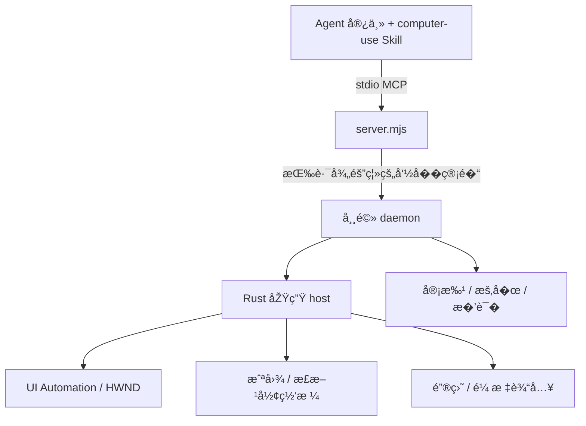

# FastCUA

**�� AI Agent 的本地�元素优先 Windows 控制平�。**

[网站](https://guojiz.github.io/FastCUA/) · [English](README.md) · [技术论文](docs/TECHNICAL_PAPER.md) · [下一步设计](docs/NEXT_DESIGN.md)

> [!WARNING]
> FastCUA �是快速开�中的实验项目。请�用于测试，��用于��或无人值守的工作。

FastCUA 为 Agent �供一套快速��审计的 Windows 应用接�。它优先读� Windows UI Automation 文本；当语义信��足时，�切�到截图和正方形数字网格；相关的多个原生动作由一个常驻本地�行时执行。人类�以通过��状��按应用审批�全局暂����和退出控制始终掌�电脑。

FastCUA �绑定�一家 Agent，但完整安装必须在**�一个 Agent 宿主**内�时具备：

1. 完整的 `skills/computer-use/` �作规范；
2. `sky-computer-use` stdio MCP Server。

�装 MCP 等于有能力�缺少必��作规范；�装 Skill 则没有执行器。

## 模型�求

�使用**一个五官�全的主模型**：�解文本和图����推��调用 Skill 与 MCP，并�留完�整个任务所需的上下文。录制�白时最好能原生�解音频，�则使用文字笔记。���置 writer�转写�备用或纯文本模型。

## 为什么使用 FastCUA

| | 视觉优先 Computer Use | �览器自动化 | FastCUA |
|---|---|---|---|
| 主�观察方� | 截图 | DOM/CDP | UIA 文本，�足时�用视觉 |
| 范围 | 任���界� | 网页内容 | Windows 应用��览器外壳�跨应用�程 |
| 执行方� | 通常�轮一个动作 | �览器命令 | 一个模型回�执行多个原生动作 |
| �行时状� | 常按调用�建 | �览器会� | 一个常驻 daemon 与原生 host |
| 人类接管 | �决于集� | 仅��览器 | 全局暂�����审批�退出 |

FastCUA 是网页内自动化的补充，�是替代�。

## 架构


```mermaid
flowchart TB
  A["Agent 宿主 + computer-use Skill"] -->|"stdio MCP"| B["server.mjs"]
  B -->|"按路径隔离的命�管�"| C["常驻 daemon"]
  C --> D["Rust 原生 host"]
  D --> E["UI Automation / HWND"]
  D --> F["截图 / 正方形网格"]
  D --> G["键盘 / 鼠标输入"]
  C --> H["审批 / 暂� / ��"]
```

所有客户端共享一个 daemon�策略状�和物�光标。�久化 `js` cell �在一个模型回�内执行一组相关 `sky.*` 动作；目标过期�焦点或光标�化��标越界�超时和人类控制信�都会�止执行。

## 定�逻辑

先调用 `get_window_state({include_text:true})` 并读� `state.uia`：

| 观察结果 | 必须采�的动作 |
|---|---|
| `quality:"good"`，目标有�称和有效边界 | 点击当�快照的 `element_index` |
| `prefer_vision:true`�`weak`�`broken`�`[no-hit]`，或一次索引过期 | �止语义点击，调用 `grid_view` |

视觉�控�循**观察 → 选择 → 细分 → �交**：

1. `grid_view({window})` 返回一张带正方形数字格的窗�图。
2. 看图�选择包�目标的格�。选择�是判断，�会产生输入。
3. 若目标没有安全地�在格�中心，调用 `grid_refine({window,grid,cell})`；它��出该格并�新画 3×3，�继续细分。
4. ��交一次：格�中心用 `click_cell({window,grid,cell})`，格内�移用 `click_in_cell({window,grid,cell,x,y,view})`，当�图或�剪图中的精确�置用 `click_view({window,view,x,y})`。
5. 任何�能改�布局或焦点的动作��新观察。

�标始终属于当�窗�图或�剪图，原点在左上角。helper 会�算截图缩放并拒�窗�外�标。完整机制与论��[技术论文](docs/TECHNICAL_PAPER.md#4-observation-semantics-first-pixels-when-needed)。

## 安装

统一使用 PowerShell 安装器。它会在需�时通过 WinGet 安装 Node.js，从 GitHub Release 下载�行时并校验哈希：

```powershell
irm https://raw.githubusercontent.com/Guojiz/FastCUA/main/install.ps1 | iex
```

�过校验的安装器会在桌�生� `FastCUA Agent Setup.txt`。把它交给真正�使用 FastCUA 的 Agent。该 Agent 必须：

1. 把完整 `skills\computer-use` 文件夹安装到自己的 Skill 系统；
2. 把 Node.js + 已安装的 `server.mjs` �置为 `sky-computer-use` MCP；
3. �新加载并确认 Skill �被�现；
4. �功调用 `list_windows`。

Skill 或 MCP 缺少任何一个，安装都�完整。

### 验�与更新

```powershell
& "$env:LOCALAPPDATA\FastCUA\asͼïÛh‘é춻§q«^wn。',
    copy: '�制', copied: '已�制',
    deployNote: '使用无 Display Overlay 的 native host 时，请将二进制�留在本机，并把 overlayEnabled 设为 false。验�与安全说明�自部署指�。',
    emptyActivity: '等待下一次桌��作', emptyApproved: '还没有审批记录',
    helperLive: '原生 helper 在线', helperIdle: '等待第一�请求',
    unavailable: '无法连接', tryAgain: '请�动 daemon ��试',
  },
  en: {
    brandSub: 'Desktop automation control plane', connecting: 'Connecting', online: 'Local daemon connected', offline: 'Daemon offline',
    navConsole: 'Control center', navDeploy: 'Self-host',
    eyebrow: 'A persistent desktop control plane',
    heroTitle: 'One warm helper. Every desktop action stays in rhythm.',
    heroBody: 'FastCUA keeps a single native host alive so every connected client can automate the desktop with less setup and more continuity.',
    kpiWarm: 'shared warm helper', kpiProtocol: 'transparent local protocol', kpiStop: 'instant turn recovery',
    statusTitle: 'System pulse', statusWaiting: 'Waiting for daemon', statusLive: 'Ready for desktop actions',
    statusPaused: 'Paused by user', statusApproval: 'Awaiting approval',
    portLabel: 'Local endpoint',
    metricClients: 'Connected clients', metricClientsHint: 'shared session count',
    metricHelper: 'Native helper', metricHelperHint: 'one cursor, one state',
    metricApproved: 'Approved apps', metricApprovedHint: 'cached across clients',
    metricUptime: 'Uptime', metricUptimeHint: 'daemon lifetime',
    activityTitle: 'Action timeline', activityBody: 'Recent requests across connected clients.',
    approvedTitle: 'Approval memory', approvedBody: 'Apps approved for the shared helper.',
    refresh: 'Refresh', clear: 'Clear',
    runtimeTitle: 'Runtime & safety',
    runtimeBody: 'Settings stay local. Port and helper path changes need a daemon restart.',
    pause: 'Pause control', resume: 'Resume control', killHelper: 'Stop helper', shutdown: 'Exit FastCUA', restart: 'Restart daemon',
    allowOnce: '1 · Allow once', trustApp: '2 · Always approve', fullAccess: '3 · Full access', deny: '4 · Deny',
    costartLabel: 'Start policy', costartClaude: 'On demand', costartLogin: 'At sign-in', costartManual: 'Manual',
    costartDesc: { claude: 'Starts on the first MCP request.', login: 'Stays available after Windows sign-in.', manual: 'Runs only when you start the daemon.' },
    approvalLabel: 'Approval policy', approvalSafe: 'Safe access', approvalFull: 'Full access',
    approvalHelp: 'Safe: unknown apps need approval. Full: no prompts (high risk).',
    idleLabel: 'Idle shutdown (minutes)', idleHelp: 'Use 0 to keep the daemon alive.',
    portHelp: 'Restart the daemon after changing this value.',
    helperLabel: 'Native helper path', helperHelp: 'Leave empty to auto-discover; CUA_BIN takes precedence.',
    overlayLabel: 'Enable FastCUA status overlay', overlayHelp: 'Disable when using the native no-display host.',
    overlayTitleLabel: 'Overlay title',
    whitelistLabel: 'Whitelist', whitelistHelp: 'One executable name or absolute path per line.',
    save: 'Save settings', saved: 'Saved', localOnly: 'Runs locally on your Windows desktop',
    deployEyebrow: 'Repeatable self-hosting',
    deployTitle: 'From clone to first desktop action in four clear steps.',
    deployBody: 'A local daemon, a compatible native helper, and one MCP entry point. No cloud control plane required.',
    step1Title: 'Prepare Windows', step1Body: 'Install Node.js 18+ and place a compatible helper on the machine.',
    step2Title: 'Clone and configure', step2Body: 'Set the helper path in config.json or use CUA_BIN for a local override.',
    step3Title: 'Start the control plane', step3Body: 'Run the daemon, then verify its local health endpoint before connecting a client.',
    quickStartTitle: 'Quick start', quickStartBody: 'Built for copy, paste, verify.',
    mcpTitle: 'Connect an MCP client', mcpBody: 'Point your client to the thin stdio server; it reuses the shared daemon.',
    copy: 'Copy', copied: 'Copied',
    deployNote: 'For the native no-display host, keep the binary local and set overlayEnabled to false. See the self-hosting guide for verification and safety notes.',
    emptyActivity: 'Waiting for the next desktop action', emptyApproved: 'No approvals yet',
    helperLive: 'Native helper online', helperIdle: 'Waiting for first request',
    unavailable: 'Unavailable', tryAgain: 'Start the daemon and try again',
  }
};

const $ = (id) => document.getElementById(id);
let cfg = {};
let lang = localStorage.getItem('fastcua-lang') || ((navigator.language || '').startsWith('zh') ? 'zh' : 'en');
let events = [];
let pendingApproval = null;

const t = (k) => {
  const v = I18N[lang] && I18N[lang][k];
  return v == null ? k : v;
};

const api = (path, body) => fetch(path, body ? {
  method: 'POST',
  headers: { 'Content-Type': 'application/json' },
  body: JSON.stringify(body),
} : undefined).then(async (r) => {
  if (!r.ok) throw new Error(await r.text());
  return r.json();
});

function applyLanguage() {
  document.documentElement.lang = lang === 'zh' ? 'zh-CN' : 'en';
  document.title = 'FastCUA · ' + (lang === 'zh' ? '控制中心' : 'Control Center');
  $('locale').textContent = lang === 'zh' ? 'EN' : '中文';
  document.querySelectorAll('[data-i18n]').forEach((el) => {
    const v = t(el.dataset.i18n);
    if (typeof v === 'string') el.textContent = v;
  });
  if (cfg.costartMode && t('costartDesc') && typeof t('costartDesc') === 'object') {
    $('costart-desc').textContent = t('costartDesc')[cfg.costartMode] || '';
  }
  renderEvents();
}

function selectSegment(id, value) {
  const group = $(id);
  if (!group) return;
  [...group.children].forEach((button) => button.classList.toggle('active', button.dataset.v === value));
  group.onclick = (e) => {
    if (!e.target.dataset.v) return;
    [...group.children].forEach((button) => button.classList.remove('active'));
    e.target.classList.add('active');
    if (id === 'costart' && t('costartDesc') && typeof t('costartDesc') === 'object') {
      $('costart-desc').textContent = t('costartDesc')[e.target.dataset.v] || '';
    }
  };
}

function renderEvents() {
  const box = $('activity');
  box.replaceChildren();
  if (!events.length) {
    const e = document.createElement('div');
    e.className = 'empty';
    e.textContent = t('emptyActivity');
    box.append(e);
    return;
  }
  events.slice(-40).reverse().forEach((event) => {
    const row = document.createElement('div');
    row.className = 'event';
    const dot = document.createElement('span');
    dot.className = 'event-dot ' + (event.ok === false ? 'bad' : event.type === 'action_end' ? 'ok' : '');
    const text = document.createElement('div');
    const a = document.createElement('div');
    a.className = 'action';
    a.textContent = event.action || event.type || 'event';
    const s = document.createElement('div');
    s.className = 'summary';
    s.textContent = event.summary || event.error || event.client || '';
    text.append(a, s);
    const time = document.createElement('time');
    time.textContent = new Date(event.ts || Date.now()).toLocaleTimeString([], {
      hour: '2-digit', minute: '2-digit', second: '2-digit',
    });
    row.append(dot, text, time);
    box.append(row);
  });
}

function renderApproved(apps) {
  const box = $('approved');
  box.replaceChildren();
  if (!apps || !apps.length) {
    const empty = document.createElement('span');
    empty.className = 'muted';
    empty.textContent = t('emptyApproved');
    box.append(empty);
    return;
  }
  apps.forEach((app) => {
    const chip = document.createElement('span');
    chip.className = 'chip';
    chip.textContent = app;
    box.append(chip);
  });
}

function setPulse(state) {
  const control = state.controlState || 'running';
  const hasPending = (state.pendingApprovals || []).length > 0;
  if (control === 'paused_by_user') {
    $('dot').className = 'dot paused';
    $('big-status').textContent = t('statusPaused');
    $('status-copy').textContent = t('statusPaused');
    $('act-pause').hidden = true;
    $('act-resume').hidden = false;
  } else if (hasPending || control === 'awaiting_approval') {
    $('dot').className = 'dot approval';
    $('big-status').textContent = t('statusApproval');
    $('status-copy').textContent = t('statusApproval');
    $('act-pause').hidden = false;
    $('act-resume').hidden = true;
  } else {
    $('dot').className = 'dot live';
    $('big-status').textContent = state.binaryPid ? t('helperLive') : t('helperIdle');
    $('status-copy').textContent = state.binaryPid ? t('statusLive') : t('statusWaiting');
    $('act-pause').hidden = false;
    $('act-resume').hidden = true;
  }
  pendingApproval = (state.pendingApprovals || [])[0] || null;
  const callout = $('approval-callout');
  if (pendingApproval) {
    callout.hidden = false;
    $('pending-app').textContent = pendingApproval.app || pendingApproval.summary || 'app';
  } else {
    callout.hidden = true;
  }
}

async function load() {
  cfg = await api('/api/config');
  selectSegment('costart', cfg.costartMode || 'claude');
  selectSegment('approval', cfg.approvalPolicy === 'full' ? 'full' : 'safe');
  $('idle').value = cfg.idleTimeoutMin;
  $('port').value = cfg.port;
  $('whitelist').value = (cfg.whitelist || []).join('\n');
  $('overlay-en').checked = cfg.overlayEnabled !== false;
  $('overlay-title').value = cfg.overlayTitle || '';
  $('cuabin').value = cfg.cuaBinPath || '';
  applyLanguage();
}

async function refresh() {
  try {
    const [state, feed] = await Promise.all([
      api('/api/state'),
      api('/api/events?since=0'),
    ]);
    events = feed.events || [];
    $('connection').textContent = t('online');
    const version = state.runtime?.version || '—';
    $('version-pill').textContent = state.update?.status === 'available'
      ? `v${version} → v${state.update.latestVersion}`
      : `v${version}`;
    $('version-pill').title = state.update?.status === 'available'
      ? 'Update available - run & "$env:LOCALAPPDATA\\FastCUA\\app\\install.ps1" -Action Update'
      : (state.runtime?.root || '');
    $('endpoint').textContent = '127.0.0.1:' + (cfg.port || 8420);
    $('s-clients').textContent = state.clients;
    $('s-binary').textContent = state.binaryPid ? (lang === 'zh' ? '�行' : 'Live') : (lang === 'zh' ? '空闲' : 'Idle');
    $('s-approved').textContent = (state.approvedApps || []).length;
    $('s-uptime').textContent = state.uptime || '—';
    setPulse(state);
    renderApproved(state.approvedApps || []);
    renderEvents();
  } catch {
    $('dot').className = 'dot';
    $('connection').textContent = t('offline');
    $('big-status').textContent = t('unavailable');
    $('status-copy').textContent = t('tryAgain');
    $('act-pause').hidden = false;
    $('act-resume').hidden = true;
    $('approval-callout').hidden = true;
  }
}

async function save() {
  const costart = [...$('costart').children].find((b) => b.classList.contains('active'))?.dataset.v;
  const approval = [...$('approval').children].find((b) => b.classList.contains('active'))?.dataset.v;
  cfg = await api('/api/config', {
    costartMode: costart,
    approvalPolicy: approval,
    idleTimeoutMin: +$('idle').value,
    port: +$('port').value,
    whitelist: $('whitelist').value.split('\n').map((s) => s.trim()).filter(Boolean),
    bannerEnabled: !!cfg.bannerEnabled,
    overlayEnabled: $('overlay-en').checked,
    overlayTitle: $('overlay-title').value,
    overlayLanguage: cfg.overlayLanguage || 'auto',
    cuaBinPath: $('cuabin').value.trim(),
  });
  $('saved').classList.add('show');
  setTimeout(() => $('saved').classList.remove('show'), 1500);
  applyLanguage();
  await refresh();
}

async function control(action, token) {
  await api('/api/action', { action, token });
  await refresh();
}

document.querySelectorAll('.nav button').forEach((button) => {
  button.onclick = () => {
    document.querySelectorAll('.nav button').forEach((b) => b.classList.toggle('active', b === button));
    document.querySelectorAll('.view').forEach((v) => v.classList.toggle('active', v.id === button.dataset.view));
  };
});
$('locale').onclick = () => {
  lang = lang === 'zh' ? 'en' : 'zh';
  localStorage.setItem('fastcua-lang', lang);
  applyLanguage();
  refresh();
};
$('save').onclick = () => save().catch((error) => alert(error.message));
$('act-pause').onclick = () => control('pause').catch((error) => alert(error.message));
$('act-resume').onclick = () => control('resume').catch((error) => alert(error.message));
$('approve-once').onclick = () => pendingApproval && control('allowOnce', pendingApproval.token).catch((e) => alert(e.message));
$('approve-trust').onclick = () => pendingApproval && control('alwaysApprove', pendingApproval.token).catch((e) => alert(e.message));
$('approve-full').onclick = () => pendingApproval && control('fullAccess', pendingApproval.token).catch((e) => alert(e.message));
$('approve-deny').onclick = () => pendingApproval && control('denyApproval', pendingApproval.token).catch((e) => alert(e.message));
$('act-shutdown').onclick = () => api('/api/action', { action: 'shutdown' }).catch(() => {});
$('act-restart').onclick = () => api('/api/action', { action: 'restart' }).catch(() => {});
$('act-killbin').onclick = () => control('killBinary').catch((error) => alert(error.message));
$('act-clear').onclick = () => control('clearApprovals').catch((error) => alert(error.message));
$('clear-events').onclick = refresh;
document.querySelectorAll('.copy').forEach((button) => {
  button.onclick = async () => {
    try {
      await navigator.clipboard.writeText($(button.dataset.copy).textContent);
      const before = button.textContent;
      button.textContent = t('copied');
      setTimeout(() => { button.textContent = before; }, 1200);
    } catch {}
  };
});

// Approval keyboard: 1 once / 2 always / 3 full access / 4 deny (skip when typing in a field)
document.addEventListener('keydown', (event) => {
  if (!pendingApproval) return;
  const tag = (event.target && event.target.tagName || '').toLowerCase();
  if (tag === 'input' || tag === 'textarea' || tag === 'select' || event.target?.isContentEditable) return;
  if (event.key === '1') {
    event.preventDefault();
    control('allowOnce', pendingApproval.token).catch((e) => alert(e.message));
  } else if (event.key === '2') {
    event.preventDefault();
    control('alwaysApprove', pendingApproval.token).catch((e) => alert(e.message));
  } else if (event.key === '3') {
    event.preventDefault();
    control('fullAccess', pendingApproval.token).catch((e) => alert(e.message));
  } else if (event.key === '4') {
    event.preventDefault();
    control('denyApproval', pendingApproval.token).catch((e) => alert(e.message));
  }
});

load().then(refresh).catch(refresh);
setInterval(refresh, 1500);
</script>

</body>
</html>
