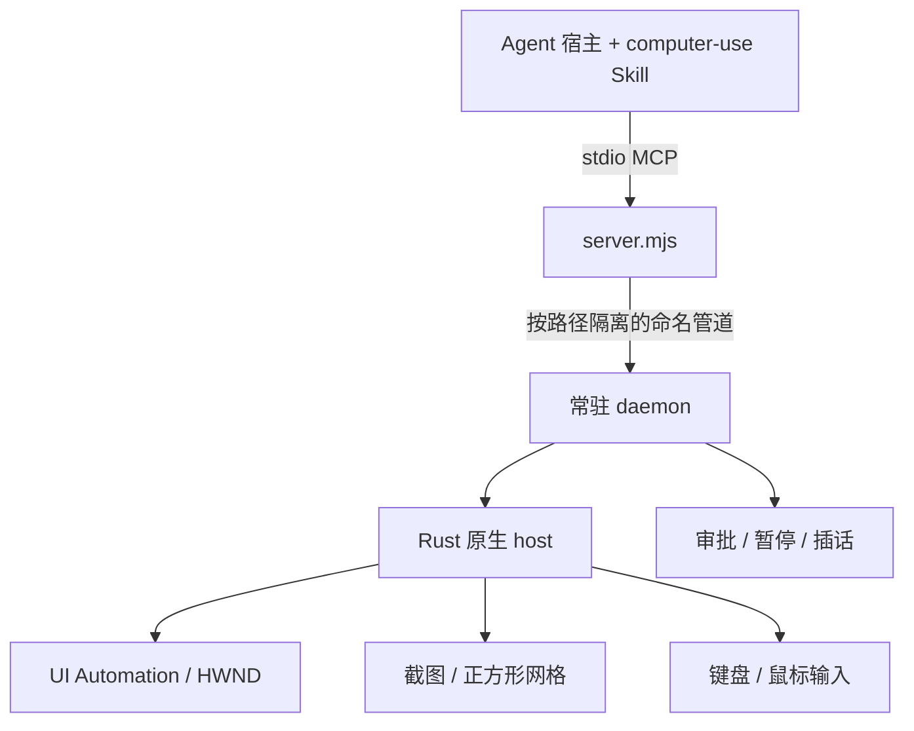

# FastCUA

**文本优先。视觉按需。不断放大，直到足够精准。**

FastCUA 是一个面向 AI Agent 的本地 Windows Computer Use 运行时，它围绕一条原则设计：

> **不要默认每一步 Computer Use 都需要截图。只把当前决策真正需要的信息交给模型。**

[网站](https://guojiz.github.io/FastCUA/) · [English](README.md) · [技术论文](docs/TECHNICAL_PAPER.md) · [下一步设计](docs/NEXT_DESIGN.md)

> [!WARNING]
> FastCUA 仍是快速开发中的实验项目。请只用于测试，不要用于重要或无人值守的工作。

## FastCUA 到底有什么不同

### 1. 默认不是先截图

FastCUA 会先从 Windows UI Automation 读取结构化语义信息，例如控件角色、名称、边界和当前快照中的元素索引。

如果这些信息已经足够可靠，Agent 可以完全不接收截图，直接完成定位和操作：

```text
Windows UI
   ↓
UI Automation 文本
   ↓
Agent 选择 element_index
   ↓
Windows 输入
```

如果 UI Automation 很弱、失效、过期，或者虽然存在但实际上不可操作，FastCUA 会切换到视觉，而不是让 Agent 一遍遍重试坏掉的语义路径。

### 2. 需要视觉时，也不是直接在整张大图上猜 XY

FastCUA 不要求模型一上来就在大尺寸截图上直接预测一个精确坐标。

第一层视觉观察是**一张带编号正方形区域的窗口图**。模型只需要判断目标在哪个区域。选择编号本身不会产生任何点击。

FastCUA 随后只裁出这个区域，再画一个新的 3×3 网格。如果目标仍然不够清楚，就继续细分：

```text
完整窗口
    ↓
编号区域
    ↓
选择一个区域
    ↓
只裁这个区域
    ↓
3×3 细分
    ↓
仍不够精确就继续细分
    ↓
最后只提交一次点击
```

也就是说，模型解决的是连续几个更简单的问题：**“目标在哪个区域？”**，而不是在 4K 窗口上一次性做出类似 `click(3371, 184)` 的高精度坐标回归。

这是一条**单图、由粗到细的观察链**，不是把整张图切成很多小图后一次性全部喂给模型。

### 3. 模型负责判断目标，几何换算交给运行时

进入裁剪或细分后，模型输出的坐标只属于当前看到的局部图。FastCUA 会保留裁剪原点和截图缩放比例，并用确定性的代码把坐标映射回去：

```text
局部图坐标
    ↓
裁剪区域坐标
    ↓
窗口坐标
    ↓
物理屏幕坐标
```

模型不需要自己反算 DPI、裁剪偏移或整屏几何关系。超出当前区域的坐标会被拒绝，而不是偷偷钳到附近某个位置。

### 4. 模型说“点这里”，不等于系统立刻就点

真正产生输入之前，FastCUA 会在副作用发生前重新检查本地环境。窗口身份、前台状态、光标位置、目标边界、超时以及人类控制信号都可以终止执行。

换句话说：

> **模型决定应该发生什么；运行时决定现在是否仍然安全、有效地让它发生。**

完整路径可以概括为：

```text
UIA 文本
   ↓ 足够
语义目标
   ↓
校验后执行

   ↓ 不足

窗口图像
   ↓
区域
   ↓
更小区域
   ↓
精确局部目标
   ↓
确定性坐标映射
   ↓
环境重新校验
   ↓
校验后执行
```

FastCUA 同时保持一个常驻本地运行时，因此 UIA 质量历史、截图状态、审批、暂停/插话状态，以及一组相关的原生动作，不需要在每一次工具调用时从头重建。

FastCUA 不绑定某一家 Agent，但完整安装必须在**同一个 Agent 宿主**内同时具备：

1. 完整的 `skills/computer-use/` 操作规范；
2. `sky-computer-use` stdio MCP Server。

只装 MCP 等于有能力却缺少必要操作规范；只装 Skill 则没有执行器。

## 模型要求

只使用**一个五官齐全的主模型**：理解文本和图像、可靠推理、调用 Skill 与 MCP，并保留完成整个任务所需的上下文。录制旁白时最好能原生理解音频，否则使用文字笔记。不再配置 writer、转写、备用或纯文本模型。

## 为什么使用 FastCUA

| | 视觉优先 Computer Use | 浏览器自动化 | FastCUA |
|---|---|---|---|
| 主要观察方式 | 截图 | DOM/CDP | 先读 UIA 文本，需要时才开视觉 |
| 视觉定位 | 常直接预测整图 XY | DOM selector | 编号区域 + 递归局部细分 |
| 坐标处理 | 常由模型面对 | 浏览器处理 | 运行时把局部坐标映射回 Windows |
| 范围 | 任意可见界面 | 网页内容 | Windows 应用、浏览器外壳、跨应用流程 |
| 执行方式 | 通常每轮一个动作 | 浏览器命令 | 一个模型回合执行多个原生动作 |
| 运行时状态 | 常按调用重建 | 浏览器会话 | 一个常驻 daemon 与原生 host |
| 人类接管 | 取决于集成 | 仅限浏览器 | 全局暂停、插话、审批、退出 |

FastCUA 是网页内自动化的补充，不是替代品。

## 架构


```mermaid
flowchart TB
  A["Agent 宿主 + computer-use Skill"] -->|"stdio MCP"| B["server.mjs"]
  B -->|"按路径隔离的命名管道"| C["常驻 daemon"]
  C --> D["Rust 原生 host"]
  D --> E["UI Automation / HWND"]
  D --> F["截图 / 正方形网格"]
  D --> G["键盘 / 鼠标输入"]
  C --> H["审批 / 暂停 / 插话"]
```

所有客户端共享一个 daemon、策略状态和物理光标。持久化 `js` cell 可在一个模型回合内执行一组相关 `sky.*` 动作；目标过期、焦点或光标变化、坐标越界、超时和人类控制信号都会停止执行。

## 定位逻辑

先调用 `get_window_state({include_text:true})` 并读取 `state.uia`：

| 观察结果 | 必须采取的动作 |
|---|---|
| `quality:"good"`，目标有名称和有效边界 | 点击当前快照的 `element_index` |
| `prefer_vision:true`、`weak`、`broken`、`[no-hit]`，或一次索引过期 | 停止语义点击，调用 `grid_view` |

视觉操控遵循**观察 → 选择 → 细分 → 提交**：

1. `grid_view({window})` 返回一张带正方形数字格的窗口图。
2. 看图后选择包含目标的格号。选择只是判断，不会产生输入。
3. 若目标没有安全地落在格子中心，调用 `grid_refine({window,grid,cell})`；它只裁出该格并重新画 3×3，可继续细分。
4. 只提交一次：格子中心用 `click_cell({window,grid,cell})`，格内偏移用 `click_in_cell({window,grid,cell,x,y,view})`，当前图或裁剪图中的精确位置用 `click_view({window,view,x,y})`。
5. 任何可能改变布局或焦点的动作后重新观察。

坐标始终属于当前窗口图或裁剪图，原点在左上角。helper 会反算截图缩放并拒绝窗口外坐标。完整机制与论证见[技术论文](docs/TECHNICAL_PAPER.md#4-observation-semantics-first-pixels-when-needed)。

## 安装

统一使用 PowerShell 安装器。它会在需要时通过 WinGet 安装 Node.js，从 GitHub Release 下载运行时并校验哈希：

```powershell
irm https://raw.githubusercontent.com/Guojiz/FastCUA/main/install.ps1 | iex
```

经过校验的安装器会在桌面生成 `FastCUA Agent Setup.txt`。把它交给真正要使用 FastCUA 的 Agent。该 Agent 必须：

1. 把完整 `skills\computer-use` 文件夹安装到自己的 Skill 系统；
2. 把 Node.js + 已安装的 `server.mjs` 配置为 `sky-computer-use` MCP；
3. 重新加载并确认 Skill 可被发现；
4. 成功调用 `list_windows`。

Skill 或 MCP 缺少任何一个，安装都不完整。

### 验证与更新

```powershell
& "$env:LOCALAPPDATA\FastCUA\app\install.ps1" -Action Doctor
& "$env:LOCALAPPDATA\FastCUA\app\install.ps1" -Action Check
& "$env:LOCALAPPDATA\FastCUA\app\install.ps1" -Action Update
```

在 MCP 内调用 `runtime_info`，确认实际使用的 server、daemon、原生 host、版本、提交、管道和数据目录。

## 人类控制

| 按键 | 操作 |
|---|---|
| `F7` | 暂停并打开控制中心 |
| `F8` | 暂停或继续 |
| `F9` | 暂停并插话 |
| `F10` | 退出 FastCUA |

本地控制中心位于 `http://127.0.0.1:8420`。安全模式在操作未知应用前会请求审批；信任采用精确应用身份，而不是模糊名称匹配。

## 视觉点击示例

假设 `window` 来自 `list_windows`：

```js
let view = await sky.grid_view({ window });       // 看图，选择 4 号格
view = await sky.grid_refine({
  window,
  grid: view.grid,
  cell: "4",
});                                               // 看图，选择 5 号格
await sky.click_cell({ window, grid: view.grid, cell: "5" });
await sky.close();
```

## 录制技能（预览）

可选录制器会先把演示变成可审计证据包，再允许写出 Skill：

```text
录制 → 编译证据 → 当前主 Agent 写 Skill → 来源校验
     → 用新参数 dry-run → 人工审阅后安装
```

密码框和安全桌面时刻会被遮蔽。当前主 Agent 根据证据写 Skill；来源校验、dry-run、应用范围和明确的安装审批都是硬门禁。详见 `skills/skill-recorder/` 与[技术论文](docs/TECHNICAL_PAPER.md#9-evidence-first-skill-recording)。

> [!NOTE]
> 使用 Skill Recorder 时，录制的屏幕内容、操作证据和旁白可能会发送给所使用的云端模型提供商。

## 从源码开发

```powershell
git clone https://github.com/Guojiz/FastCUA.git
cd FastCUA
.\native-host\build.ps1
```

然后把完整 `skills\computer-use` 目录复制到当前 Agent 的 Skill 目录，并把 `server.mjs` 的绝对路径配置为 stdio MCP Server。用 `runtime_info` 验证当前 checkout。复现命令与测试矩阵见[技术论文](docs/TECHNICAL_PAPER.md#12-reproduction-and-operation)。

项目官网源码位于 `site/`，并由本仓库的 `.github/workflows/pages.yml` 发布。根目录的 `web.html` 仍是本地运行时控制中心，不是公开官网。

## 使用边界

FastCUA 当前面向 Windows 11 x64。UAC、安全桌面、认证对话框、密码管理器、Windows 安全中心、更高完整性进程、受保护画面，以及具有特殊截图/无障碍行为的应用，不属于正常工作路径。合成输入不等同于硬件输入，当前组合键实现仍使用已被取代的 `keybd_event` API。剩余的输入、provider、截图、IPC 与评测工作记录在[下一步设计](docs/NEXT_DESIGN.md)中。

## 卸载

```powershell
& "$env:LOCALAPPDATA\FastCUA\app\uninstall.ps1"
```

## 链接

| | |
| --- | --- |
| **项目站点** | https://guojiz.github.io/FastCUA/ |
| **作者站点** | https://guojiz.github.io/ |
| **X** | https://x.com/guojizh |
| **哔哩哔哩** | https://space.bilibili.com/3493114115263006 |
| **赞助** | https://github.com/Guojiz/Sponsors |

### 其它已上线官网的 Guojiz 项目

- [GitLearnOS](https://guojiz.github.io/gitlearnos/) — 学习者拥有的 Git 学习记忆
- [Word Snap](https://guojiz.github.io/word-snap/) — 双语单词匹配 PWA

## 许可证

MIT，见 [LICENSE](LICENSE)。
