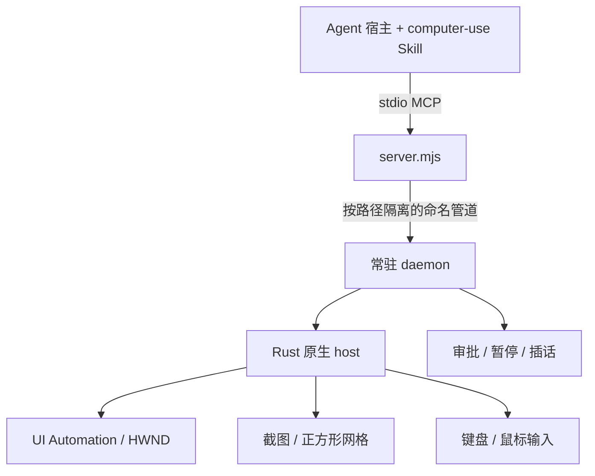

# FastCUA

**面向 AI Agent 的本地、元素优先 Windows 控制平面。**

[网站](https://guojiz.github.io/FastCUA/) · [English](README.md) · [技术论文](docs/TECHNICAL_PAPER.md) · [下一步设计](docs/NEXT_DESIGN.md)

> [!WARNING]
> FastCUA 仍是快速开发中的实验项目。请只用于测试，不要用于重要或无人值守的工作。

FastCUA 为 Agent 提供一套快速、可审计的 Windows 应用接口。它优先读取 Windows UI Automation 文本；当语义信息不足时，再切换到截图和正方形数字网格；相关的多个原生动作由一个常驻本地运行时执行。

FastCUA 提供三项功能：

1. **Computer use** — 桌面自动化（UIA 文本优先，视觉正方形网格兜底）；
2. **Record skill** — 录制演示 → 编译证据 → 写 Skill → dry-run → 审批安装；
3. **Computer use history** — 本地磁盘审计时间线，记录每次动作与应用、结果、截图。

FastCUA 是**无界面（headless）运行**：没有任何网页控制台、悬浮横幅或热键 UI，唯一的配置面是本地 `config.json` 文件（默认 **Full access**）。暂停、插话、审批等控制由宿主控制面（例如 DeepSeek Harness 中的 FastCUA 插件）提供。

FastCUA 不绑定某一家 Agent，但完整安装必须在**同一个 Agent 宿主**内同时具备：

1. 完整的 `skills/computer-use/` 操作规范；
2. `sky-computer-use` stdio MCP Server。

只装 MCP 等于有能力却缺少必要操作规范；只装 Skill 则没有执行器。

## 模型要求

只使用**一个五官齐全的主模型**：理解文本和图像、可靠推理、调用 Skill 与 MCP，并保留完成整个任务所需的上下文。录制旁白时最好能原生理解音频，否则使用文字笔记。不再配置 writer、转写、备用或纯文本模型。

## 为什么使用 FastCUA

| | 视觉优先 Computer Use | 浏览器自动化 | FastCUA |
|---|---|---|---|
| 主要观察方式 | 截图 | DOM/CDP | UIA 文本，不足时再用视觉 |
| 范围 | 任意可见界面 | 网页内容 | Windows 应用、浏览器外壳、跨应用流程 |
| 执行方式 | 通常每轮一个动作 | 浏览器命令 | 一个模型回合执行多个原生动作 |
| 运行时状态 | 常按调用重建 | 浏览器会话 | 一个常驻 daemon 与原生 host |
| 人类接管 | 取决于集成 | 仅限浏览器 | 全局暂停、插话、审批、退出 |

FastCUA 是网页内自动化的补充，不是替代品。

## 架构


```mermaid
flowchart TB
  A["Agent 宿主 + computer-use Skill"] -->|"stdio MCP"| B["server.mjs"]
  B -->|"按路径隔离的命名管道"| C["常驻 daemon"]
  C --> D["Rust 原生 host"]
  D --> E["UI Automation / HWND"]
  D --> F["截图 / 正方形网格"]
  D --> G["键盘 / 鼠标输入"]
  C --> H["审批 / 暂停 / 插话"]
```

所有客户端共享一个 daemon、策略状态和物理光标。持久化 `js` cell 可在一个模型回合内执行一组相关 `sky.*` 动作；目标过期、焦点或光标变化、坐标越界、超时和人类控制信号都会停止执行。

## 定位逻辑

先调用 `get_window_state({include_text:true})` 并读取 `state.uia`：

| 观察结果 | 必须采取的动作 |
|---|---|
| `quality:"good"`，目标有名称和有效边界 | 点击当前快照的 `element_index` |
| `prefer_vision:true`、`weak`、`broken`、`[no-hit]`，或一次索引过期 | 停止语义点击，调用 `grid_view` |

视觉操控遵循**观察 → 选择 → 细分 → 提交**：

1. `grid_view({window})` 返回一张带正方形数字格的窗口图。
2. 看图后选择包含目标的格号。选择只是判断，不会产生输入。
3. 若目标没有安全地落在格子中心，调用 `grid_refine({window,grid,cell})`；它只裁出该格并重新画 3×3，可继续细分。
4. 只提交一次：格子中心用 `click_cell({window,grid,cell})`，格内偏移用 `click_in_cell({window,grid,cell,x,y,view})`，当前图或裁剪图中的精确位置用 `click_view({window,view,x,y})`。
5. 任何可能改变布局或焦点的动作后重新观察。

坐标始终属于当前窗口图或裁剪图，原点在左上角。helper 会反算截图缩放并拒绝窗口外坐标。完整机制与论证见[技术论文](docs/TECHNICAL_PAPER.md#4-observation-semantics-first-pixels-when-needed)。

## 安装

统一使用 PowerShell 安装器。它会在需要时通过 WinGet 安装 Node.js，从 GitHub Release 下载运行时并校验哈希：

```powershell
irm https://raw.githubusercontent.com/Guojiz/FastCUA/main/install.ps1 | iex
```

经过校验的安装器会在桌面生成 `FastCUA Agent Setup.txt`。把它交给真正要使用 FastCUA 的 Agent。该 Agent 必须：

1. 把完整 `skills\computer-use` 文件夹安装到自己的 Skill 系统；
2. 把 Node.js + 已安装的 `server.mjs` 配置为 `sky-computer-use` MCP；
3. 重新加载并确认 Skill 可被发现；
4. 成功调用 `list_windows`。

Skill 或 MCP 缺少任何一个，安装都不完整。

### Agent 自部署（推荐）

`scripts/agent-setup.ps1` 会把 `sky-computer-use` MCP Server 和
`computer-use` Skill 注册到检测到的 Agent 宿主（Qoder、Claude Code、
Claude Desktop、Codex CLI、VS Code、opencode、Kimi Work），自动备份每个
被修改的配置文件，并运行真实的 stdio MCP 冒烟测试：

```powershell
& "$env:LOCALAPPDATA\FastCUA\app\scripts\agent-setup.ps1" -Action List
& "$env:LOCALAPPDATA\FastCUA\app\scripts\agent-setup.ps1" -Action Install
& "$env:LOCALAPPDATA\FastCUA\app\scripts\agent-setup.ps1" -Action Verify
```

各 Agent 的配置路径、组件生命周期和验证规则见 [docs/AGENT_SETUP_zh.md](docs/AGENT_SETUP_zh.md)。

### 验证与更新

```powershell
& "$env:LOCALAPPDATA\FastCUA\app\install.ps1" -Action Doctor
& "$env:LOCALAPPDATA\FastCUA\app\install.ps1" -Action Check
& "$env:LOCALAPPDATA\FastCUA\app\install.ps1" -Action Update
```

在 MCP 内调用 `runtime_info`，确认实际使用的 server、daemon、原生 host、版本、提交、管道和数据目录。

## 配置与控制

FastCUA 默认 **Full access**：对未知应用直接放行，不弹审批。所有设置都在本地配置文件 `config.json` 中，用户可直接编辑，改完重启 daemon 生效。把 `approvalPolicy` 改回 `"safe"` 即可恢复白名单/审批模式。

控制面（暂停 / 插话 / 审批 / 退出）通过 daemon 命名管道方法（`pause` / `resume` / `interject` / `resolve_approval` / `shutdown` 等）提供给宿主集成；DeepSeek Harness 插件负责配置与历史查看。审批采用精确应用身份，而不是模糊名称匹配。

## 视觉点击示例

假设 `window` 来自 `list_windows`：

```js
let view = await sky.grid_view({ window });       // 看图，选择 4 号格
view = await sky.grid_refine({
  window,
  grid: view.grid,
  cell: "4",
});                                               // 看图，选择 5 号格
await sky.click_cell({ window, grid: view.grid, cell: "5" });
await sky.close();
```

## 录制技能（预览）

可选录制器会先把演示变成可审计证据包，再允许写出 Skill：

```text
录制 → 编译证据 → 当前主 Agent 写 Skill → 来源校验
     → 用新参数 dry-run → 人工审阅后安装
```

密码框和安全桌面时刻会被遮蔽。当前主 Agent 根据证据写 Skill；来源校验、dry-run、应用范围和明确的安装审批都是硬门禁。详见 `skills/skill-recorder/` 与[技术论文](docs/TECHNICAL_PAPER.md#9-evidence-first-skill-recording)。

> [!NOTE]
> 使用 Skill Recorder 时，录制的屏幕内容、操作证据和旁白可能会发送给所使用的云端模型提供商。

## 计算机使用历史

每次桌面动作与控制事件都会以追加 JSONL 形式写入本地数据目录的 `history/history.jsonl`，截图存入 `history/shots/`。条目包含应用、动作、摘要、结果、耗时，以及（`get_window_state` / `grid_view` 时）截图。`type_text` / `set_value` 只记录长度、不记录原文。保留策略由 `config.json` 中的 `historyEnabled`、`historyCaptureScreenshots`、`historyMaxEntries`、`historyRetentionDays`、`historyMaxShotsPerAction` 控制。

Agent 可用 `list_history` / `get_history` MCP 工具读取历史；DeepSeek Harness 插件提供可视化查看。所有历史数据只保存在本机。

## 从源码开发

```powershell
git clone https://github.com/Guojiz/FastCUA.git
cd FastCUA
.\native-host\build.ps1
```

然后把完整 `skills\computer-use` 目录复制到当前 Agent 的 Skill 目录，并把 `server.mjs` 的绝对路径配置为 stdio MCP Server。用 `runtime_info` 验证当前 checkout。复现命令与测试矩阵见[技术论文](docs/TECHNICAL_PAPER.md#12-reproduction-and-operation)。

FastCUA 无自带 UI：配置在本地 `config.json`，控制与历史查看由宿主（DeepSeek Harness 插件）提供。

## 使用边界

FastCUA 当前面向 Windows 11 x64。UAC、安全桌面、认证对话框、密码管理器、Windows 安全中心、更高完整性进程、受保护画面，以及具有特殊截图/无障碍行为的应用，不属于正常工作路径。合成输入不等同于硬件输入，当前组合键实现仍使用已被取代的 `keybd_event` API。剩余的输入、provider、截图、IPC 与评测工作记录在[下一步设计](docs/NEXT_DESIGN.md)中。

## 卸载

```powershell
& "$env:LOCALAPPDATA\FastCUA\app\uninstall.ps1"
```

## 许可证

MIT，见 [LICENSE](LICENSE)。
