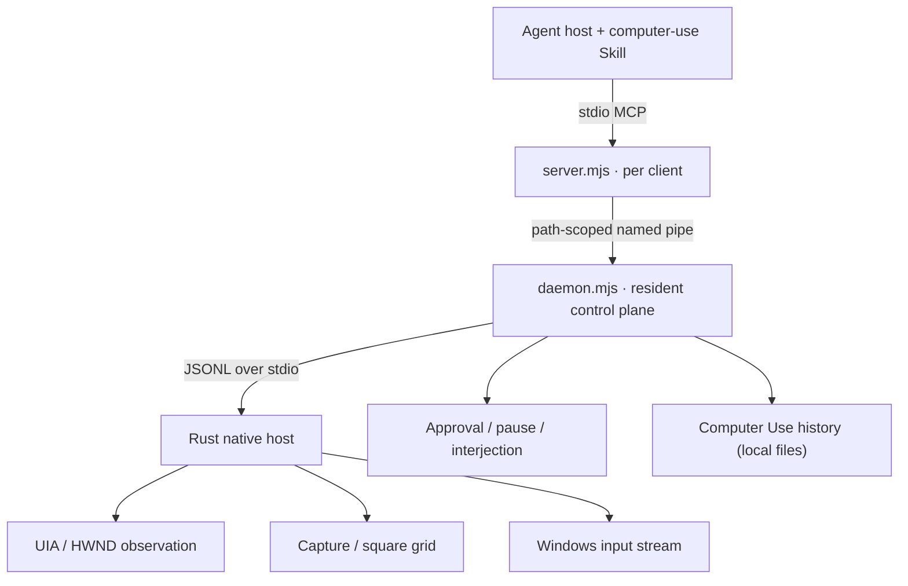
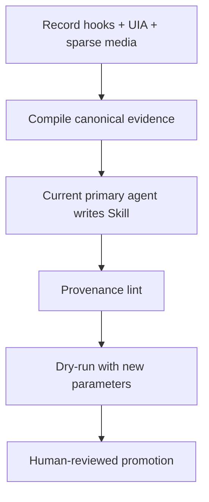

# FastCUA: An Accessibility-First, Local Control Plane for AI Agents on Windows

**Implementation-backed technical report · repository version 0.3.0 · Author: Guojiz**

**Status:** Open-source preprint; not peer reviewed

## Abstract

Computer-use agents often treat a desktop as a sequence of screenshots and isolated pointer actions. That design is general, but it spends model context on pixels that may already be available as structured accessibility data, repeats process startup and state discovery, and makes human interruption an integration-specific afterthought. FastCUA explores a different systems design for Windows: an accessibility-first observation path, an optional visual targeting path, a resident local control plane, and a Model Context Protocol (MCP) interface that can execute several related native actions within one model turn.

The implementation combines a per-client Node.js MCP server, one path-scoped resident daemon, a Rust native host, Windows UI Automation (UIA), bounded screenshot capture, numbered square-grid targeting, and USER input-stream injection. Safety is enforced at several layers: exact application identity, approval policy, foreground and cursor revalidation, time budgets, local-only control surfaces, visible status, global pause/interjection/exit controls, and agent-side operating rules distributed as a Skill. A separate recorder turns demonstrations into evidence packages; the same full-capability primary agent that performed the task reviews that evidence and writes any reusable Skill.

This report makes three bounded claims. First, the architecture reduces unnecessary visual observation without removing visual fallback. Second, the resident control plane creates a single place for lifecycle, approval, interruption, and runtime identity. Third, the implementation converts several common desktop failures—stale elements, unresponsive accessibility providers, moved cursors, changed foreground windows, and ambiguous demonstrations—into explicit failure states. It does **not** claim hardware-equivalent input, universal application compatibility, security against a malicious same-user process, or complete correctness of the current legacy key-chord path. Those limitations are part of the result, not omitted edge cases.

## 1. Problem and contribution

### 1.1 Research question

Can a local Windows computer-use runtime expose a desktop to heterogeneous AI agents while satisfying all of the following?

1. Use semantic UI structure when it is reliable and pixels only when they add information.
2. Preserve a stable execution context across individual tool calls and agent clients.
3. Translate model-visible coordinates into native input without silently targeting another window.
4. Let a person pause, redirect, approve, or stop execution outside the agent conversation.
5. Fail explicitly when observation, identity, timing, or authority is insufficient.
6. Remain inspectable and self-hostable without a remote automation service.

FastCUA answers with an implementation and a set of testable contracts rather than a claim of general desktop autonomy.

### 1.2 Contributions

The repository contributes:

- a four-layer Windows control architecture separating agent instructions, MCP transport, policy/lifecycle, and native desktop operations;
- a hybrid observation policy that grades UIA output and switches to a visual number grid when the semantic tree is missing or weak;
- a formal coordinate contract between window captures, downscaled images, refined views, and physical screen points;
- detect-and-abort input sequencing based on foreground and cursor re-observation;
- a human control plane with approval, pause, interjection, shutdown, visible state, and stable machine-readable interruption tags;
- path-scoped runtime identity, verified release artifacts, rollback, and development/release isolation;
- an evidence-first demonstration recorder whose compiler, primary-agent synthesis, linter, dry-run, and promotion stages remain separately auditable.

### 1.3 Non-goals

FastCUA is not a browser DOM replacement, remote desktop protocol, kernel input driver, anti-cheat bypass, secure-desktop automation system, or autonomous authority layer. UAC prompts, password managers, authentication surfaces, Windows Security, and higher-integrity targets are outside the normal operating path. The agent still owns task planning; FastCUA owns the local observation/action/control substrate.

## 2. System model

### 2.1 Actors and trust boundary

The system has four actors:

- **Human operator:** authorizes the task and can interrupt it through global controls.
- **Agent host:** runs one full-capability primary model, loads the `computer-use` Skill, and connects to the MCP server.
- **FastCUA runtime:** MCP server, resident daemon, persistent history store, and native host running as the current Windows user.
- **Target application:** a visible desktop process with an HWND, accessibility provider, and/or capturable surface.

The local user session is the trust boundary. FastCUA constrains accidental or agent-originated misuse; it does not defend against arbitrary malicious code already running with the same user privileges. The path-derived named pipe reduces accidental cross-runtime attachment, but it is not a replacement for an operating-system security boundary.

### 2.2 Threat and failure model

The implementation assumes failures may occur at any hop:

- an agent may reuse a stale element index or coordinate;
- a target can change focus, move, close, or stop pumping messages;
- a UIA provider can return little information or never return;
- a person may move the pointer or take focus during an action;
- an MCP client can disconnect while work is pending;
- input insertion can be partial or blocked by User Interface Privilege Isolation (UIPI);
- demonstration data can omit intent, contain secrets, or be over-generalized by a language model.

The response is bounded execution plus explicit failure. It is not global device locking or perfect rollback.

## 3. Architecture



### 3.1 Layer responsibilities

| Layer | Primary responsibility | Lifetime |
|---|---|---|
| `skills/computer-use/` | Agent procedure, safety rules, fallback policy | Loaded by agent host |
| `server.mjs` | MCP tools, persistent JavaScript cell, coordinate helpers | One process per client |
| `daemon.mjs` | Shared helper lifecycle, policy, approvals, interrupts, runtime identity, Computer Use history recording | Resident per runtime root |
| `cua-native-host.exe` | UIA, HWND fallback, capture, grid rendering, activation, input | One shared child of daemon |
| `lib/history.mjs` | Persistent local audit timeline (JSONL + screenshots), retention | Local data directory |

This separation is intentional. Agent procedure can evolve without embedding policy prose in the native binary; MCP clients can come and go without rebuilding the Windows helper; and every local action crosses one policy point.

### 3.2 Transport and identity

The agent-facing server implements MCP tool discovery and invocation over newline-delimited JSON-RPC on stdio. MCP standardizes model-controlled tools over JSON-RPC, but FastCUA intentionally implements only the subset it exposes rather than importing a full SDK. The server forwards work to the daemon through a Windows named pipe whose name contains the first 12 hexadecimal characters of a hash of the canonical runtime root. Development checkouts and installed releases therefore use distinct pipes and data directories.

The daemon communicates with the native host through newline-delimited JSON on the child's stdio. It starts the host with a parent-process watchdog, so the native process exits when its owning daemon disappears. Runtime metadata reports the server path, daemon path, native-host path, version, build commit, pipe, port, and data directory to diagnose mixed installations.

### 3.3 One warm control plane

The daemon owns state that would otherwise be reconstructed for each click: trusted applications, approval requests, control state, interruptions, UIA quality history, update state, helper generation, and recent activity. Multiple MCP clients share one helper and therefore one physical pointer. Requests remain individually identified and cancellable; stale helper exits cannot overwrite the state of a replacement generation.

## 4. Observation: semantics first, pixels when needed

### 4.1 UI Automation path

Microsoft describes UI Automation as an accessibility framework that exposes programmatic information about desktop UI elements and supports automated testing. FastCUA consumes UIA directly through hand-written COM bindings. It asks for the Control View, begins from `ElementFromHandle(hwnd)`, and walks children and siblings with explicit depth and node limits. The resulting text tree contains a per-snapshot index, control role, automation ID, name, bounds availability, and selected secondary actions.

An element index is **snapshot-local**, not a persistent object identity. Any layout-changing action requires a new observation. Automation IDs are retained as stronger restart-stable hints for demonstration replay, but they are still validated in the current application scope.

Focused editable values use `IUIAutomationValuePattern`. `replace:true` is allowed only when the currently focused control exposes a writable value. FastCUA deliberately does not implement broad replacement as a blind global `Ctrl+A`; if a scoped writable value is unavailable, replacement fails.

### 4.2 Provider liveness and HWND fallback

Accessibility providers execute application code and may hang. Snapshot and point-hit operations therefore run on bounded worker threads. A provider timeout marks the application as UIA-disabled for the current helper session; subsequent observations use a short probe and fall back quickly. The fallback enumerates visible child HWNDs, maps common window classes to roles, and reads window text with `SendMessageTimeoutW`. It does not pretend that this reduced tree is equivalent to healthy UIA; the response sets `prefer_vision:true`.

The liveness mechanism has an explicit trade-off: a timed-out worker is detached and allowed to die with its private COM resources, while the shared host continues. This bounds the caller but does not cancel arbitrary provider code in-process. A stronger isolation boundary would require a disposable provider subprocess.

### 4.3 Quality assessment

FastCUA grades each semantic snapshot:

| Observation | Quality | Agent policy |
|---|---|---|
| Provider timeout/disabled or empty tree | `broken` | Switch to vision immediately |
| Mostly non-hit-testable nodes or very few actionable nodes | `weak` | Prefer vision |
| Sufficient actionable, bounded elements | `good` | Prefer UIA text |

The score is a routing heuristic, not a probability of correctness. It prevents an agent from repeatedly parsing a visibly inadequate tree.

### 4.4 Capture and numbered square grid

Window capture runs in a worker with a three-second budget. It tries `PrintWindow` first and falls back to `BitBlt` when rendering fails or the application is hung. Microsoft documents `PrintWindow` as synchronous and potentially slow, which is why it cannot be allowed to block the control thread indefinitely.

Captured BGRA pixels are converted to RGB, downscaled by box averaging to a default maximum long edge of 1568 pixels, encoded as JPEG, and deduplicated for two seconds by a frame hash. Any input action invalidates the capture cache.

When semantic targeting is weak, `grid_view` overlays centered square cells and small numbers on one image. Each refinement captures only the selected square and overlays a new 3×3 grid; the path of selected IDs identifies the crop.

### 4.5 Visual-control state machine

Visual control deliberately separates perception from input:

| State | Agent operation | Runtime effect |
|---|---|---|
| Observe | `grid_view({window})` | Returns one numbered image; no input |
| Select | Choose the cell containing the target | Agent-local decision; no tool call and no input |
| Refine | `grid_refine({window,grid,cell})` | Crops that cell and returns a numbered 3×3 image; no input |
| Commit center | `click_cell({window,grid,cell})` | Clicks the selected cell center after scope, bounds, foreground, and cursor checks |
| Commit offset | `click_in_cell({window,grid,cell,x,y,view})` | Validates a cell-local offset, transforms it once, then clicks |
| Commit point | `click_view({window,view,x,y})` | Validates a point in the current image/crop, transforms it once, then clicks |
| Verify | New `get_window_state` or `grid_view` | Observes post-action state; input has invalidated the image cache |

The agent refines when a cell contains multiple plausible targets or when its center is not the intended hit point. It may refine repeatedly. Only the three commit operations inject input; selecting a number never clicks. A stale UIA index, `[no-hit]`, `prefer_vision:true`, or `quality` of `weak`/`broken` enters this state machine immediately. After layout or focus changes, the agent discards prior indexes and visual coordinates and observes again.

## 5. Coordinate model

### 5.1 Spaces and transform

Let the physical outer window rectangle be

\[
R=(L,T,W,H),
\]

where \((L,T)\) is the screen-space origin and \((W,H)\) is the full window size in physical pixels. Let a returned image have size \((w,h)\), with scale factors

\[
s_x=W/w,\qquad s_y=H/h.
\]

For a point \(p_i=(x_i,y_i)\) selected in that image, the full window point is

\[
p_w=(\operatorname{round}(s_xx_i),\operatorname{round}(s_yy_i)),
\]

and the physical screen point is

\[
p_s=(L+p_{w,x},\ T+p_{w,y}).
\]

A refined view adds its crop origin \((c_x,c_y)\) before the final screen translation:

\[
p_w=(c_x+\operatorname{round}(s_vx_v),\ c_y+\operatorname{round}(s_vy_v)).
\]

Direct numeric tool coordinates are interpreted as normalized only when **both** values lie in \([0,1]\). Otherwise they are screenshot pixels and are inverted through the latest capture scale. Internal helpers such as `click_cell` and `click_view` submit `space:"window_pixels"` after performing the transform once, preventing double scaling. All paths reject points outside \([0,W)\times[0,H)\) before adding the screen origin.

The native host declares Per-Monitor-V2 DPI awareness before creating UI resources. Microsoft documents that this mode lets an application see raw pixels on each display. That choice aligns `GetWindowRect`, UIA bounds, capture geometry, hooks, and injected screen positions under display scaling.

### 5.2 Coordinate invariants

The contract establishes:

- **Containment:** no translated point may leave the current target window rectangle.
- **Single inversion:** downscale is reversed exactly once.
- **Declared origin:** every visual point uses the top-left of the relevant window image or crop.
- **Fresh identity:** coordinates are coupled to an explicit target `{app,id}` rather than an unscoped desktop point.
- **Post-observation invalidation:** input invalidates image deduplication so the next verification capture is fresh.

These properties reduce coordinate ambiguity; they do not prevent a window from moving between observation and action. Activation and near-effect revalidation address that residual race.

## 6. Actuation and correctness conditions

### 6.1 Input mechanism

FastCUA positions the pointer with `SetCursorPos`, inserts mouse buttons and Unicode text with `SendInput`, and currently emits virtual-key chords with `keybd_event`. Microsoft specifies that `SendInput` inserts an ordered array into the keyboard or mouse input stream and returns the number of inserted events. It is subject to UIPI and cannot inject into a process at a higher integrity level. Microsoft also marks `keybd_event` as superseded by `SendInput`; the current chord path is therefore documented as technical debt, not an endorsed final design.

### 6.2 Near-effect invariants

Let \(T\) be the target HWND, \(F(t)\) the foreground HWND, \(P\) the intended physical point, and \(C(t)\) the observed cursor position. FastCUA aims to enforce:

- **I1 Foreground ownership:** \(F(t_{effect})=T\).
- **I2 Cursor ownership:** \(C(t_{effect})=P\).
- **I3 Coordinate containment:** \(P\) was derived from a point inside the current window.
- **I4 Balanced transitions:** every inserted down event has a matching up event or a bounded cleanup attempt.
- **I5 Bounded software wait:** each hop has an explicit budget or is isolated by an outer process/request boundary.
- **I6 Fail stop:** a failed identity, focus, cursor, bounds, insertion-count, or policy check terminates the action.

I4 is fully pursued for mouse and Unicode-text paths. It is **not yet proven** for the legacy key-chord path because `keybd_event` provides no insertion count and the implementation does not inspect pre-existing physical modifier state. I5 is also partial for synchronous UIA value writes: they avoid dangerous late detached writes but depend on outer containment if a provider blocks.

### 6.3 Action state machines

A click follows:

```text
Idle → Activate → Resolve point → Move → Settle → Verify(F,C)
     → Button down → Button up/cleanup → Verify(C) → Complete
```

A drag holds the button while interpolating 20 points. Before each move it rechecks foreground ownership and the previous cursor position; release is attempted even if the path fails. Text is emitted as UTF-16 down/up pairs in bounded batches with a foreground check between batches. If a partial text batch ends after a down event, the runtime attempts a compensating key-up.

These are sampled detect-and-abort rules, not mutual exclusion. Another actor can still intervene in the narrow interval between a final check and the Windows API call.

### 6.4 Window activation

Windows restricts which processes can call `SetForegroundWindow`, and even a process satisfying documented conditions may be denied. FastCUA restores the target, temporarily attaches input queues when needed, brings the window to the top, requests foreground activation, and verifies the result within a 1.5-second budget. Failure remains visible to the caller; the runtime does not assume activation succeeded.

## 7. Human control and local safety

### 7.1 Approval policy

In safe mode, an action targeting an unknown application produces an approval request. Trust matching uses canonical exact application identity rather than fuzzy substrings. The operator can allow once, add the application to the whitelist, enter full-access mode, or deny. A default whitelist only bypasses the machine approval prompt; agent-side Skill rules still prohibit sensitive targets.

### 7.2 Out-of-band controls

FastCUA ships no UI of its own. A host control plane — the DeepSeek Harness plugin, a script, or a test — drives the resident daemon through its named-pipe control methods (`pause`, `resume`, `interject`, `resolve_approval`, `shutdown`, `stop_all`, `clear_approvals`, `restart`). The daemon maps these states to stable `[control_plane:*]` tags. Pause, stop, shutdown, approval wait, and interjection are semantically distinct. Only interjection carries new task text; the other states instruct the agent to stop calling desktop tools rather than retrying around human control.

### 7.3 Local configuration

Configuration lives only in the local `config.json` file; there is no HTTP console. The daemon reads it at startup and applies it through the `set_config` pipe method. Control messages are bounded and the pipe is path-scoped to the runtime root. The default policy is full access; users who edit `approvalPolicy` back to `"safe"` opt into per-app prompts resolved through the host control plane.

### 7.4 Residual local risk

Loopback and a path-scoped named pipe reduce exposure but do not authenticate a hostile same-user process. Microsoft notes that named pipes are accessible subject to security checks and can be remotely accessible when server services allow it. FastCUA should therefore be treated as a local-user automation component, not a hardened multi-tenant broker. Explicit pipe access control is a future hardening target.

## 8. Agent interface: Skill and MCP as one unit

The MCP server exposes runtime identity, application/window discovery, observation, click, keyboard, text, scroll, drag, activation, secondary action, close, visual grid, and a persistent JavaScript execution cell. Internal native methods are not all public MCP tools; in particular, broad `set_value` is not exposed in version 0.3.0.

The `computer-use` Skill is part of the safety mechanism. It specifies bootstrap, stale-state handling, UIA-to-vision switching, text-field observation before mutation, sensitive-action confirmation, control-plane tag behavior, verification, and turn closure. Installing only the MCP server gives an agent capability without the required operating policy; installing only the Skill gives instructions without an executor. FastCUA therefore defines a complete installation as **Skill + MCP in the same active agent host**.

That host should use one full-capability primary model: text and image understanding, reliable reasoning, local Skill support, MCP tool use, and sufficient context for multi-step desktop work. Native audio understanding is preferred for demonstration narration. FastCUA does not recommend a separate writer, transcription model, or fallback model. If the primary model cannot consume an audio track, the recorder's typed notes or a user-corrected text note are used instead.

The persistent `js` tool is a latency and state-management feature, not an escape hatch. Its `sky` object exposes only bounded FastCUA operations. Cells are serialized, timed, and tracked with `AsyncLocalStorage`; delayed callbacks and detached desktop promises are cancelled when a cell ends so a timed-out action cannot land later.

## 9. Evidence-first Skill recording

### 9.1 Why recording is separated from synthesis

A demonstration contains observable events, but a reusable Skill also contains inferred intent, parameters, warnings, and generalization. Writing prose directly from raw input would collapse evidence and inference. FastCUA therefore produces a non-executable evidence package before the current primary agent writes natural-language instructions. This keeps one model responsible for the original task context, visual evidence, user corrections, and final Skill instead of transferring meaning to separately configured models.

### 9.2 Pipeline



The recorder captures low-level keyboard/mouse events, foreground identity, focus snapshots, point anchors, sparse keyframes, optional local video/audio, and typed notes. Password focus removes key content and suppresses visual frames; secure desktop is not recorded. The compiler deterministically creates evidence and draft artifacts, preserves unresolved steps, infers parameters with provenance, and never writes `SKILL.md` itself.

The active agent reads `evidence.json`/`evidence.md`, inspects only the non-redacted frames or audio it needs, and writes `SKILL.md` inside the draft directory. Every step, parameter, and warning must retain its evidence citation. Provenance lint rejects missing or fabricated evidence. Dry-run re-resolves anchors in a restarted application, substitutes new parameter values, refuses out-of-scope applications, skips redacted steps, and stops on unresolved anchors or control-plane interruption. Promotion requires an explicit review attestation; unverified Skills require an additional override. FastCUA does not route this evidence through a separately configured model or transcription service.

### 9.3 Recorder limits

The recorder does not prove human intent from pointer motion. Narration and notes remain evidence with uncertainty, not ground truth. Injected demonstrations are labeled, audio may be unavailable, and compatibility must be established per application. The current repository includes a validated preview and real-machine test programs, but no attached independent user study.

## 10. Evaluation and claim discipline

### 10.1 Evidence classes

This report uses four evidence classes:

| Class | What it supports | What it does not support |
|---|---|---|
| Source inspection | Implemented control flow, constants, interfaces | Runtime success on a machine |
| Deterministic contract tests | Protocol, lifecycle, policy, transform, compiler invariants | General Windows compatibility |
| Windows fixture tests | Native UIA/input/capture behavior against controlled apps | Arbitrary third-party apps |
| Application end-to-end tests | A complete workflow in one named application/environment | Universal reliability or comparative superiority |

### 10.2 Repository test matrix

| Suite | Evidence target |
|---|---|
| `server-lifecycle.mjs` | MCP surface, cell timeout/cancellation, visual coordinate helpers, close fencing |
| `control-plane-integration.mjs` | origin rejection, pause/resume, approvals, disconnect cleanup, interjection |
| `protocol-regression.mjs` | live native observation/actions and failure responses |
| `real-machine-validation.mjs` | Notepad/fixture UIA, capture/grid, hung providers, scale inversion, click snapping, UIA profile recovery |
| `skill-authoring-contract.mjs` | deterministic evidence-citation acceptance/rejection and absence of secondary-model configuration |
| `skill-recorder-validation.mjs` | redaction, media containers, evidence compilation, replay, scope refusal, promotion gates |
| `office-demo-e2e.mjs` | recorded Office workflow replayed with new values and output verification |

GitHub CI performs Rust formatting/tests, JavaScript syntax and contract checks, PowerShell/XAML parsing, native builds, and selected native regressions on `windows-latest`. Two hosted-runner desktop regressions are explicitly best-effort because interactive desktop behavior on CI runners is not equivalent to a normal logged-in Windows session.

### 10.3 What is established

Within the repository's fixtures and stated environments, tests exercise:

- semantic discovery, focus/value observation, scoped replacement, Unicode typing, click, drag, and scroll;
- window-image and refined-view coordinate translation, including downscale inversion and out-of-bounds rejection;
- fresh capture after input, image deduplication before input, and visual targeting after a provider hang;
- timeout containment, helper replacement, client disconnect cleanup, approval lifecycle, and one-shot interjection;
- recorder password redaction, non-executable evidence, parameter substitution, restart-stable anchor re-resolution, scope failure, provenance lint, and gated promotion.

These statements describe test coverage. Reproducing a result requires running the corresponding suite on the supported Windows environment; the repository does not turn a test assertion into an independent benchmark simply by documenting it.

### 10.4 What is not established

The project does not yet provide:

- a controlled comparison of latency, token use, or task success against vision-only systems;
- a broad application compatibility matrix across Windows versions, DPI layouts, languages, elevated processes, and custom-rendered UI frameworks;
- systematic physical-modifier contamination, E0 key, surrogate-pair, swapped-button, `ClipCursor`, or partial-chord-insertion tests;
- formal non-interference between a human and the injector;
- penetration testing of the same-user local IPC/control surface;
- an independent usability study for approval and interruption controls;
- peer review or third-party reproduction artifacts.

## 11. Limitations and design gaps

### 11.1 Input correctness

The highest-priority technical debt is replacing `keybd_event` with one balanced `SendInput(INPUT[])` transaction for chords. The design should preserve left/right modifiers, mark extended keys, check for physically held modifiers/buttons and abort without releasing human input, tag events with a diagnostic cookie, and add failure injection that verifies down/up balance after partial insertion.

UIPI failures remain ambiguous because Windows does not identify UIPI as the reason for `SendInput` failure. Integrity-level diagnostics can report a likely explanation but must not claim the API supplied one.

### 11.2 Provider isolation

Detached bounded workers prevent one UIA read from wedging the shared helper, but synchronous value mutation remains hard to cancel safely. Moving destructive provider calls into a disposable child process would give a stronger kill boundary without permitting late writes.

### 11.3 Capture coverage

`PrintWindow` and `BitBlt` do not guarantee correct pixels for every hardware-accelerated, protected, minimized, or compositor-specific surface. Future work should measure Windows Graphics Capture as an optional backend while preserving the existing coordinate and privacy contracts.

### 11.4 Local hardening

Future releases should apply an explicit current-user access control list to the named pipe, add a per-installation control token or equivalent authenticated channel, and document behavior when Windows exposes local pipes remotely. These changes would strengthen the runtime against other same-user or network-reachable processes but still would not create a multi-tenant sandbox.

### 11.5 Distribution and model architecture

The supported user path is the PowerShell bootstrapper plus verified GitHub Release artifacts. Installation, diagnosis, updates, rollback, and uninstall all use the installed PowerShell entry point; no alternative package-manager bootstrap or publication path is shipped.

The supported agent path is one full-capability primary model. The daemon, release package, and recorder contain no provider, transcription, secondary-model, or separate credential configuration. The active agent keeps task context through operation, evidence review, Skill writing, lint, dry-run, and promotion.

### 11.6 Empirical evaluation

A useful comparative study should pre-register tasks and measure success rate, model turns, image bytes/tokens, median/p95 action latency, human interventions, and unsafe-action near misses across three modes: vision-only, accessibility-only, and FastCUA hybrid. Until that experiment exists, efficiency and reliability claims remain architectural hypotheses supported by targeted tests, not benchmark conclusions.

## 12. Reproduction and operation

### 12.1 Requirements

- Windows 11 x64
- Node.js 18 or newer
- Rust stable toolchain for source builds
- an agent host that supports local Skills and stdio MCP

### 12.2 Install a release

Use the PowerShell bootstrapper. It installs Node.js through WinGet when necessary, downloads the runtime from GitHub Releases, and verifies the published checksum:

```powershell
irm https://raw.githubusercontent.com/Guojiz/FastCUA/main/install.ps1 | iex
```

The installer downloads the versioned Windows runtime, verifies its SHA-256 digest, and writes `FastCUA Agent Setup.txt`. Give that file to the agent host that will use FastCUA. Installation is complete only after that host installs the full `skills\computer-use` directory, configures `server.mjs` as the `sky-computer-use` stdio MCP server, reloads, and successfully calls `list_windows`.

Installed maintenance commands use the same PowerShell entry point:

```powershell
& "$env:LOCALAPPDATA\FastCUA\app\install.ps1" -Action Doctor
& "$env:LOCALAPPDATA\FastCUA\app\install.ps1" -Action Check
& "$env:LOCALAPPDATA\FastCUA\app\install.ps1" -Action Update
```

### 12.3 Build from source

```powershell
git clone https://github.com/Guojiz/FastCUA.git
cd FastCUA
.\native-host\build.ps1
```

For a source checkout, configure the MCP command as the current Node executable with the absolute path to `server.mjs`. Copy the complete `skills\computer-use` folder into the active agent's Skill directory. Use `runtime_info` after reload to verify that the server, daemon, host, pipe, data directory, version, and commit all belong to the intended checkout.

### 12.4 Validation

Portable checks:

```powershell
node --check server.mjs
node --check daemon.mjs
node tests\server-lifecycle.mjs
node tests\control-plane-integration.mjs
```

Native and real-machine checks:

```powershell
cargo test --manifest-path native-host\Cargo.toml --locked
.\tests\build-fixture.ps1
node tests\protocol-regression.mjs
node tests\real-machine-validation.mjs
node tests\skill-recorder-validation.mjs
```

Tests that move the pointer or type into applications require an interactive desktop and should not be run on a machine doing important work.

### 12.5 Release and rollback

The canonical release is a versioned Windows runtime ZIP, checksum file, manifest, and PowerShell installer published through GitHub Releases. A `v*` tag triggers the Windows workflow, validates the manifest and both Rust component versions against the tag, runs the contract checks, and builds those artifacts.

Installed updates use a staging directory, verify file hashes from the manifest, atomically replace the application directory, and keep `app.previous` for rollback. Development checkouts are never overwritten by the release updater.

## 13. Conclusion

FastCUA's central result is architectural: computer use is more than screenshot acquisition followed by a click. It is a coupled system of observation quality, identity, coordinate transforms, native event ordering, liveness containment, human authority, agent procedure, and evidence. Moving those concerns into one resident local control plane makes them visible and testable.

The implementation is strongest where its contracts are narrow: scoped windows, bounded observations, explicit coordinate spaces, local policy, and failure-aware replay. It is weakest where Windows itself exposes ambiguous or non-cancellable behavior: foreground restrictions, UIPI, third-party accessibility providers, capture diversity, and shared physical input. The project should advance by tightening those boundaries and publishing comparative measurements, not by broadening claims ahead of evidence.

## References

1. Microsoft, [UI Automation](https://learn.microsoft.com/en-us/windows/win32/winauto/entry-uiauto-win32).
2. Microsoft, [`SendInput` function](https://learn.microsoft.com/en-us/windows/win32/api/winuser/nf-winuser-sendinput).
3. Microsoft, [`keybd_event` function](https://learn.microsoft.com/en-us/windows/win32/api/winuser/nf-winuser-keybd_event).
4. Microsoft, [`PrintWindow` function](https://learn.microsoft.com/en-us/windows/win32/api/winuser/nf-winuser-printwindow).
5. Microsoft, [`SetForegroundWindow` function](https://learn.microsoft.com/en-us/windows/win32/api/winuser/nf-winuser-setforegroundwindow).
6. Microsoft, [High-DPI desktop application development on Windows](https://learn.microsoft.com/en-us/windows/win32/hidpi/high-dpi-desktop-application-development-on-windows).
7. Microsoft, [Named Pipes](https://learn.microsoft.com/en-us/windows/win32/ipc/named-pipes).
8. Model Context Protocol, [Specification](https://modelcontextprotocol.io/specification/2025-11-25).
9. FastCUA source and tests, repository version 0.3.0: [`server.mjs`](../server.mjs), [`daemon.mjs`](../daemon.mjs), [`native-host/src`](../native-host/src), and [`tests`](../tests).
10. FastCUA, [Next design: close implementation gaps](NEXT_DESIGN.md).
